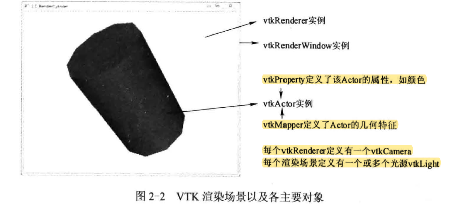
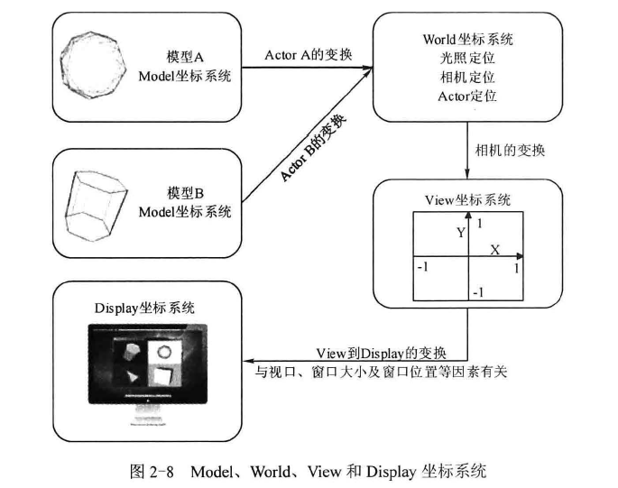
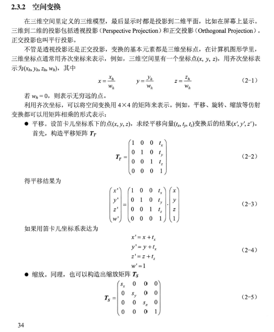
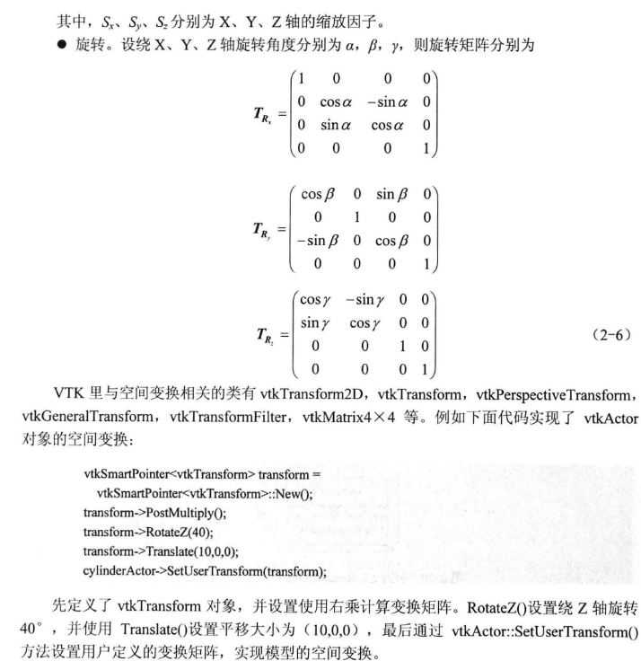
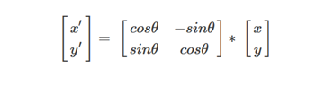
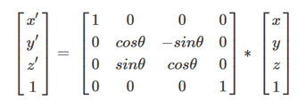
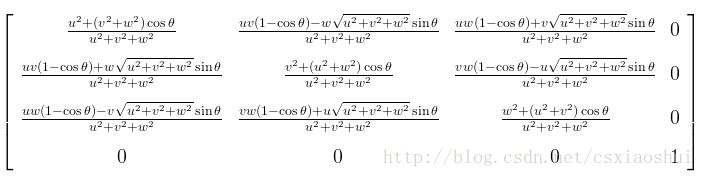
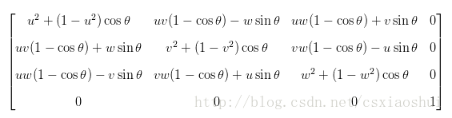
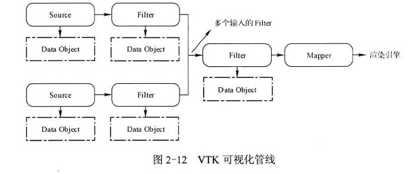

[toc]
# 大概
## VTk与OpenGL和D3D的比较
|     | VTK         | OD                          |
| :-- | :---------- | :-------------------------- |
|     |             | 仅提供底层API接口            |
|     |             | 需要理解图形学基础            |
|     |             | 没有封装可视化算法如体绘制算法 |
| 特点 | 开源，跨平台 |                             |

## VTK了解
|                            |                                                                                                                                                                                                                                                                                                                                                              |
| :------------------------- | :----------------------------------------------------------------------------------------------------------------------------------------------------------------------------------------------------------------------------------------------------------------------------------------------------------------------------------------------------------- |
| 应用方向                    | 三维图形图像处理和可视化                                                                                                                                                                                                                                                                                                                                       |
| 结构                       | C++类库和语言接口层                                                                                                                                                                                                                                                                                                                                           |
| 下载p3                     | 源码，测试程序的数据，文档，Tcl脚本运行器                                                                                                                                                                                                                                                                                                                        |
| 资料p5                     | 类库使用指南及算法讲解，source刊物，在线文档                                                                                                                                                                                                                                                                                                                     |
| 编译安装p6                  | 下载VS及ServicePack1及64位组件，Cmake，解压源码和数据包新建bin文件夹；Cmake两个文本框的配置，Cmake其他配置打开编译VTK示例，库设为静态编译，关闭测试程序，使用QT作为GUI开发工具，打开GUI支持，勾选使用MFC；打开VTK.sln，vs中进行编译，在报错类库的txt中添加vtkIO，再次编译；提取VTK及动态链接库文件的操作                                                                              |
| Cmake                      | 跨平台工程构建工具，只要给工程里的每个目录都写一个固定名称的CMakeLists.txt脚本就可以通过CMake生成该工程的编译文件                                                                                                                                                                                                                                                      |
| 建立一个VTK应用程序          | 在VTK/Examples新建文件夹Chap01，新建CMakeLists.txt和1.3_TestVTKInstall.cpp，打开CMake，                                                                                                                                                                   将CMakeLists.txt作为源码，Examlples\Chap01\bin作为编译目录路径，配置CMake选项，直到Generate。打开bin目录，打开*.sln文件F7编译F5运行，如报调试会议的错误将工程文件设置StartUp项目，再按F5运行，如报缺少文件的运行错误，p15修改工作目录 |
| CMakeLists.txt的常用命令P16 | 版本要求，指定工程名称,搜索并加载外部工程，指定载入一个文件或者模块，生成一个指定文件名的可执行文件，指定生成的可执行文件需要连接哪些文件                                                                                                                                                                                                                                   |
| 一个简单的VTK工程           | 头文件，用智能指针定义某类的对象（VTK的类实例化对象的基本用法，因为VTK的每个类的构造函数都定义位保护成员，所以与常规定义方法不同，只能使用智能指针，另外使用New()定义的变量要在其生命周期结束前使用Delete函数释放内存），渲染vtk窗口，暂停程序等待输入                                                                                                                                |

# VTK基本概念
## 一个稍微复杂的VTK程序（渲染圆柱体，并实现交互：ch8）
|                                    |                                                                                                                                                                                                                                                                                                                                                                                                                                                                                                                                                                                                                                                                                                                                                                                                                                                                                                                                                                                                                 |
| :--------------------------------- | :-------------------------------------------------------------------------------------------------------------------------------------------------------------------------------------------------------------------------------------------------------------------------------------------------------------------------------------------------------------------------------------------------------------------------------------------------------------------------------------------------------------------------------------------------------------------------------------------------------------------------------------------------------------------------------------------------------------------------------------------------------------------------------------------------------------------------------------------------------------------------------------------------------------------------------------------------------------------------------------------------------------- |
| 配置                               | 在VTK\Examples\新建一个文件夹》新建CMakeLists.txt和2.1_RenderCylinder.cpp文件，运行CMake-Configure-Generate，打开生成的Chap02.sln文件，编译，然后调试运行                                                                                                                                                                                                                                                                                                                                                                                                                                                                                                                                                                                                                                                                                                                                                                                                                                                               |
| vtkCylinderSource                  | 生成一个中心在渲染场景原点的柱体：：高，横截面半径，横截面的等边多边形的边数？                                                                                                                                                                                                                                                                                                                                                                                                                                                                                                                                                                                                                                                                                                                                                                                                                                                                                                                                           |
| vtkPolyDataMapper                  | 将输入的数据转换成几何图形并进行渲染：：VTK可视化管线的输入输出数据接口                                                                                                                                                                                                                                                                                                                                                                                                                                                                                                                                                                                                                                                                                                                                                                                                                                                                                                                                                 |
| vtkActor                           | 渲染场景中数据的可视化表达即确定渲染对象的位置大小和方向，vtkProp的子类，表达场景中的几何数据（vtkVolume表达场景中的体数据）还可设置纹理对象用于纹理贴图：：vtkFollwer（自动更新方向信息使其始终面向一个特定的相机，即无论怎么旋转都可见如三维场景中的广告板或者文本），vtkLODActor（自动改变自身的几何表达型式来实现所需的交互帧率），vtkAssembly(建立了各个Actor的层次结构以便于在整个结构平移、旋转或缩放等变换时能更合理地进行控制)，这三个都是可以不依赖对象的vtkActor的子类；vtkActor::SetMapper()设置生成几何图元的Mapper，即连接一个Actor到可视化管线的末端                                                                                                                                                                                                                                                                                                                                                                                                                                                                                               |
| vtkProp                            | 数据在场景中渲染时，不能把数据直接加入到渲染场景，而是以vtkProp的型式存在，Prop依赖于两个对象Mapper（存放数据和渲染信息）和Property（控制颜色、不透明度）  ：：vtkImageActor（负责图像显示），vtkPieChartActor（用于创建数组数据的饼图可视化表达形式），vtkAxisActor（其内部直接包括了控制显示的参数和待渲染数据的索引，因此不需要Property和Mapper对象）                                                                                                                                                                                                                                                                                                                                                                                                                                                                                                                                                                                                                                                                                     |
| vtkRenderWindow                    | 将操作系统与VTK 渲染引擎连接到一起。不同平台下的vtkRenderWindow 子类负责管理本地计算机系统中窗口创建和渲染过程。当使用VTK 开发应用程序时，只需要使用平台无关的vtkRendererWindow 类，运行时，系统会自动替换为平台相关的vtkRendererWindow 子类。比如， Windows 下运行上述的VTK 程序， 实际创建的是vtkWin320penGLRenderWindow(vtkRenderWindow 的子类）对象。vtkRenderWindow 中包含了vtkRenderer 集合、渲染参数，如立体显示(Stereo) 、反走样、运动模糊(Motion Blur) 和焦点深度( Focal Depth ) 等。    vtkRenderWindow: :AddRenderer(): 该方法用于加入vtkRenderer 对象。    vtkRenderWindow:: SetSize(): 该方法是从vtkRenderWindow 的父类vtkWindow 继承过来的，用于设置窗口的大小，以像素为单位。                                                                                                                                                                                                                                                                                                                                                                |
| vtkRender                          | 负责管理场景的渲染过程。组成场景的对象包括Prop, 照相机(vtkCamera ) 和光照( vtkLight ) 都被整合到一个vtkRenderer 对象中。一个vtkRenderWindow 中可以有多个vtkRenderer 对象，而这些vtkRenderer 可以渲染在窗口不同的矩形区域中（即视口）或者覆盖整个窗口区域。    vtkRenderer: :AddActor(): 该方法用千将vtkProp 类型的对象添加到渲染场景中。                    vtkRenderer: :SetBackground(): 该方法是从vtkRenderer 的父类vtkViewport 继承的，用于设置渲染场景的背景颜色，用R、G、B 的格式设置，三个分量的取值为0.0 ~ 1.0 。( 0.0, 0.0,0.0) 为黑色， (1.0, 1.0, 1.0) 为白色。除了可以设置单一的背景颜色之外，还可以设置渐变的背景颜色。    vtkViewport:: SetBackground2()用千设置渐变的另外一种颜色，但是要使背景颜色渐变生效或者关闭，必须调用以下的方法。    vtkViewport: :SetGradientBackground(bool): 参数为0 时，关闭，反之，打开。    vtkViewport: :GradientBackgroundOn(): 该方法用于打开背景颜色渐变效果，相当于调用方法SetGradientBackground(1) 。    vtkViewport: :GradientBackgroundOff(): 该方法用千关闭背景颜色渐变效果。相当于调用方法SetGradientBackground(O) 。                        |
| vtkRenderWindowlnteractor          | 提供平台独立的响应鼠标、键盘和时钟事件的交互机制，通过VTK 的观察者／命令模式（请参考本书第8 章内容）将监听到的特定平台的鼠标、键盘和时钟事件交由vtklnteractorObserver 或其子类，如vtklnteractorStyle 进行处理。vtklnteractorStyle 等监听这些消息并进行处理以完成旋转、拉伸和缩放等运动控制。    vtkRenderWindow Interactor 会自动建立一个默认的3D 场景交互器样式( Interactor Style ) :vtklnteractorStyleSwitch, 当然也可以选择其他交互器样式或者创建自己的交互器样式，如本例中使用的vtklnteractorStyleTrackballCamera。    vtkRenderWindowInteractor:: SetRenderWindow(): 该方法用千设置渲染窗口，消息是通过渲染窗口捕获到的，所以必须给交互器对象设置渲染窗口。    vtkRenderWindow Interactor:: SetlnteractorSty le(): 该方法用千定义交互器样式，默认的交互器样式为vtk:InteractorStyleSwitch。vtkRender Window Interactor: :Initialize(): 该方法表示为处理窗口事件做准备，交互器工作之前必须先调用这个方法进行初始化。vtkRenderWindowinteractor: :Start(): 该方法表示开始进入事件响应循环，交互器处千等待状态，等待用户交互事件的发生。进入事件响应循环之前必须先调用Initialize()方法。 |
| vtk.InteractorStyleTrackballCamera | 交互器样式的一种。该样式下， 用户通过控制相机对物体作旋转、放大、缩小等操作。打个比方，在照相时如果要想物体拍起来显得大一些， 可以采取两种做法：第一种做法是相机不动，让要拍的物体靠近相机； 第二种做法是物体不动，让相机靠近物体。第二种做法就是vtk.InteractorSty I e Trackball Camera 的风格。其父类为vtk.InteractorStyle, 除了vtk.InteractorStyleTrackball Camera 之外， VTK 还定义了其他多种交互器样式，如vtk.InteractorStylelmage,主要用于显示二维图像时的交互。                                                                                                                                                                                                                                                                                                                                                                                                                                                                                                                                                                               |
## 形象化理解地渲染圆柱体，并实现交互地各个类
整个剧院就好比VTK 程序的渲染窗口( vtkRenderWindow ) ; 舞台就相当于渲染场景( vtkRenderer) ; 而那些演员就是程序中的Actor, 台上演员与台下观众的互动可以看作与应用程序的交互CvtkRenderWindowlnteractor) ; 演员与观众的互动方式有很多种，现场的观众可以直接上台跟演员们握手拥抱， 电视机前的可以发短信， 计算机前的可以微博关注等，这就好比程序中的交互器样式( vtk.InteractorStyle ) ; 对于舞台上的演员，观众都可以一一分辨出来，不会弄混，是因为他们穿着打扮、容貌都不一样， 这就相当千程序中vtk.Actor 的不同属性C vtkProperty) ; 台下观众的眼睛可以看作vtkCamera, 前排的观众因为离得近， 在观看台上演员时会觉得他们比较高大，而后排的观众因为离得远，所以那些演员看起来就会显得小些，每位观众看到的东西在他／她的世界里都是唯一的，所以渲染场景Renderer 里的vtkCamera 对象也是只有一个；舞台上的灯光可以有多个，所以渲染场景里的vtkLight 也存在多个

## 三维场景的基本要素
|            | 书上均有代码         | 几个注意点 |
| :--------- | :------------------ | :-------- |
| 灯光p26     | vtkLight            |           |
| 相机p27     | vtkCamera           |           |
| 颜色p29     | vtkActor的属性       |           |
| 纹理映射p30 | vtkImageData的数据集 |           |
## 坐标系统及空间变换

|             |                                                                                                                                                                           |
| ----------- | ------------------------------------------------------------------------------------------------------------------------------------------------------------------------- |
| Model-World | 每一个模型可以定义自己的Model坐标系统， 但World 坐标系只有一个， 每一个Actor 必须通过放缩、旋转、平移等操作将Model坐标系变换到World 坐标系。World 坐标系同时也是相机和灯光所在的坐标系统。 |
| View        | View 坐标系统表示的是相机所看见的坐标系统。相机负责将World 坐标系变换到View 坐标系。                                                                                              |
| Display     | Display 坐标系统与View 坐标系统类似，但是各坐标轴的取值不是[- 1, I], 而是使用屏幕像素值。屏幕上显示的不同窗口的大小会影响View 坐标系的坐标值[-1, l] 到Display 坐标系的映射。             |

### 控制坐标系统变换的类vtkCoordinate
在VTK 里， Model 坐标系统用得比较少， 其他三种坐标系统经常使用。它们之间的变换则是由类vtkCoordinate 进行管理的。根据坐标值的单位、取值范围等不同，可以将坐标系统细分为如下几类。
|     |     |   vtkCoordinate 可以用来表示坐标系统，其内部提供了函数接口来定义坐标系统  |
| :-- | :-- | :-- |
|  DISPLAY   |   X 、Y 轴的坐标取值为渲染窗口的像素值。坐标原点位于渲染窗口的左下角，这个对于VTK 里的所有二维坐标系统都是一样的， 且VTK 里的坐标系统都是采用右手坐标系。  |SetCoordinateSystemToDisplay（）     |
| NORMALIZED DISPLAY    |    X 、Y 轴坐标取值范围为[O, l], 跟DISPLAY 一样，也是定义在渲染窗口里的。 | SetCoordinateSystemToNormalizedDisplay O    |
| VIEWPORT    | X 、Y 的坐标值定义在视口或者渲染器( Renderer) 里。    |  SetCoordinateSystemToViewport O；SetCoordinateSystemToNonnalizedViewport O   |
|  VIEW   |   X 、Y 、Z 坐标值定义在相机所在的坐标系统里，取值范围为[-1, l], Z值表示深度信息。  |   SetCoordinateSystemToView O  |
|  WORLD   |  X 、Y 、Z 坐标值定义在世界坐标系统   | SetCoordinateSystem To World O    |
|    USERDEFINED |  用户自定义坐标系统。   |     |

#### ？问题代码
归一化窗口坐标与窗口坐标之间的转换：
```
vtkSmartPointer<vtkCoordinate> coordinate = 
vtkSmartPointer<vtkCoordinate>::New();
coordinate->SetCoordinateSystemToNonnalizedDisplay();
coordinate->SetValue(.5,.5,0);
int* val;
val = coordinate->GetComputedDisplayValue(renderer);
/*先调用了SetCoordinateSystemToNormalizedDisplayO设置坐标系统为归一化窗口坐标， 并设置坐标值为( 0 . 5, 0.5, 0), 即屏幕的中心,然后通过函数GetComputedDisplayValue()实现窗口坐标的转换
```
怎么就通过函数GetComputedDisplayValue()实现窗口坐标的转换？把renderer带进去是什么意思？

#### 该类中坐标系统转换函数
GetComputedWorldValueO
GetComputedViewportValueO
GetCornputedDisplay ValueO
GetComputedLocalDisplayValueO
GetComputedDouble ViewportValue()
GetComputedDoubleDisplayValueO
GetComputedUserDefmedValueO
### ？空间变换过程


#### [旋转矩阵](https://www.cnblogs.com/zhoug2020/p/7842808.html)
|                                                      | 右手坐标系                                  | 推导步骤                                                                       |
| :--------------------------------------------------- | :----------------------------------------- | :----------------------------------------------------------------------------- |
| 绕原点二维旋转                                         |  | 1.旋转前后的坐标2.三角展开变化后的坐标并将旋转前坐标代入3.写成矩阵形式                |
| 绕任意点的二维旋转                                     |  | 1. 首先将旋转点移动到原点处2. 执行如2所描述的绕原点的旋转3. 再将旋转点移回到原来的位置 |
| 绕x轴的三维旋转绕Y轴的三维旋转需变换xz位置才能保持形式不变 |  | 类比绕原点的二维旋转，只是所绕轴值不变                                             |
 绕任意轴的三维旋转                                                                                                                                                                                                                                                           |                                                        | 1. 将旋转轴u绕x轴旋转至xoz平面2. 将旋转轴u绕y轴旋转至于z轴重合3. 绕z轴旋转θ角4. 执行步骤2的逆过程5. 执行步骤1的逆过程6.关于计算： Rx(α)， Ry(−β)，绕正轴的三维旋转， Ry(β)， Rx(−α)，MR=Rx(−α)Ry(β)Rz(θ)Ry(−β)Rx(α)，ps:如果向量是经过单位化的（单位向量），那么有a2+b2+c2=1，可以简化上述的公式 |                                                                                |
## VTK管线

|                                       |                                                                                                                                                                                                                                                                                                                                                                                                                                                                                                                                                                                                                             |
| :------------------------------------ | :-------------------------------------------------------------------------------------------------------------------------------------------------------------------------------------------------------------------------------------------------------------------------------------------------------------------------------------------------------------------------------------------------------------------------------------------------------------------------------------------------------------------------------------------------------------------------------------------------------------------------- |
| 可视化管线作用                         | 获取或创建数据、处理数据以及把数据写入文件或者把数据传递给渲染引擎进行显示                                                                                                                                                                                                                                                                                                                                                                                                                                                                                                                                                          |
| 组成                                  | 实现获取或创建数据对象Source,处理对象Filter,控制数据流方向Mapper的一些类                                                                                                                                                                                                                                                                                                                                                                                                                                                                                                                |
| 举例p36                               | 读入一个vtk格式文件,用移动立方体法提取等值面,然后把等值面数据经Mapper送往渲染引擎进行显示                                                                                                                                                                                                                                                                                                                                                                                                                                                                                                                                            |
| 可视化管线的连接                        | marchingCubes->SetlnputConnection(reader->GetOutputPort());上行代码将reader 的输出端口与marchingCubes 的输入端口建立连接。使用SetlnputConnection()和GetOutputPort()连接可视化管线时， 还要求连接的两部分由于管线是运行时才执行的，如果连接的两部分类型不匹配， 程序运行时就会报错。之间的数据类型必须一致。                                                                                                                                                                                                                                                                                                                                     |
| 提取轮廓线的一个步骤                    | Filter 概括起来有以下三种类型（见图2- 14 ) : 单个输入， 产生单个输出； 多个输入， 产生单个输出，但输出的数据可有多种用途， 比如， 读入数据后，可以对其作等值面提取，另外还可以针对读入的数据生成轮廓线( Outline ) ;                                                                                                                                                                                                                                                                                                                                                                                                                             |
| 可视化管线执行时的机制                  | 惰性机制,某一个Filter的输入发生了变化,对于其不影响的分支不需要从新执行管线.VTK 采用一种叫作“惰性赋值" (Lazy Evaluation) 的方案来控制管线的执行，惰性赋值是指根据每个对象的内部修改时间来决定什么时候执行管线，只有当用户或者程序发出“请求数据“时，管线才会被执行。vtkObject 类里有一个重要的成员变量MTirne, 管线里的每个从vtkObject 派生的类的对象都会跟踪自己的内部修改时间， 当遇到“ 请求数据“时， 该对象会比较这个修改时间，如果发现修改时间发生了改变，对象就会执行。换言之， VTK 是采用命令驱动(Demand Driven) 的方法来控制管线的执行，这种方法的好处是， 当对数据对象作了更改时，不必立即做计算，只有当发出请求时才开始处理，这样能最小化计算所需的时间，以便更流畅地与数据进行交互。 |
| 可视化管线执行代码举例,写代码时极易出错!! | 没有请求数据,在                                                                                                                                                                                                                                                                                                                                                                                                                                                                                                                                                                                                               |
|                                       |                                                                                                                                                                                                                                                                                                                                                                                                                                                                                                                                                                                                                             |
|                                       |                                                                                                                                                                                                                                                                                                                                                                                                                                                                                                                                                                                                                             |
|                                       |                                                                                                                                                                                                                                                                                                                                                                                                                                                                                                                                                                                                                             |

# 