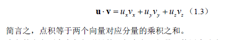
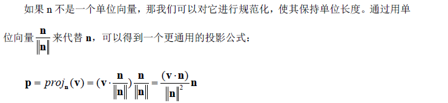
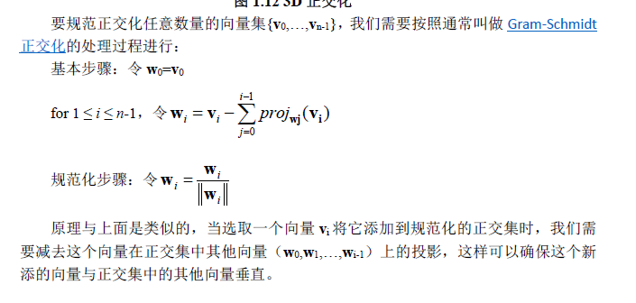
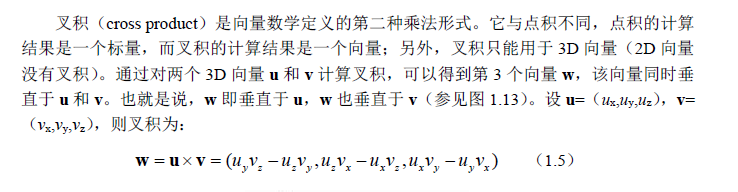
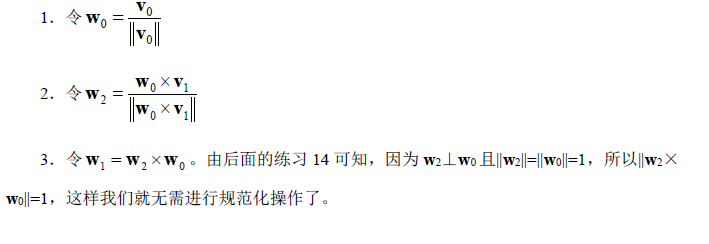
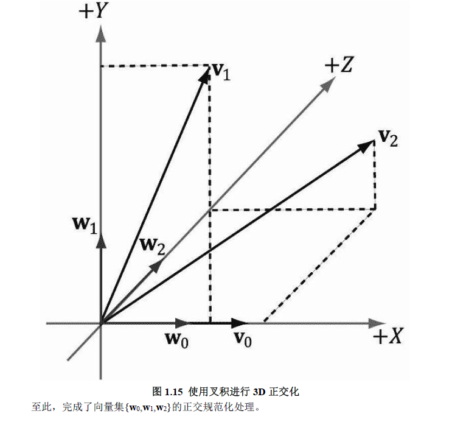

# 向量 
向量规范化：当我们想要让一个向量具有单位长度时，我们说要对该向量进行规范化。我们将向量的每个分量除以该向量的模，得到规范化向量
## 点积

### 正交投影
我们将 p 称为 v在 n 上的正交投影（orthogonal projection），并记为p = projn (v)
#### 投影公式
如果n 不是一个单位向量，那我们可以对它进行规范化，使其保持单位长度。通过用单位向量nn来代替n，可以得到一个更通用的投影公式：

### 3D正交化

## 叉积

### 叉积不支持交换律，实际上，u*v=-vu
### u向量（x,y）的2D伪叉积为一个垂直于它的向量v(-y,x)
### 使用叉积进行正交规范化
目的就是正交化，即通过给定的三个向量构造一个三维坐标系的初始向量

