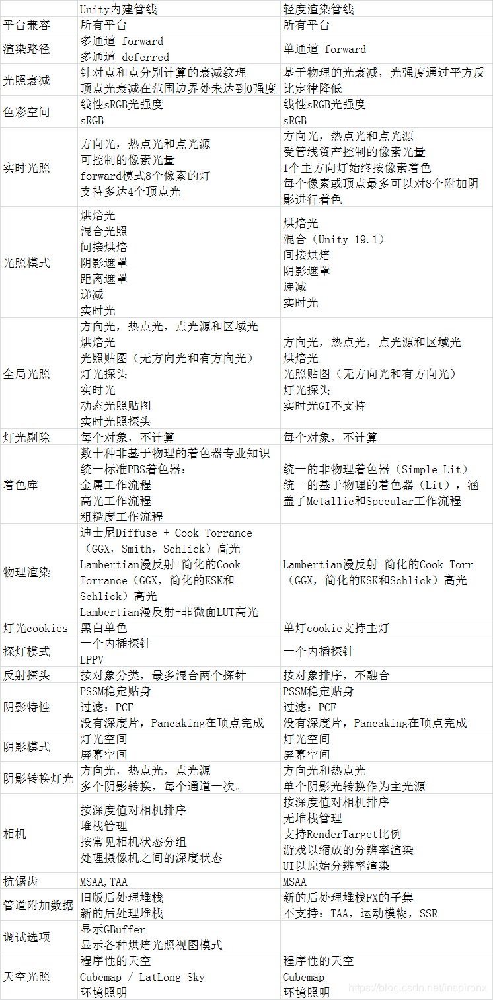
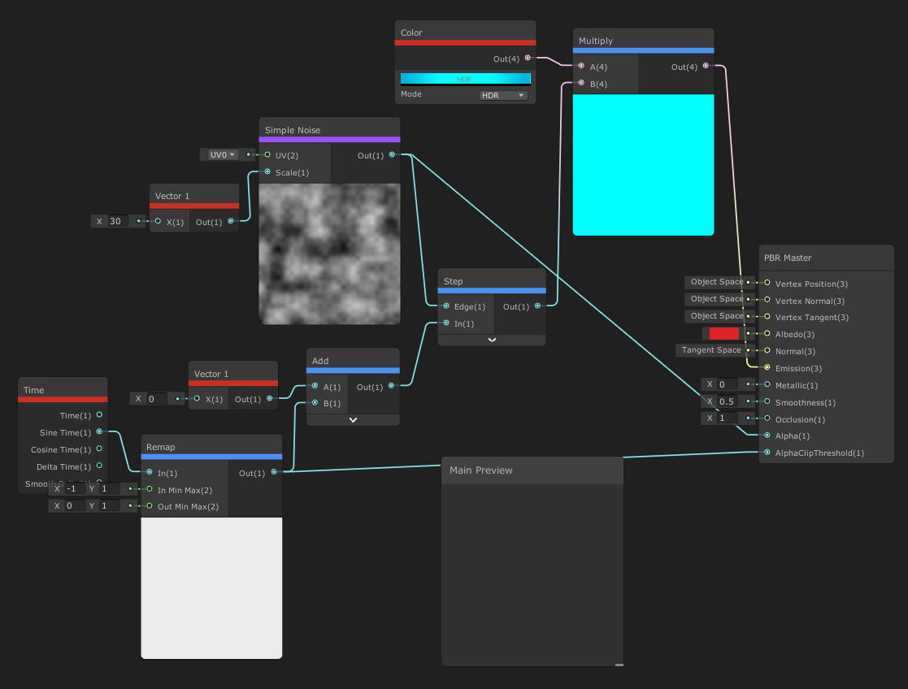

[toc]

# 1. 学前需知
https://www.sohu.com/a/216988990_280780?qq-pf-to=pcqq.c2c
https://zhuanlan.zhihu.com/p/98052762
https://zhuanlan.zhihu.com/p/95914965
https://blog.csdn.net/yangxuan0261/article/details/89842033
[文档](https://blog.csdn.net/inspironx/category_9508436.html)
[文档](https://blog.csdn.net/jiyao1990)
# 2. PBR Master:physically based rendering master物理渲染管理
https://blog.csdn.net/jiyao1990/article/details/88610832
//必须用的节点，基于物理渲染的节点。可以用于金属或高光材质。
vertex posion：顶点位置
vertex tangent：切线顶点
vertex normal：标准顶点
albedo：反射率
normal：表面贴图
emission：排放,散发,发出(气体、光、热)
metallic：金属的
smoothness：平滑
occlusion：闭塞
alpha：透明度，最初的
AlphaClipThreshold：透明度修剪门栏
# 3. UV
https://baike.baidu.com/item/UV/2490475#viewPageContent
# 4. LWRP和传统Shader对比

# 5. 全息投影
Emission控制从表面发出的光的颜色和强度。当你在场景中使用Emission材质时，它以可见光源的形式出现。自发光。Emission材质通常是用在GameObjects需要从内部亮了起来，如监视器上的屏幕，如汽车在夜间行驶时闪亮的仪表盘，或是再漆黑地方闪亮着怪物的眼睛。即在黑暗的地方也能看见的
Tiling And Offset 图片的大小和偏移，[Tiling and Offset](https://blog.csdn.net/PresleyGo/article/details/86496909?depth_1-utm_source=distribute.pc_relevant.none-task&utm_source=distribute.pc_relevant.none-task)
fresnel effect 边缘光效果
通过time-random range-comparison-branch这套实现每间隔0.9s闪烁一次

# 6. 镭射效果
功能：
调整模型透明度，实现入场和出场动画
动画的边缘发光效果

输入节点：
simple noise，remap
simple noise通过step并和一个范围值选择哪些噪音点被显示出来，哪些被隐藏
emission 自发光输入
color控制消失的边缘的颜色
# 7. 卡通火焰
[火焰](_v_attachments/20200226220741164_29456/Fire.ShaderGraph)
# 8. 摆动龙
[DragonSwing.shadergraph](../../../../New%20Unity%20Project/Assets/DragonSwing.shadergraph)