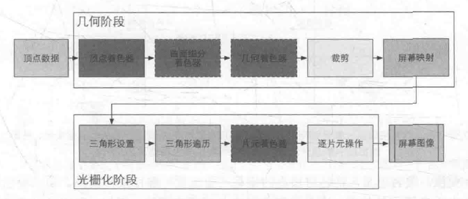
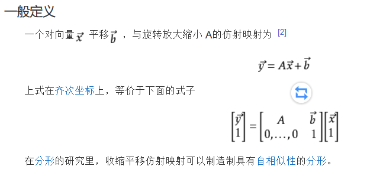
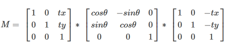
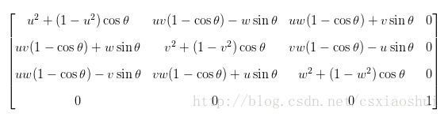
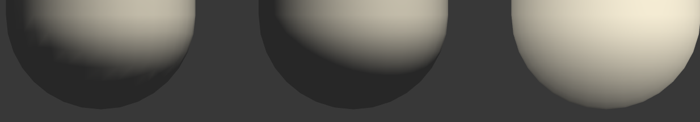
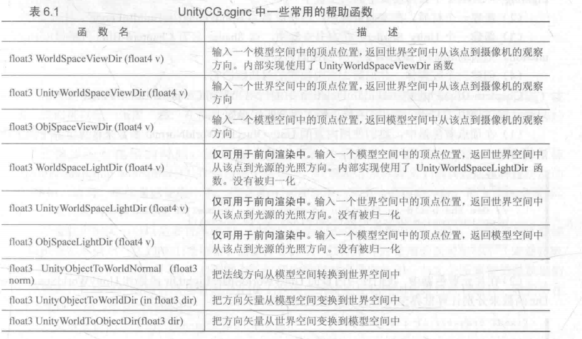

[toc]

# 1. 渲染流水线
## 1.1. 流水线系统的特点在渲染流水线上的体现
分步骤，所有步骤并行进行
可以提高单位时间的生产量
但是最慢的生产工序所需的时间决定了生产性能的瓶颈

渲染的各阶段分步骤，所有步骤并行进行
渲染的性能被提高了
渲染性能的瓶颈被渲染中最慢的工序所决定
## 1.2. 概念流水线的各阶段
应用阶段输出渲染图元》几何阶段输出屏幕空间的顶点信息》光栅化阶段
### 1.2.1. 应用阶段干啥了
既可配置又可编程由开发者写的应用决定？    由CPU实现
准备场景数据（摄像机，视锥体，模型，光源）》粗粒度剔除（剔除不可见物体）》设置好每个模型的渲染状态（材质的漫反射和高光反射颜色，使用的纹理和shader）以输出渲染所需的几何信息即渲染图元（点线三角面等）
### 1.2.2. 几何阶段干啥了
处理几何绘制 GPU实现
把顶点坐标变换到屏幕空间》传递给光栅器》光栅器处理》输出屏幕空间的二维顶点坐标，每个顶点对应的深度值和着色等信息
### 1.2.3. 光栅化阶段干啥了
产生屏幕上的像素渲染图像 GPU实现
决定每个渲染图元中的哪些像素应该被绘制在屏幕上
对传来的逐顶点信息（纹理坐标和顶点颜色）插值处理》进行逐像素处理
## 1.3. GPU渲染流水线（本质是一个计算过程）的各阶段
### 1.3.1. CPU先和GPU进行通信（应用阶段）
把数据加载到显存》设置渲染状态》调用Draw Call
把数据加载到显存：硬盘HDD》系统内存RAM》显存VRAM
设置渲染状态：如使用哪个顶点或片元着色器/光源属性/材质
调用Draw Call命令：CPU把需要被渲染的图元列表（不含材质信息）传给GPU
### 1.3.2. 几何阶段和光栅化阶段的具体操作

从图中可以看出， GPU 的渲染流水线接收顶点数据作为输入。这些顶点数据是由应用阶段加载到显存中，再由Draw Call 指定的。这些数据随后被传递给顶点着色器。
|  几何阶段   | 功能    | 
| --- | --- | 
|  顶点着色器  可编程 | 实现顶点的空间变换、顶点着色    | 
|  曲面细分着色器 可选  |  细分图元   |  
|  几何着色器  可选 | 执行逐图元( Per-Primi tive)的着色操作，或者被用于产生更多的图元   |  
|   裁剪 可配置  | 将那些不在摄像机视野内的顶点裁剪掉， 并剔除某些三角图元的面片    |  
|   屏幕映射 不可修改 |  把每个图元的坐标转换到屏幕坐标系中   |   
|  光栅化阶段   |     |   
| 三角形设置和三角形遍历    |   利用固定的一些函数表述一个三角网络是怎样覆盖每个像素的  |  
| 片元着色器  可编程  | 实现逐片元( Per-Fragment ) 的着色操作    |   
|  逐片元操作  可配置 | 执行很多重要的操作，例如修改颜色、深度缓冲、进行混合等    |    


### 1.3.3. 顶点着色器的工作
### 1.3.4. 从模型空间转换到齐次裁剪空间的步骤
### 1.3.5. 屏幕映射的任务
### 1.3.6. 光栅化阶段的目标
### 1.3.7. 三角形设置和三角形遍历输入什么、输出什么
### 1.3.8. 片元！=像素，片元==？
### 1.3.9. 片元着色器的输入和输出
### 1.3.10. 片元着色器中进行的纹理采样的步骤
### 1.3.11. 逐片元操作干啥了
### 1.3.12. 模板测试和深度测试是在检测什么，成功后干了什么
### 1.3.13. 为什么要进行模板测试和深度测试
### 1.3.14. 混合操作针对怎样的物体，混合的方式是什么
### 1.3.15. ？片元着色器中的操作会和提前测试有什么冲突
### 1.3.16. Unity Shader中干啥了
## 1.4. 章末答疑
### 1.4.1. cpu/gpu/图形应用编程接口/显卡驱动/shader在渲染的过程中操作
cpu调用OD将数据放到显存中》
开发者编写shader调用OD发出渲染命令》
显卡驱动把渲染命令翻译成GPU能执行的命令》
GPU利用现存中的数据和执行命令进行处理，绘制并输出到屏幕上
### 1.4.2. CPU和GPU利用什么实现并行工作
### 1.4.3. 游戏卡了一定是GPU的错吗
### 1.4.4. 什么是shader
GPU的渲染流水线的一部分，流水线中部分来控制渲染细节的可编程的阶段
//编写unity shaderLab就是编写片元属性，固定指令，顶点着色器、片元着色器的过程
# 2. Unity Shader基础
## 2.1. 概述
### 2.1.1. 四种unity shader 模板
standard surface shader：包含一个标准光照模型的表面着色器模板
Unlit Shader：不含光照但含雾效的基本顶点/片元着色器
Image Effect Shader：为我们实现各种屏幕后处理效果提供一个基本模板
Computer Shader：一种利用GPU的并行性来进行一些与常规渲染流水线无关的计算的文件
### 2.1.2. Default Maps面板
指定该Unity Shader 使用的默认纹理。当任何材质
第一次使用该Unity Shader 时，这些纹理就会自动被赋予到相应的属性上。在下方的面板中， Unity
会显示出和该Unity Shader 相关的信息，例如它是否是一个表面着色器( Surface Shader) 、是否是
一个固定函数着色器(Fixed Function Shader ) 等，还有一些信息是和我们在Unity Shader 中的标
签设置（详见3 .3.3 节）有关，例如是否会投射阴影、使用的渲染队列、LOD 值等。
## 2.2. ShaderLab
### 2.2.1. 什么是ShaderLab
一种专门为Unity Shader 服务的语言，利用抽象简化了渲染开发中的设置（使用语义描述渲染需要的数据的结构），和其他平台的shader编写方法略有不同
### 2.2.2. Unity Shader（Unity中的shader文件）的结构
name Properties SubShader Fallback
### 2.2.3. Properties的结构（设置以后就能在材质面板中显示出来，便于调参）
### 2.2.4. SubShader的结构
[Tags] [RenderSetup] [Pass] Pass中的标签是内部特定的和外部的Tags不一样，不一样在哪里？
但是外部的RenderSetup的状态设置会用于所有的Pass
### 2.2.5. 只能在SubShder的Tags里而不能在Pass中定义的7个标签
渲染队列归属，着色器分类，
顶点动画时是否批处理，是否投射阴影，
是否忽略Project，是否使用精灵地图集，
材质面板的预览类型（形状）
### 2.2.6. Pass的结构
[Name] [Tags] [Pass]
## 2.3. UnityShader的形式
### 2.3.1. UnityShader的着色器代码的写法位置
## 2.4. 答疑
### 2.4.1. Unity shader相对于传统的shader编写上的特点
### 2.4.2. ShaderLab就是在Unity中给CG语言再封装一层皮
# 3. Shader需要的数学
## 3.1. 笛卡尔坐标系
### 3.1.1. 使左手坐标系和右手坐标系重合时的特点
## 3.2. 点和矢量
### 3.2.1. 使用点积干啥
### 3.2.2. 比较两个矢量的大小最快的方法
### 3.2.3. 怎么计算叉积
### 3.2.4. 怎么判断一个平面的法向量的正方向
## 3.3. 矩阵
### 3.3.1. 矩阵乘法运算规律
### 3.3.2. 矩阵乘法特点
### 3.3.3. 五种特殊矩阵
### 3.3.4. 怎么判断一个矩阵是正交矩阵
### 3.3.5. 右乘的运算顺序
## 3.4. 矩阵的几何意义：变换
### 3.4.1. 线性变换的判断条件
说把空间中的元素（特殊地想为三维空间的向量）经过一个变换，而这种变换是具有线性的特性的。那么这种变换的从一个元素转变到另外一个元素的对应关系，我们可以用前面的一个矩阵来表示，称为线性变换矩阵。
### 3.4.2. 仿射变换矩阵需要四个维度
由一个线性变换接上一个平移，二维仿射变换的功能

### 3.4.3. 基础变换矩阵的组成

### 3.4.4. 平移矩阵
### 3.4.5. 缩放矩阵
### 3.4.6. [旋转矩阵](https://www.cnblogs.com/zhoug2020/p/7842808.html)
|                                                      | 右手坐标系                                                         | 推导步骤                                                                       |
| :--------------------------------------------------- | :---------------------------------------------------------------- | :----------------------------------------------------------------------------- |
| 绕原点二维旋转                                         |  | 1.旋转前后的坐标2.三角展开变化后的坐标并将旋转前坐标代入3.写成矩阵形式                |
| 绕任意点的二维旋转                                     |  | 1. 首先将旋转点移动到原点处2. 执行如2所描述的绕原点的旋转3. 再将旋转点移回到原来的位置 |
| 绕x轴的三维旋转绕Y轴的三维旋转需变换xz位置才能保持形式不变 |  | 类比绕原点的二维旋转，只是所绕轴值不变                                             |
 绕任意轴的三维旋转                                                                                                                                                                                                                                                           | | 1. 将旋转轴u绕x轴旋转至xoz平面2. 将旋转轴u绕y轴旋转至于z轴重合3. 绕z轴旋转θ角4. 执行步骤2的逆过程5. 执行步骤1的逆过程6.关于计算： Rx(α)， Ry(−β)，绕正轴的三维旋转， Ry(β)， Rx(−α)，MR=Rx(−α)Ry(β)Rz(θ)Ry(−β)Rx(α)，ps:如果向量是经过单位化的（单位向量），那么有a2+b2+c2=1，可以简化上述的公式 |                                                                                |
### 3.4.7. 为什么采用缩放旋转平移的这种约定的变换顺序
先缩放再平移：避免平移后物体因为缩放坐标又改变了
先旋转再平移：避免平移后物体因为旋转坐标又改变了
先缩放再旋转：避免旋转后物体因为缩放坐标又改变了
### 3.4.8. 绕ZXY轴旋转时的组合旋转变换矩阵为什么是ZXY
我们希望是进行旋转时不旋转当前坐标系的绕ZXY轴的顺序的旋转，这种旋转和旋转时旋转当前坐标系的绕YXZ轴的顺序的旋转的结果是相同的，实际上旋转时使用的坐标系是后者，而按列矩阵运算的矩阵是右乘从右往左运算的
## 3.5. 坐标空间
### 3.5.1. 顶点着色器就是把模型的顶点坐标从模型空间转换到齐次裁剪坐标空间
### 3.5.2. ！怎么把一个点从一个坐标空间转换到另一个坐标空间
### 3.5.3. 顶点空间的变换过程
模型空间》世界空间》观察空间（右手坐标系）》裁剪空间
### 3.5.4. ？透视投影中摄像机的横纵比由Game视图的横纵比和Viewport Rect中的W和H属性共同决定的
### 3.5.5. 裁剪空间到屏幕空间
# 4. 开始编写Unity Shader
## 4.1. 一个最简单的顶点/片元着色器
### 4.1.1. 顶点/片元着色器的基本结构
```
Shader "Unity Shaders Book/Chapter 5/Simple Shader" {
SubShader {
Pass {
CGPROGRAM

#pragma vertex vert//指定顶点着色器的函数
#pragma fragment frag//指定片元着色器的函数

float4 vert(float4 v: POSITION) : SV_POSITION {//POSITION指定了v是模型的顶点坐标，SV_POSITION制定了该顶点着色器的输出是裁剪空间中的顶点坐标
return mul (UNITY_MATRIX_MVP, v);//把顶点坐标从模型空间转换到裁剪空间
}

fixed4 frag() : SV_Target{//SV_Target指定了该片元着色器把输出的颜色存储到一个渲染目标，帧缓存中
return fixed4(1.0, 1.0, 1.0, 1.0);//完全不透明的白色，不同于rgba的这里四个变量的范围都在[0,1]
}

ENDCG
}
```
[rgba(0,0,0,0)详解](https://blog.csdn.net/weixin_43215482/article/details/87613479)
## 4.2. 模型数据从哪来--自定义结构体,通过语义调用使用该材质的Mesh Render组件提供的每个三角面片的3个顶点的顶点位置、法线、切线、纹理坐标、顶点颜色
```
Shader "Unity Shaders Book/Chapter 5/Simple Shader" {
SubShader {
Pass {
CGPROGRAM
#pragma vertex vert//指定顶点着色器的函数
#pragma fragment frag


struct a2v {／／使用一个结构体来定义顶点着色器的输入，从应用阶段传递到顶点着色器中
float4 vertex: POSITION;/ / POSITION语义告诉Unity, 用模型空间的顶点坐标填充vertex变量
float3 normal : NORMAL;// NORMAL语义告诉Unity, 用模型空间的法线方向填充normal变量
float4 texcoord : TEXCOORDO;//TEXCOORDO语义告诉Unity, 用模型的第一套纹理坐标填充texcoord变量
) ;

float4 vert(a2v v) : SV_POSITION {
return mul (UNITY_MATRIX_MVP, v.vertex);//把v.vertex从模型空间转换到裁剪空间
}

fixed4 frag() : SV_Target {
return fixed4(1.0, 1.0, 1.0, 1.0);//完全不透明的白色
}

ENDCG
}}}
```
### 4.2.1. 通过自定义结构体实现顶点着色器和片元着色器的通信
## 4.3. Unity 提供的CG/HLSL语义
### 4.3.1. 语义的功能
### 4.3.2. UnityCG.cginc文件
### 4.3.3. 其他文件的内置变量
## 4.4. Debug的三种方法
假彩色图像法
Graphics Debugger：[Unity3D Shader之路 VS2015下Graphics Debugger调试Shader](https://blog.csdn.net/u012632851/article/details/64124352)
帧调试器：
# Unity中的基础光照
在片元着色器中计算，也被称为逐像素光照；在顶点着色器中计算，也被称为逐顶点光照。
在逐像素光照中，我们会以每个像素为基础，得到它的法线，然后进行光照模型的计算。这种在面片之间对顶点法线进行插值的技术被称为Phong着色，也被称为Phong插值或者法线插值着色技术。这不同于我们之前讲到的Phong光照模型。

与之相对的是逐顶点光照，也被称为高洛德着色。在逐顶点光照中，我们在每个顶点上计算光照，然后会在渲染图元内部进行线性插值，最后输出成像素颜色。由于顶点数目往往小于像素数目，因此逐顶点光照的计算量往往要小于逐像素光照。但是，由于逐顶点光照依赖于线性插值来得到像素光照，因此，当光照模型中有非线性的计算（例如计算高光反射时）时，逐顶点光照就会出问题。而且，由于逐顶点光照会在渲染图元内部对顶点颜色进行插值，这会导致渲染图元内部的颜色总是暗于顶点处的最高颜色值，这在某些情况下会产生明显的菱角现象。
## 逐顶点的漫反射光照效果
假设漫反射部分是没有方向性的，也就是说，光线在所有方向上是平均分布的
漫反射辐射量=光源颜色 X 材质的漫反射颜色 X（表面法线和指向光源的单位矢量的点积（需为正））
函数：saturate(x) 描述：把 x 截取在[0, 1]范围内，如果 x 是一个矢量，那么会对它的每一个分量进行这样的操作。

```
Shader "Unity Shaders Book/Chapter 6/Diffuse Vertex-Level" {
	Properties {
		_Diffuse ("Diffuse", Color) = (1, 1, 1, 1)//一个白颜色，用于控制漫反射属性
	}
	SubShader {
		Pass {
			Tags { "LightMode"="ForwardBase" }//指明光照模式为ForwardBase，不可省略，否则会报灯光的向量取值出错//用于正向渲染时，将应用环境光，主方向光，顶点源和光照贴图。

			CGPROGRAM

			#pragma vertex vert
			#pragma fragment frag

			#include "Lighting.cginc"

			fixed4 _Diffuse;//fixed是一种精度比float小的浮点类型//通过这种定义就可以引用Properties中的内容了

			struct a2v {
				float4 vertex : POSITION;//模型空间中的顶点坐标 
				float3 normal : NORMAL;//模型空间中的法线方向 
			};

			struct v2f {
				float4 pos : SV_POSITION;//裁剪空间中的顶点坐标
				fixed3 color : COLOR;//输出第一组顶点颜色
			};

			v2f vert(a2v v) {
				v2f o;

				o.pos = UnityObjectToClipPos(v.vertex);
				//将顶点从模型空间转换为裁剪空间，顶点着色器的基本任务
				//o.pos = mul(UNITY_MATRIX_MVP，v.vertex);

                    //Unity的内置变量_LightColor0来访问该Pass处理的光源的颜色和强度信息（注意，想要得到正确的值需要定义合适的LightMode标签），而光源方向可以由_WorldSpaceLightPos0 来得到。需要注意的是，这里对光源方向的计算并不具有通用性)
                    //计算法线和光源方向之间的点积时，我们需要选择它们所在的坐标系，只有两者处于同一坐标空间下，它们的点积才有意义。这里选择世界坐标系。a2v得到的顶点法线v.normal是处于模型空间下,即把法线转换到世界空间中
                    //将法线从模型空间到世界空间变换需要法向量左乘顶点从模型空间到世界空间的逆转置矩阵
                    //把顶点从模型空间到世界空间的变换矩阵的逆矩阵为_World2Object，然后通过调换它在mul函数中的位置，得到和转置矩阵相同的矩阵乘法。（当行向量左乘行主矩阵的时候，mul在为了满足算法计算，就会将行主矩阵转置成列主矩阵）（放左边就是行向量，放右边就是列向量，当向量放左边不注明右边是行矩阵的时候，右边的矩阵就会转置！！！）由于法线是一个三维矢量，因此我们只需要截_World2Object的前三行前三列即可。
                    //得到了世界空间中的法线和光源方向后，我们需要对它们进行归一化操作
				fixed3 worldNormal = normalize(mul(v.normal, (float3x3)unity_WorldToObject));
				fixed3 worldLight = normalize(_WorldSpaceLightPos0.xyz);

				fixed3 diffuse = _LightColor0.rgb * _Diffuse.rgb * saturate(dot(worldNormal, worldLight));
                    //最后我们对环境光和漫反射部分相加，得到最终的光照结果  
				o.color = ambient + diffuse;

				return o;
			}

			fixed4 frag(v2f i) : SV_Target {//输出值存储到渲染目标中
				return fixed4(i.color, 1.0);
			}

			ENDCG
		}
	}
	FallBack "Diffuse"
}

```
//
[UnityShader中的语义相关](https://www.cnblogs.com/luguoshuai/p/9901943.html)
[Unity3D-Rendering Paths（渲染路径）及LightMode（光照模式）](https://www.jianshu.com/p/d7abf230eb96)
[SubShader Tags备忘](https://blog.csdn.net/xdedzl/article/details/89420092)
[Unity Shader入门精要学习笔记 - 第6章 开始 Unity 中的基础光照](https://www.cnblogs.com/kanekiken/p/7616700.html)
[求助，unity shader法线从本地空间转换到世界空间中的问题](http://tieba.baidu.com/p/5285671136?red_tag=c0521028731)
[HLSL中mul()函数的解释]
（DirectX11--HLSL中矩阵的内存布局和mul函数探讨)

## 逐像素的漫反射光照效果
修复逐顶点光照中细分程度较低的地方的视觉问题
```
Shader "Unity Shaders Book/Chapter 6/Diffuse Pixel-Level" {
	Properties {
		_Diffuse ("Diffuse", Color) = (1, 1, 1, 1)
	}
	SubShader {
		Pass { 
			Tags { "LightMode"="ForwardBase" }
		
			CGPROGRAM
			
			#pragma vertex vert
			#pragma fragment frag
			
			#include "Lighting.cginc"
			
			fixed4 _Diffuse;
			
			struct a2v {
				float4 vertex : POSITION;
				float3 normal : NORMAL;
			};
			
			struct v2f {
				float4 pos : SV_POSITION;
				float3 worldNormal : TEXCOORD0;
			};
			
			v2f vert(a2v v) {
				v2f o;
				o.pos = UnityObjectToClipPos(v.vertex);

				o.worldNormal = mul(v.normal, (float3x3)unity_WorldToObject);

				return o;
			}

			fixed4 frag(v2f i) : SV_Target {

				fixed3 ambient = UNITY_LIGHTMODEL_AMBIENT.xyz;

				fixed3 worldNormal = normalize(i.worldNormal);

				fixed3 worldLightDir = normalize(_WorldSpaceLightPos0.xyz);


				fixed3 diffuse = _LightColor0.rgb * _Diffuse.rgb * saturate(dot(worldNormal, worldLightDir));

				fixed3 color = ambient + diffuse;

				return fixed4(color, 1.0);

			ENDCG
		}
	}
	FallBack "Diffuse"
}

```
## 半兰伯特漫反射光照模型
逐像素光照可以得到更加平滑的光照效果。但是，即便使用了逐像素漫反射光照，有一个问题仍然存在。在光照无法到达的区域，模型的外观通常是全黑的，没有任何明暗变化，这会使模型的背光区域看起来就像一个平面一样，失去了模型细节表现。实际上我们可以通过添加环境光来得到非全黑的效果，但即便这样仍然无法解决背光面明暗一样的缺点。为此， 有一种改善技术被提出来，这就是半兰伯特(Half Lambert) 光照模型。
与原兰伯特模型相比，半兰伯特光照模型没有使用max操作来防止n和I的点积为负值，而是对其结果进行了一个α 倍的缩放再加上一个β 大小的偏移。绝大多数情况下，α 和β的值均为0.5，
对于模型的背光面，在原兰伯特光照模型中点积结果将映射到同一个值，即0值处；而在半兰伯特模型中，背光面也可以由明暗变化，不同的点积结果会映射到不同的值上。

## 逐顶点光照的高光反射效果
高光反射辐射量=光源颜色 X 高光反射系数 X（反射方向和视角方向的单位矢量的点积（需为正）的反光度次方）
其中m(gloss)是材质的光泽度，也被反称为反光度。它用于控制高光区域的“亮点”有多宽，m(gloss)越大，亮点就越小。
世界空间下的视角方向 =（世界空间中的摄像机的位置 -顶点位置从模型空间变换到世界空间下的位置）的单位方向
函数reflect(i,n)可以计算反射方向：当给定入射方向i和法线方向n时，reflect函数可以返回反射方向。
反射方向由表面法线和光源方向计算时的方向问题？
```
Shader "Unity Shaders Book/Chapter 6/Specular Vertex-Level" {
	Properties {
		_Diffuse ("Diffuse", Color) = (1, 1, 1, 1)
		_Specular ("Specular", Color) = (1, 1, 1, 1)//用于控制材质的高光反射颜色 
		_Gloss ("Gloss", Range(8.0, 256)) = 20//用于控制高光区域的大小，返回一个8-256的数，越大，亮点越小越强
	}
	SubShader {
		Pass { 
			Tags { "LightMode"="ForwardBase" }
			
			CGPROGRAM
			
			#pragma vertex vert
			#pragma fragment frag
			
			#include "Lighting.cginc"
			
			fixed4 _Diffuse;////引用属性中的变量  
			fixed4 _Specular;
			float _Gloss;
			
			struct a2v {
				float4 vertex : POSITION;
				float3 normal : NORMAL;
			};
			
			struct v2f {
				float4 pos : SV_POSITION;
				fixed3 color : COLOR;
			};
			
			v2f vert(a2v v) {
				v2f o;
				// Transform the vertex from object space to projection space
				o.pos = UnityObjectToClipPos(v.vertex);
				
				// Get ambient term
				fixed3 ambient = UNITY_LIGHTMODEL_AMBIENT.xyz;
				
				// Transform the normal from object space to world space
				fixed3 worldNormal = normalize(mul(v.normal, (float3x3)unity_WorldToObject));
				// Get the light direction in world space
				fixed3 worldLightDir = normalize(_WorldSpaceLightPos0.xyz);
				
				// Compute diffuse term
				fixed3 diffuse = _LightColor0.rgb * _Diffuse.rgb * saturate(dot(worldNormal, worldLightDir));
				
				// Get the reflect direction in world space
				fixed3 reflectDir = normalize(reflect(-worldLightDir, worldNormal));
				// Get the view direction in world space
				fixed3 viewDir = normalize(_WorldSpaceCameraPos.xyz - mul(unity_ObjectToWorld, v.vertex).xyz);
				
				// Compute specular term
				fixed3 specular = _LightColor0.rgb * _Specular.rgb * pow(saturate(dot(reflectDir, viewDir)), _Gloss);
				
				o.color = ambient + diffuse + specular;
							 	
				return o;
			}
			
			fixed4 frag(v2f i) : SV_Target {
				return fixed4(i.color, 1.0);
			}
			
			ENDCG
		}
	} 
	FallBack "Specular"
}
```
[Unity shader 内置函数，变量， 常用的Cg标准函数库](https://blog.csdn.net/y90o08u28/article/details/88027031)
[大佬](https://gameinstitute.qq.com/community/detail/120973)
## 逐像素光照的高光反射效果
修复逐顶点光照的高光部分的不平滑，因为高光反射部分的计算是非线性的， 而在顶点着色器中计算光照再进行插值的过程是线性的，破坏了原计算的非线性关系，就会出现较大的视觉问题。？
```
Shader "Unity Shaders Book/Chapter 6/Specular Pixel-Level" {
	Properties {
		_Diffuse ("Diffuse", Color) = (1, 1, 1, 1)
		_Specular ("Specular", Color) = (1, 1, 1, 1)
		_Gloss ("Gloss", Range(8.0, 256)) = 20
	}
	SubShader {
		Pass { 
			Tags { "LightMode"="ForwardBase" }
		
			CGPROGRAM
			
			#pragma vertex vert
			#pragma fragment frag

			#include "Lighting.cginc"
			
			fixed4 _Diffuse;
			fixed4 _Specular;
			float _Gloss;
			
			struct a2v {
				float4 vertex : POSITION;
				float3 normal : NORMAL;
			};
			
			struct v2f {
				float4 pos : SV_POSITION;
				float3 worldNormal : TEXCOORD0;
				float3 worldPos : TEXCOORD1;
			};
			
			v2f vert(a2v v) {
				v2f o;
				// Transform the vertex from object space to projection space
				o.pos = UnityObjectToClipPos(v.vertex);
				
				// Transform the normal from object space to world space
				o.worldNormal = mul(v.normal, (float3x3)unity_WorldToObject);
				// Transform the vertex from object spacet to world space
				o.worldPos = mul(unity_ObjectToWorld, v.vertex).xyz;
				
				return o;
			}
			
			fixed4 frag(v2f i) : SV_Target {
				// Get ambient term
				fixed3 ambient = UNITY_LIGHTMODEL_AMBIENT.xyz;//环境光
				
				fixed3 worldNormal = normalize(i.worldNormal);//顶点在世界坐标的位置
				fixed3 worldLightDir = normalize(_WorldSpaceLightPos0.xyz);//光源方向
				
				// Compute diffuse term
				fixed3 diffuse = _LightColor0.rgb * _Diffuse.rgb * saturate(dot(worldNormal, worldLightDir));
				
				// Get the reflect direction in world space
				fixed3 reflectDir = normalize(reflect(-worldLightDir, worldNormal));
				// Get the view direction in world space
				fixed3 viewDir = normalize(_WorldSpaceCameraPos.xyz - i.worldPos.xyz);
				// Compute specular term
				fixed3 specular = _LightColor0.rgb * _Specular.rgb * pow(saturate(dot(reflectDir, viewDir)), _Gloss);
				
				return fixed4(ambient + diffuse + specular, 1.0);//环境光+漫反射+高光
				}
			
			ENDCG
		}
	} 
	FallBack "Specular"
}
```
## Blinn-Phong光照模型
```
Blinn-Phong光照模型 用视角方向和光照方向相加后再归一化得到的矢量代替反射方向，
				fixed3 diffuse = _LightColor0.rgb * _Diffuse.rgb * max(0, dot(worldNormal, worldLightDir));//漫反射
				fixed3 viewDir = normalize(_WorldSpaceCameraPos.xyz - i.worldPos.xyz);//计算视角方向，相机-反射点矢量，为什么用相机减？
				fixed3 halfDir = normalize(worldLightDir + viewDir);//视角方向和光照方向相加然后归一化
				fixed3 specular = _LightColor0.rgb * _Specular.rgb * pow(max(0, dot(worldNormal, halfDir)), _Gloss);

逐像素光照的高光反射效果
				fixed3 diffuse = _LightColor0.rgb * _Diffuse.rgb * saturate(dot(worldNormal, worldLightDir));
				fixed3 reflectDir = normalize(reflect(-worldLightDir, worldNormal));
				fixed3 viewDir = normalize(_WorldSpaceCameraPos.xyz - i.worldPos.xyz);
				fixed3 specular = _LightColor0.rgb * _Specular.rgb * pow(saturate(dot(reflectDir, viewDir)), _Gloss);
```
## Unity内置函数
处理更复杂光照时（点光源和聚光灯等），在代码里自行计算得到光源方向和视角方向会出错》需要先判断光源类型，再计算光源信息》使用UnityCG.cginc中的内置函数
