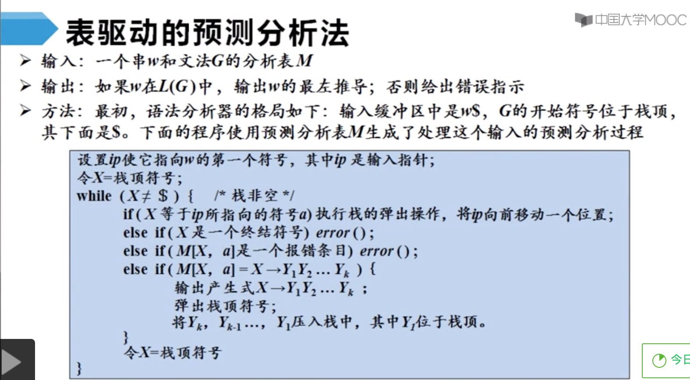

# 期末复习总结

​		             12 13 14

15 16 17 18 19 20 21

## 待复习知识点

词法分析 语法分析 语法制导翻译 中间代码生成

 进程管理 内存管理 文件管理 设备管理

网络体系结构 物理层 数据链路层 网络层 

 面向对象分析 数据库设计 系统总体设计

## 已复习知识点


操作系统绪论

传输层 应用层

软件分析 结构化分析

## 待复习习题

词法分析 语法分析 语法制导翻译 中间代码生成

操作系统绪论 进程管理 内存管理 文件管理 设备管理

网络体系结构 物理层 数据链路层 网络层 传输层 应用层

软件分析 结构化分析 面向对象分析 数据库设计 系统总体设计

## 已复习习题

#总结版

# 编译原理

## 剩余任务

看书4章 刷题课 4h


## 编译原理复习

编译原理待复习题
https://wenku.baidu.com/view/a23ae6c589eb172ded63b717.html
https://blog.csdn.net/weixin_44162921/article/details/103481890
https://blog.csdn.net/as1072966956/article/details/80690700
https://blog.csdn.net/as1072966956/article/details/80690742
https://wenku.baidu.com/view/e85da2a41eb91a37f1115ce2.html
https://blog.csdn.net/as1072966956/article/details/80690837
https://wenku.baidu.com/view/703f07d95022aaea998f0f91.html
https://www.jianshu.com/p/19bb92f853cf
https://blog.csdn.net/as1072966956/article/details/80690902
https://wenku.baidu.com/view/8f572ba331126edb6f1a10f5.html
https://wenku.baidu.com/view/9774d17427284b73f2425062.html
[编译原理学习资料整理](https://blog.csdn.net/CPPCPPCPPCPP/article/details/74066990?depth_1-utm_source=distribute.pc_relevant.none-task-blog-OPENSEARCH-8&utm_source=distribute.pc_relevant.none-task-blog-OPENSEARCH-8)

### 基本概念

1. 字母表
2. 字母表上的四种运算
3. 串
4. 串上的两种运算

### 文法的定义

1. 文法的形式化定义：终结符集合，非终结符集合，产生式集合，开始符号
2. 产生式的简写
3. 符号约定：终结符，非终结符（大写字母+斜体），文法符号（后面的大写字母），终结符号串（后面的小写字母），文法符号串（小写希腊字母），开始符号（第一个产生式的左部）

### 语言的定义

1. 推导和规约：直接推导，0步推导，正数步推导，若干步推导
2. 如何利用文法（语言规则）判定某一词串是否是该语言的句子？
3. 句型和句子的定义
4. 文法G生成的语言的定义

### 文法的分类

1. 0型文法
2. 1型文法
3. 2型文法
4. 3型文法
5. [4种文法的判断](https://wenku.baidu.com/view/eee561de6edb6f1afe001fa6.html)

### CFG2型文法的分析树

1. 分析树是推导的图形化表示
2. 句型的短语
3. 二义性文法

### 4.语法分析

### 重点

1. 自顶向下分析定义
2. 自顶向下每步要做的选择
3. 

LR分析法概述
LR(0)分析
LR(0)分析表构造算法
SLR分析
LR(1)分析
LALR分析法
二义性文法的LR分析
LR分析中的错误处理

[直接左递归和间接左递归的解法](https://www.cnblogs.com/Alexkk/p/5977899.html)
ps:期末问老师考间接左递归吗？


## 学长笔记

[2小时视频](https://www.bilibili.com/video/av80556432?p=3)
[学长笔记](https://www.cnblogs.com/littlepage/p/12099968.html)
对于普通程序员，我认为编译原理这门课主要掌握几点就够用了：1. 词法分析方面，掌握正则表达式，了解dfa/nfa。2. Parsing 方面，能读懂BNF，知道AST，会写简单的递归下降parser，会用antlr之类的parser generator。3. 优化方面，知道现代编译器的优化能力有多强，知道如何配合编译器写出高效易读的代码，避免试图outsmart编译器。4. 会实现简单的虚拟机（stack-based，不带GC），并把四则运算表达式翻译为虚拟机指令。

### 词法分析

### Thompson算法，子集构造算法（DFA，NFA)，Hopcroft算法

### 根据语言写出文法产生式

L1={a^n*b^n*c^i|n>=1,i>=0} 写出文法产生式
a^n*b^n:A->aAb|ab
c^i:B->Bc|epison
G1（S）:S->AB
A->aAb|ab
B->Bc|epison

L2={a^i*b^n*c^n|n>=1,i>=0} 写出文法产生式
G2（S）:S->AB
A->aA|epison
B->bBc|bc

L3={1^n*0^m*1^m*0^n|n,m>=0} 写出文法产生式
0^m*1^m:A->0A1|spison
1^n*A*0^n:S->1S0|A
G3（S）：S->1S0|A
A->0A1|spison

### 构造与某一正规式等价的自小DFA

DFA(Deterministic Finite Automation):确定有限自动机
NFA (Non-Deterministic Finite Automation)：非确定有限自动机
解题步骤：1.根据正规式画出对应状态的状态转换图
2.根据状态转换图画出对应状态矩阵
3.根据状态转化矩阵得到重命名状态转换矩阵
4.根据重命名状态转换矩阵得出DFA
！若题目中有最小，需要根据最终DFA进行化简
5.划分终态集与非终态集
6.递归分制，使任何两个不同子集都是可区分的，而同一个子集的中间状态共价
7.每个子集合并一个状态
8.含初态为初态含终态为终态

例1：1(0|1)*101

### 语法分析

### LL（1），消除左递归，提取公共左因子，构造预测分析表，分析过程

### LR（0），构造DFA，构造LR（0）分析表，进行语法分析，写出过程

### 短语，巨型，产生式，直接短语，句柄概念

### 语义分析

### 逆波兰表示法

### if，while的逆波兰

### 中间代码生成(汇编生成)

### 数组、if、while的中间代码

### 代码生成优化

### DAG图的优化

### 汇编执行(3地址或4地址代码的汇编执行)

### 编译原理

基于表格的预测和自上而下的递归预测
不能包含左递归
首FIrst集两两不想交，否则，提取左公因子
必须是LL1文法

自下而上的语法分析


### 课堂笔记

|     |     |
| :-- | :-- |

|NFA和DFA的区别     |1.NFA初始状态不唯一，DFA初始状态唯一2.NFA弧上的标记是子(单字符子/kz)，DFA弧上的标记是字符(串)3.NFA的转换关系是非确定的，DFA的转换关系是确定的     |
|     |     |
|     |     |
|     |     |
|     |     |
|     |     |
|     |     |
|     |     |
|     |     |
|     |     |

|                                   | 第4次笔记_18-4班元鹏                                         |
| :-------------------------------- | :----------------------------------------------------------- |
| 词法分析                          | RE+Thompson构造》NFA+子集构造法》DFA+Hopcroft算法》词法分析代码 |
| NFA和DFA的区别                    | 如果确定的DFA有限自动机，那么在使用它去进行词法分析的时候，通过一种状态继续输入一个字符得到的下一个状态时唯一确定的，而NFA这种非确定的无限自动机是不确定的，也就是说这种转换函数的结果可能对应多种状态，并且在NFA中，S0为一个非空的初态集 |
| 三个重要运算                      | 状态集epsion的闭包，状态集的a弧转换，状态集的a弧转换的闭包   |
| 状态集的闭包                      | 略                                                           |
| NFA转化为DFA的具体步骤-子集映射法 | 1.构建状态矩阵，计算epdion闭包2.使用三个重要运算3.将矩阵中的每一个状态集看做一个状态4.标记相同的状态集画出DFA的状态转移图 |
| 从NFA到DFA的转换                  | 图例没看懂                                                   |
| 从带空边的NFA到DFA的转换          | 略                                                           |
| NFA到DFA的算法-子集构造法         | 略                                                           |
| DFA化简                           | 1.确定的有限自动机很容易进行程序实现，非确定的有限自动机易于人工设计2.NFA和DFA是等价的3.用DFA做词法分析实现时，如果DFA的状态越少，算法用于保存状态转移矩阵的二维数组stateTrans代价就会越小，因此对于一个DFA我们能否找到一个状态数比他小但又和它等价的DFA的(即对DFA进行化简) 4.另一种步骤说明：初始化（将非终止状态和终止状态区分开），构造新的划分（将其中的可区分状态找出来），重复执行第二步直到每个状态集不能再分割，合并等价状态，删去无关状态 |

参考：[子集构造法举例](https://blog.csdn.net/u012359618/article/details/42456771)[Thompson构造法](https://blog.csdn.net/gongsai20141004277/article/details/52949995)                                                                                                                                                                                                                                     

|                          | 第3次笔记_18-4班元鹏                                         |
| :----------------------- | :----------------------------------------------------------- |
| 正则表达式               | 可以有较小的正则表达式按照特定规则递归地构建。最小的正则表达式就是字母表中的东西。 注意正则表达式的运算规律。 |
| 有穷自动机               | 1.定义：对具有一系列离散的输入输出信息和有穷数目的内部状态进行处理的系统建立的数学模型<br>2.功能：系统只需要根据当前所处的状态和当前面临的输入信息就可以决定系统的后继行为。每当系统处理了当前的输入后，系统的内部状态也将发生改变，如电梯控制装置<br>3.模型组成：输入带，读头，有穷控制器；用转换图来表示<br>4.FA定义的语言：给定字符串x，如果存在一个对应于串x的从初始状态到某个中值状态的转换序列，则称串x被该FA接受 |
| 最长子串匹配原则         | 1.当输入串的多个前缀与一个或多个模式匹配时，总是选择最长的前缀进行匹配<br>2.推论：在到达某个终态后，只要输入带上还有符号，FA就继续前进，以便寻找尽可能长的匹配 |
| 有穷自动机的分类         | 1.确定的有穷自动机DFA和不确定的有穷自动机NFA<br>2.DFA和NFA的等价性：对于任何NFA，存在识别同一语言的DFA；对于任何NFA，存在识别同一语言的NFA<br>3.正则表达式和有穷自动机FA也是等价的： |
| DFA                      | 1.DFA由一个五元组定义：包括有穷状态集，输入字母表即输入符号集合（约定空串不是字母表的元素），有穷状态集和输入字母表的笛卡尔积映射到S的转换函数(从状态s出发，沿着标记为a的边所能到达的状态)，s0表示开始状态，F表示接受状态集合<br>2.也可以用转换表来表示DFA，和转换图是等价的 |
| NFA                      | 1.定义和DFA相似，唯一区别是有穷状态集和输入字母表的笛卡尔积映射到2^S的转换函数，是从状态s出发，沿着标记为a的边所能到达的状态集合（注意是集合）<br>2.NFA的转换表没给全， 即如果转换函数没有给出对于某个状态-输入对的信息，就把空集放入相应的表项中 |
| 带有空边的NFA            | 1.<br>2.带有和不带有空边的NFA的等价性 |
| DFA的算法实现            |                 |
| 从正则表达式到有穷自动机 | 1.从RE->DFA若困难，则可以RE->NFA->DFA<br>2.根据RE构造NFA:<br>3.举例：  |


| 2-1，3-1，3-2          | 第2次笔记_18-4班元鹏                                         |
| :--------------------- | :----------------------------------------------------------- |
| 语言及其文法的基本概念 | 字母表，字母表的运算，串，串的长度，串的连接，串的n次幂      |
| 正则表达式             | 正则表达式的定义，运算的优先级，可以用RE定义的语言叫做正则语言或正则集合，RE的代数规律，正则文法与正则表达式等价 |
| 正则定义               | 给一些正则表达式RE命名，并在之后的RE中像使用字母表中的符号一样来使用这些名字来构造新的正则表达式 |

| 概述               | 第1次笔记_18-4班元鹏                                         | 备注                                                         |
| :----------------- | :----------------------------------------------------------- | :----------------------------------------------------------- |
| 考核               | 理论性强，慕课堂的单元检测10和课程讨论10（课堂交流区选择10个讨论），作业10，实验实践10，期末考试60 |                                                              |
| 什么是编译         | 高级语言到汇编语言或机器语言                                 | 1.计算机只能理解机器语言(比如十六进制的0和1，程序员需要记住各个操作对应什么操作数) 2.汇编语言（助记符MOV X，2把2放到X中）缺点是依赖于特定机器，指令效率也低3.汇编语言->机器语言叫汇编 |
| 语言处理系统       | 源程序+预处理器+编译器》汇编语言程序+汇编器》可重定位的机器代码+连接器/加载器》目标机器代码 | 1.预处理器（聚合不同文件中的源程序，转换宏语句）2.可重定位的机器代码（在内存中存放的起始位置不固定，起始位置+相对地址=绝对地址）3.连接器（将多个可重定位的机器代码文件连接到一起，解决外部内存地址问题）4.加载器（修改可重定位地址，并将修改后的指令和数据放到内存中适当的位置） |
| 编译系统的结构     | 词法分析器》语法分析器》语义分析器》中间代码生成器》机器无关代码优化器》目标代码生成器》机器相关代码优化器；前4个是分析部分叫前段，与源语言相关，后2个是综合部分叫后端，与目标语言相关 | 1.翻译过程：分析源语言得到句子的语义（词法分析得词性->语法分析得短语和句子结构->语义分析得各个短语在句子中充当什么成分），生成目标语言2.语义分析划分句子成分，从核心谓语动词入手，然后分析句子上下文3.语法分析+语义分析到中间代码可以直接通过语法制导技术实现 |
| 词法分析的主要任务 | 扫描字符，识别单词，确定单词类型，将单词转换成词法单元token形式<种别码，属性值> | 第三章介绍如何实现词法分析器                                 |
| 语法分析的主要任务 | 从token序列识别出各类短语，构造语法分析树来描述语法结构      | 文法：<D>-><T><IDS>；声明语句D由类型T连接标志符序列IDS和分号构成 |
| 语义分析的主要任务 | 收集标识符的属性信息（种属类型，存储位置和长度，值，作用域，参数和返回值信息），语义检查（未声明就是用的，重复声明，运算类型不匹配的，操作符和操作数类型的不匹配） | 如何根据语法规则为输入句子构造分析树                         |
| 中间代码生成       | 以源程序的中间表示形式为输入，为程序中使用的变量合理分配寄存器 | 常用的中间代码表示形式：三地址码（有类似汇编语言的指令序列组成），语法结构树/分析树 |


## 词法分析


## 语法分析

### 自上而下的语法分析

###求一个非终结符的First集

first集：能推导出的所有串首终结符

1.如果产生式的右部第一个是终结符（运算符+具体单词）打头，将该运算符直接加入；如果可以直接推导出空串，空串也直接加入

2.如果产生式右部第一个是非终结符，将该非终结符的First集加入

###  求一个串的first集

将所有符号的first集(非空)加入到串的first集中，只有所有first都有空串，才将空串加入到该串的first集

### 求非终结符A的follow集

先将$加入到开始符号的follow集中

分析每一个产生式，如E->TE'

先将E'的first集中的所有终结符(不含空串)加入到T的follow集中(3fi->2fo)

如果E‘的first集中有空串，再将所有E的所有follow集加入到T的follow集中(3fi有空，1fo->2fo)

将E的follow集加入到E’的follow集中(1fo->3fo)

如果某非终结符后有终结符，可以将该终结符加入到该非终结符的follow集中,(将后跟终结加到fo中)

再将以上过程重复，直到所有的非终结符的follow 集不再更新

```
终结符或空串打头直接加到fi
while(first集更新){//遍历非终结符字母表,确保都不能再加了
非终结符打头，并上该非终结符的fi
}

$加入到开始符号的follow集
直接推出终结符，加到fo中
//产生式通式 E->TE'  1->23
while(follow集更新){//遍历非终结符字母表，确保都不能再加了
  2是非终结符，3是终结符，加到的2的fo中
  3fi(不含空的)->2fo
  if(3fi有空) 1fo->2fo
	1fo->3fo
	
}


```


### 计算文法各产生式的select集


产生式右部第一个是非终结符的：该非终结符的first集中的终结符

产生式右部第一个是终结符的：就是该终结符

产生式右部是空串的：产生式左部的follow集

特点：如果所有的相同产生式左部的select集都互不相交，则该文法是LL1文法

### 根据LL1文法的select集构造预测分析表

预测分析表中的内容是，根据非终结符的产生式的select集判断非终结符在遇到某个输入符号时使用的产生式


### LL1文法的预测分析法


### 递归的预测分析法

编写每一个非终结符对应的过程时，根据预测分析表进行产生式的选择


### 非递归的预测分析法

根据预测分析表构造一个自动机，也叫表驱动的预测分析

由输入带+栈+预测分析表构成

ES入栈，剩余输入为id+id*idS

当E遇见id，会输出TE'，将E出栈，将TE'入栈

当T遇见id，会输出FT'，将T出栈，将FT'入栈

当F遇见id，会输出id，将F出栈，将id入栈，此时站内元素为idT'E'S,当栈顶元素和剩余输入带头部相同时，栈顶元素和剩余输入带头部同时出栈

以此类推，直至栈空且剩余输入也空




### 自底向上语法分析


### 移入规约分析

!!!每次被规约的符号串称为“句柄”，下图有6个句柄

栈内符号串+剩余输入=“规范句型”（最右句型）下图有7个规范句型


### 如何正确识别句柄

移入规约分析的关键问题--当前栈中元素有多种规约方式选择时


当前句型的直接短语一定是某个产生式的右部

产生式的右部不一定是当前句型的直接短语

单独的iB不是高度为2的子树的边缘，所以iB不是当前句型的直接短语

而且，当前句型有两个直接短语，一个是以<IDS>为根节点的高度为2的子树的边缘<IDS>,IB，一个是以<T>为根节点的高度为2的子树的边缘real

句柄是句型的最左直接短语，所以以<IDS>为根节点的高度为2的子树的边缘<IDS>,IB才是当前句型的句柄

具体实现，下见

### 构造LR分析表概述

构造给定文法的LR分析表

不同的分析法有不同的LR分析表构造方法


### LR(0)分析法--语法分析4还得再听

SLR=SLR分析表=LRO分析+FOLLOW=LR0分析表+FOLLOW=LR自动机+FOLLOW集

根据一个给定的文法，构造对应的LR0自动机，然后得到LR分析表，然后程序根据LR分析表进行LR分析

对输入进行从左到右的扫描，反向构造出一个最右推导序列，需要向前查看0个输入符号的LR分析

 


#### LR0分析表的用法


#### LR0分析程序的写法


#### LR0分析表的写法


根据文法写出增广文法对应的各个状态，简化状态，构造LR自动机，得到LR分析表

当一个项目的圆点后面是一个非终结符时，表明这个非终结符具有等价项目，可以被简化成一个状态，实际上LR0自动机的每一个状态都是一个项目集闭包Closure


#### LR0分析表构造算法

构造LR0自动机需要两个函数

closure函数：计算给定项目集I的闭包


 

GOTO函数：返回项目集I对应于文法符号X的后继项目集闭包


从文法的初始项目集开始，利用closure函数和GOTO函数就可以构造LR0自动机的状态集C（即规范LR0项集族）


当A遇到输入符号a的时候，采取一个移入动作即将a移入到栈中，然后转入状态j

如果状态i中包含一个规约项目A->a`并且A！=S‘，那么对于每一个终结符和$，执行ACTION[I,A]=RJ；即在状态i遇到任一个输入符号都执行规约动作用a定义为α进行规约

如果状态i中包含文法的接受项目S’->S~,领ACTION[I,$]=acc,也就是状态i遇到结束符号时我们进行成功接收这一操作 


M=(M的状态集就是规范LR0项集族C，M的符号表就是文法的非终结符集合和终结符集合的并集，M的转换函数就是GOTO函数，M的初始状态就是文法的初始项目的项目集闭包，M的终止状态集合中只有一个状态就是文法的接受项目集闭包)

#### LR0分析过程中的冲突


某状态的两个项目存在移进/规约冲突，事实上构造LR0分析表中就存在这种冲突。

还存在规约/规约冲突，即将栈顶的空串规约为不同的文法符号

只有没有冲突时给定的文法才是LR0文法，上下文无关文法不总是LR0文法


### SLR分析法-8min-1h

SLR=LRO+FOLLOW=不向前查看输入符号+LR分析表+FOllow

在遇到规约状态的产生式，不能直接规约了，而是只有下一个输入符号是该产生式左部的FOLLOW集中的元素再进行规约


对于LR分析法中的规约冲突，产生式规约后的文法符号的的FOLLOW集中如果不包含规约后的情况，那么这种规约就不是句柄不能规约，SLR就是引入FOLLOW集的LR0分析法。

对于K=0的情况，会省略0.


这n+1个集合两两互不相交，因此输入符号a最多只能属于其中一种情况，即最多只能采取一个动作就不会冲突了。

关键是对这个两两不相交的设计，看a到底怎么操作。即SLR能处理的文法是，只有判断出下一个输入符号a属于规约的文法的follow集才进行规约。


这里根据文法和follow集和自动机构造aciton表的方法太棒了，怎么写SLR分析表绝对是个考点


和LR分析表构造算法不同的是主要是规约动作的条件

SLR也有冲突


### LR1分析法-20min


LR0+Follow集+下一个输入符号来丰满规约条件


展望符是非终结符后面必须紧跟的终结符


LR1自动机的构造过程

7min-13min，自己搞一遍视频中的文法再看视频才有用

文法-LR1自动机-LR1分析表-LR1程序

LR1分析表中的规约项目，只有当下一个输入符号匹配的时候才能执行规约动作

LR1比SLR多的状态正是LR1比SLR更加细化的地方

如果除展望符外，两个LR1项目集是相同的，则称这两个LR1项目集是同心的

LR1项目集闭包的计算

LR1后继项目集闭包的计算

LR1分析表的构造算法

### LALR分析法-13min

为了简化同心项目集

[一个老弟的CSDN博客，魔方一下](https://blog.csdn.net/weixin_44225182/article/details/106600648)

https://blog.csdn.net/weixin_44225182/article/details/104092591

https://www.cnblogs.com/sunshine-zzl/p/6719831.html

### 二义性文法的LR分析-5min

### LR分析中的错误处理-7min

## 语法制导翻译

##中间代码生成

## 参考资料

LL1语法分析器：https://blog.csdn.net/Jamence/article/details/84502471

递归下降分析法：https://blog.csdn.net/lishichengyan/article/details/84196947


### 西安交大老教授

[1](https://www.bilibili.com/video/BV1P4411i7W3?from=search&seid=6762744086131865031)
[方舟](https://www.bilibili.com/video/BV1S7411b7Gq?from=search&seid=6210743396226136848)
24 LL1文法
24 规范规约

### 编译原理龙书

### 语法分析

### 引论

1. 语法分析器的作用
2. 代表性的文法
3. 语法错误的处理

### 上下文无关文法

1. 正式定义
2. 符号表示的约定
3. 推导
4. 语法分析树和推导
5. 二义性
6. 验证文法生成的语言
7. 上下文无关文法和正则表达式

### 设计文法

-  词法分析和语法分析
-  消除二义性
-  左递归的消除
-  提取左公因子
-  非上下文无关语言的构造

### 自顶向下的语法分析

如何正确地识别句柄是自底向上分析的关键问题
等价于寻找输入串的最左推导的过程

### 自底向上的语法分析

1. 递归下降的语法分析
2. FIRST和FOLLOW

### LR语法分析技术介绍：简单LR技术

用于自底向上语法分析

- 为什么使用LR语法分析器

1. 表格驱动
2. 只要存在这样一个从左到右扫描的移入-规约语法分析器，它总是能够在某文法的最右句型的句柄出现时在栈顶时识别出这个句柄，那么这个文法就是LR的
3. 好处：文法通用，最通用的无回溯移入-规约分析技术，尽早检错，比LL文法可描述更多语言(LLK要求必须是产生式右部推导出的串的前K个符号)
4. 手工构造工作量大，引入Yacc

- 项和LR(0)自动机

1. 项集决定移入-规约语法分析器何时移入、规约
   2.项A->XYZ·才表示是把XYZ规约为A的情况
2. LR0自动机的每个状态代表了规范LR0项集族的一个项集
3. LR(0)语法分析的含义：存在这样一个从左到右扫描的移入-规约语法分析器，它总是能够在某文法的最右句型的句柄出现时在栈顶时识别出这个句柄，并在做出语法分析决定时向前看0个输入符号，从而反向构造出一个最右推导序列
4. 再看一遍LR(0)自动机的推导过程

- LR语法分析算法
  再看一遍语法分析器的处理过程
  

### 更强大的LR语法分析器

- 规范LR(1)项
- 


### 语法制导翻译

### 语法制导定义


[人话版：编译原理LR(0)项目集规范族的构造详解](https://blog.csdn.net/Johan_Joe_King/article/details/79051993)
[编译原理之LL(1) 、LR(0)、SLR、LR(1)、LALR文法的对比](https://blog.csdn.net/zuzhiang/article/details/79047743)
编译原理的句柄是什么？

比较LL文法和LR文法
总是从左向右被扫描，每次扫描一个符号

|            | LL文法 | LR文法           |
| :--------- | :----- | :--------------- |
| 语法分析器 | 手工   | 自动化工具构造的 |
|            |        |                  |
|            |        |                  |
|            |        |                  |
|            |        |                  |


# 计算机网络

## 剩余任务

还剩6看书6章刷题课 3h


## 课程安排

[期末大题](https://www.bilibili.com/video/av64989536/?spm_id_from=333.788.videocard.1) 到上课时间：看首页和资料里的视频和PPT，然后完成作业和测试 学习通首页+资料+作业上课后到周五之前+每周五晚上周六上午考试（一小时以内）+讨论 手势签到15分 课程学习通首页音视频10分 资料阅读600分钟20分 作业在线做一份，作业本写一份 期末检查电子笔记必须是手写体

## 总结版

## 计算机网络体系结构

分层结构，模型功能及相关协议接口和服务，性能指标的计算

### 考点

- OSI参考模型与TCP/IP模型
- 计算机网络协议、接口、服务等概念
- 网络体系结构的概念，分层的必要性（包括5层和7层结构）
- 无连接服务和面向连接服务的联系和区别

### 计算机网络的三种定义

广义远程信共享，目的单元规则统，超级用户透明观

### 组成

硬软协边缘工作，功能通信和资源

### 功能

通信共享分布式，负载均衡可靠性

### 分类

WMLP范围分，广播点点传输分。

总线星形是早期，环形网状拓扑分。

共用专用使用分，电路报文和分组。

RFC变草案，建议草案因特网，标准电信电气子。

### 7大性能指标定义

带宽Hz比特秒，发传出排四时延。

时延带宽RTT，吞吐信道利用率。

最高速率称带宽。

### 计算机网络分层结构

网络各层+协议，抽象划分及功能。

SDUPCI，比特帧分组报文。

取下传上两回事，接口透明对等通。

### 计算机网络协议、接口、服务的概念

同层语法义同步，线管差控数据转。

紧邻接口SAP。协议水平服务垂。

高层可见才服务，请求被证实，指示可响应。

面向连接需先建，可靠服务有纠错，应答若有系统实。

### OSI参考模型

上下三层分子网，中级系统只二三。

物理透明传比特，接口参数意特征。

封帧差流传输管，SHPS帧中继，点到点。

路由选择子网控，流拥差控国互联，IAO主IP。

进程通信端到端，复用分用屏子网。

进程建连有序传，管理会话校验点。

标准数结和编码，压缩加解表变换。

网络应用供访O，复杂协多FSH。

### TCP\IP模型

网络接口网际层，传输合并三应用。

接受IP分组发指定。

分组有序高层负，分组格式和协议。

剩余两层尚类似。

### TCP\IP模型与OSI参考模型的比较

分层协栈可互联，模糊通差是后者。

协议菜鸟划IP。传输面向网际无，常考点。

### 补充知识点

王道例题4、7、9、10、11、12、13-18，综合应用题

## 物理层

奈奎斯特定理和香农定理的应用、编码与调制技术、数据交换方式，电路交换、报文交换与分组交换技术

### 考点

- 奈奎斯特定理和香农定理
- 电路交换、报文交换与分组交换的工作方式与特点
- 中继器和集线器的功能以及实现原理
- 有关通信基础的基本概念

### 通信基础

基带数字宽模拟，信源宿道有无线。

串远并近同异步，单工半双和全双。

波特码元比二进，带宽计网新定义。

### 那奎与香农

采样大等二倍max，码间串扰高频丢。

离散电平2底采，理想低通每秒俩。

编码牛逼码无穷，无噪信传可无穷。

10倍10底信噪比，带宽2底1和比。

带宽信噪定极限，低于极限可无差。

那奎码元香农bit，前者理想可无限。

### 编码与调制

模拟调制数字编，数字先进模拟编。

带通基带两调制，传输需高带宽用。

基带传输三编码，两种非归中间跳。

脉冲编码三步骤，采样量化和编码。

### 数据传输方式

双方独占物理路，延实序适控冲突，建时信利缺标灵。

报文节点存储转，无动靠利多目标，转发时延大缓存。

分组然后存储转，加速简存少出错，传输实验麻烦多。

HDLCX2.5和TCP，CSMA/CDIP和UDP。

建物规序瘫，带拥浪存透，收费。

### 分组交换的数据报与虚电路方式

发送缓存再转发，无努插吞健不同。

建立传输和释放，建连序虚开销小。

建址状转路失效，差流序靠网络层。

### 传输介质

双绞电缆和光线，红外微波非导向。

数模都传分屏蔽，5075单多模。

传输介质是0层，机电功能和规程。

### 物理层设备

放大模拟中继数，中心广播集线器。

冲突不隔带宽均，局域总线网CSMA/CD。

### 知识点补充

## 数据链路层

链路层基本概念和功能，滑动窗口机制、三种可靠传输协议、各种MAC协议、HDLC协议和PPP协议，特别是CSMA/CD协议和以太网帧格式，局域网的争用期和最小帧长的概念、二进制指数退避算法，中继器、网卡、集线器、网桥和局域网交换机的原理及区别

### 考点

- 流量控制与可靠传输机制
- PPP协议和CSMA/CD原理
- 争用期和截断二进制指数退避算法！
- 网桥的概念和基本原理
- 组帧机制和差错控制机制
- 循环冗余码和海明码
- 以太网的MAC帧格式

### 听课笔记

运输层用来屏蔽应用层数据的杂毛数据变成无差异数据然后交给网络层，网络层把数据分组并加上报文，链路层处理这些数据（封装成帧）然后转换成电信号或光信号交给物理层进行传输 核心部分在解析出网络层的报文的目的地就可以往后传输了

链路可以理解成网线（物理通道），数据链路（两个节点之间的逻辑通道）=链路+其他物理设备+数据传输协议，节点和节点之间的协议才叫数据链路协议

封装成帧就是在一段数据前后分别添加首部和尾部 MTU帧的最大传送单元 SOH帧的首部，EOT帧的尾部 ESC转义字符

使用字符填充法弥补实现透明传输的缺陷 

循环冗余检验CRC技术用来实现差错检测，降低误码率BER（传输错误的比特占所传输比特总数的比率）：详见天勤3.3异或运算实现循环冗余码中的二进制除法 

CRC发送：运算就是在数据M后面添加供差错检验用的n位冗余码，然后构成一个帧发送出去，一共发送k+n位。然后将这n+k位数据对提前商量好的除数P做模2运算，然后将得到的余数R作为冗余码添加在数据M的后面发送出去 

CRC检验：把收到的每一个帧都除以同样地除数P（模2运算或者说异或运算），然后检查得到余数R，若为0则这个帧没有差错，若余数R不等于0，则判定这个帧有差错，就丢弃 

在数据后面添加上的冗余码成为帧检验序列FCS，CRC和FCS不一样，CRC是一种常用的检错方法，而FCS是添加在数据后面的冗余码，FCS可以用CRC这种方法得出，但CRC并非是得到FCS的唯一方法 

要做到可靠传输（即发送什么就是什么）除了使用循环冗余检验CRC差错检测技术实现无差错计收，还必须加上确认和重传机制 

流量控制：由收方控制发方的数据流；有确认有连接的流量控制方式，超时计时器，结局重复帧问题就是使每一个数据帧带上不同的发送序号，解决帧的编号过长问题就是使数据帧中的发送序号以0和1交替的方式出现在数据帧中

PPP协议是目前使用最广泛的在用户计算机和因特网服务提供者ISP进行通信时所使用的数据链路层协议 

PPP协议的特点：简单，封装成帧，透明性，多种网络层协议，多种类型链路，差错控制，检测连接状态，最大传送单元，网络层地址协商，数据压缩协商 

在TCP/IP协议族中，可靠传输由运输层的TCP协议负责，因此数据链路层的PPP协议不需要进行纠错，不需要设置序号，不需要进行流量控制，只支持单个点对点的链路通信，只支持全双工链路 

PPP协议的组成：将IP数据报封装到串行链路的方法+用来建立、配置和测试数据链路的链路控制协议LCP（物理层）+一套网络控制协议（逻辑层） PPP协议的帧格式： 字符填充法：硬件完成 0比特填充法： 

PC-光线调制器-光线调解器-集线器

### 为网络层提供的3类服务

### 链路管理的定义

### 帧定界、帧同步与透明传输的定义

### 流量控制

### 差错控制

### 为什么既要加首部，又要加尾部

### 字符计数法

1. 字符填充的首尾定界符法
2. 零比特填充的首尾标识法
3. 违规编码法

## 网络层

### 考点

- 子网划分和无分类编址CIDR
- 路由与转发，即各种路由算法
- IP地址的分类、IP数据报格式、NAT
- ARP、DHCP和ICMP
- 3种常用路由选择协议：RIP、OSPF、BGP
- IP组播、移动IP的基本概念
- 路由器的组成和功能


### 网路层的功能 

网络层的三个功能

### 路由算法 

两种动态路由算法：距离-向量路由算法RIP和链路状态路由算法OSPF 链路状态路由算法的三大特征 如何理解层次路由的区域、区域边界路由器、骨干区域、0.0.0.0骨干区域、不同自治系统交换信息、自治系统边界路由器

### IPV4

IPv4 默认情况下讲IP数据包首部看成20B（20B=5*4B=160位）：版本4位，首部长度4位，区分服务8位，总长度16位（2B，1B就是1个字节=8位），标识16位，标志3位，片偏移13位，生存时间8位，协议8位，首部校验和16位，源地址字段32位，目的地址字段32位（重点记忆首部长度、总长度和片偏移）[IP数据报的首部](https://blog.csdn.net/cainv89/article/details/50676670) 首部长度占4位，但是以32位为单位？ 说出IP数据包首部各个字段的意义和功能：IP的版本，长度4位能表示16个数象征首部长度为0-15字节，总长度16位是首部和数据之和的长度单位为字节，当一个数据报的长度唱过MTU时必须分片每次分片标识就会+1并赋值给新的表示字段，标志是分片简单的前后关系和能否分片的判断，片偏移表示分片在原分组的相对位置他表示的数的单位是8字节每个分片的长度一定是8B的整数倍， [根据主机IP地址和子网掩码算主机ID](https://zhidao.baidu.com/question/1705827123612866980.html) [CIDR的两类题型](https://www.iteye.com/blog/uule-2102484)

### IPV6

### 路由协议

### IP组播

组播的应用 人们需要什么样的组播机制 仅用于UDP协议而TCP协议受其定义只能单播 为什么使用组播的两个原因（一个特点+下面的一个优点） 组播组的2个特点 主机使用什么协议来加入组播组？使用该协议实现因特网组播的2个步骤？ 每个D类IP地址标志一个组播组 组播数据包和一般的IP数据报的5个区别 IP组播的两个阶段 ~~？D类IP地址与以太网组播地址的映射关系？ 因特网组管理协议（使路由器知道组播成员）和组播路由选择协议（和其他路由协同）分别的功能是？ IGMP工作的两个阶段：第一个阶段发送-接受-转发三个方法，第二个阶段一个方法两个if 组播路由选择协议的目的？怎么理解这三个特点？？？~ 实现因特网组播的三种路由算法？

### 移动IP

 移动IP技术的两个要点 移动IP的目标 什么是移动结点 使用移动IP后移动结点的特性 本地代理和外部代理的区别 移动IP和移动自组网络的区别 移动IP和动态IP的区别 为什么要引入转交地址 移动IP的通信过程：连接外地链路-转交地址标识进行路由选择-if收到新转交地址，绑定以实现本地代理的注册（可以了解移动结点的当前位置） 什么是移动绑定 NET转换技术是否会改变源IP地址？ 移动IP的基本通信流程：


```
移动节点类
while(1)
if(位置在本地) 
    使用主地址进行TCP/IP通信
    if（之前在外地又回到本地）注销转交地址（辅地址）
if(位置在外地网络) 
    （主地址不变）向本地代理注册当前位置地址（转交地址）
    if(需要发送IP数据包) 将IP数据包发给外网路由器或外部代理（IP数据报包含通信对端的地址）
    if（通过隧道有转交地址的信息过来） 解封IP数据报 保存发送过来的IP分组 根据报文类型进行处理
本地代理类
while（1）
if(收到转交地址注册) 构建隧道 封装IP数据报 通过隧道给转交地址发送截获的IP分组数据报 解除隧道
```

### 补充知识点

## 传输层


### 考点

- 传输层在计算机网络中的地位、功能、工作方式及原理等，
- 掌握UDP及TCP （如首部格式、可靠传输、流量控制、拥塞控制、连接管理等）
- TCP报文分析、流量控制与拥塞控制机制，出选择题、综合题的概率均较大

### 传输层功能

- 四大功能与网异，面向进程非主机。进程不同议相同，协议相同进不同。（协议不同IP报同，剥去首部协议异）。首部数据都差检，两种协议同时存。

### 传输层寻址与端口

- 数据上下需端口，类比IP地址和MAC。16比特端口号，主机不同意义无。1024熟知号，47倍登记不可重，直到64倍客户临时号。
- 识别端点套接字，源和目的报文需。

### 无连接服务于面向连接服务

先建被管需释放，不建直发尽力传。

IP基础全双工，传输可靠用户不。

没有组播开销多，多路复用错误查。

### UDP数据报

多快好省传的少，可靠设计最努力。

面向报文不分割，4个字段ICMP。

### UDP检验

12B伪首，数据两号两址都被检。

全0入段添伪首，2字节一单位。数据不足单位用0补，反码求和取反再入段。伪首0补不发送。

添伪首，不足单位用0补。反码求和，不全1则丢弃。

### TCP协议特点

面向连接电和字，可靠四点全双工随时。

准备待确发送缓，待收插队接收缓。

### TCP报文段

TCP报文IP数据封，运载数据建释应。

首部20+4NB，逐字传送序号段。

两口两号12B，偏移保留466，窗口校验指针完，选项可变填充保4B。

紧急确认和推送，复位同步有终止。

### TCP连接管理

感知协商和分配，端口IP定连接。

243，SYN ACK，seq ack。

二次三次服客户，SYN洪泛真可怕。

2343，FIN ACK，seq ack。

### TCP可靠传输

校验和序号，确认和重传。

超时到期未确认，加权平均往返时间。

发送收到3冗余，被确后段快速重传。

### TCP流量控制

滑动窗口控速度，接受拥塞最小值。

传定用户动态边，数定结点不能动。

接受控制发送方。

### TCP拥塞控制

注入过多路过载，时延增加全局控。

接受容量网络容，发送上限选最小。

RTT加倍到门限，加法增大门限缩，cwnd取门限。

发收三冗要重传，乘法减小加法增。

发检超时慢拥塞，发收冗余快快恢。

### 疑难点

### 知识点补充

## 应用层

### 考点

域名解析FTP，HTTP

### 客户/服务器模型

Client/Server,C/S

3流程1特征，不等不通扩展差

### P2P模型

对等方直接通信，压小共享扩展好，健壮内存网络塞

### 层次域名空间

DNS-UDP，53号C/S

三级域名夵不分，标号63-允许

### 域名服务器

区内结点通，映射+连向。

13根域器，集群指顶级。

顶级或回答，主机授权记。

本地连接DNS。

### 域名解析过程

域名IP正解析，递归1次迭查多。

### 文件传输协议FTP

跨种类远程管理，公用共享可并行。

开端口等连接，从属处理回等待。

### 控制连接与数据连接

21号ASCII7，不传文件一直开。

20创建进程与连接，带外传送本地小修。

### 电子邮件系统的组成结构

异步通信不打招呼，UA自身C/S推拉6步。

### 电子邮件格式与MIME

来去主题+主体，新字段格式转换。

### SMTP和POP3

TCP25建传放，缓扫直建就绪HELO。

MailRcptData,250OK,354CRLF,Quit221。

TCP110下保和下删，IMAP会话信息取部分，用户163HTTP。

### WWW的概念与组成结构

资源URL标识，内核三标准。

站点+网页，工作三流程。

### 超文本传输协议HTTP过程

服务监听TCP80，建立连接发请求。

收到请求HTTP响应，解释显示再释放。网站访问8过程。

### HTTP特点

无状态高并发，Cookie数据库记录。

本身无连接，非持久文档+2RTT。

(持久针对TCP，流水针对HTTP)

非流水响应才发下，连续逐个发请求。

### HTTP报文结构

两个MAC6+6，2类20IP首。

反两IP4+4，20TCP首，55开始TCP数。

方法URL和版本，版本状态和短语。

2个间隔CRLF，首冒空值CRLF。

首部实体CRLF隔，实体主体偶尔响。

9个应用层协议。

## 知识点补充

###实验一

任管进程PID，运行msconfig和regedit。

cmddos界面， dircd..看文件，ipconfig /all 网络配置。ping 发ICMP，127.0.0.1测本地网卡。

netstat所有端口，-help -ano和任管的PID对比，tracert 看中转IP。

arp绑定网关防攻击，-a查看d删除，-s绑定ip mac

### 实验二

## 相关资料

计算机网络习题

https://wenku.baidu.com/view/8b90e45e541252d380eb6294dd88d0d233d43cfc.html?fr=search

https://wenku.baidu.com/view/a5492efd657d27284b73f242336c1eb91b3733c6.html?fr=search

https://wenku.baidu.com/view/1b867d518e9951e79a892719.html

https://wenku.baidu.com/view/7369563ecd1755270722192e453610661ed95a80.html?sxts=1593057615036

https://wenku.baidu.com/view/562fb6708e9951e79b892767.html?sxts=1593057611505

总结

https://www.jianshu.com/p/1cf5e20e11a9

https://wenku.baidu.com/view/45cb918e6d85ec3a87c24028915f804d2a16872c.html


子网划分

[https://baike.baidu.com/item/%E5%AD%90%E7%BD%91%E5%88%92%E5%88%86/5446046?fr=aladdin#2_3](https://baike.baidu.com/item/子网划分/5446046?fr=aladdin#2_3)


反码求和检验

https://blog.csdn.net/samaritan_infi/article/details/78884268

# 操作系统

## 剩余任务

还剩5看书5刷题课 4h

## 绪论

### 考点

两态中异和调用，功能特征和结构，发展分类及特点。

### 概念

程序集合控资源，提供接口工作调。

### 特征

时段并发刻并行，互斥共享同时访，并发共享互条件。

虚拟处内外时空，速度结果时间有异步。

### 功能

进程存储5+5+5，文件设备4+4。

管理者接口扩充，分时实时交互式，脱机说明书批处理。

### 手工操作阶段

资源CPU系统无

### 批处理阶段

操作系统开始现，自动顺序和单道。

多道宏并微观串，处理器内存I/O分。

程序数据组织存，响应时长交互无。

### 分时操作系统

同时且交互，独立还及时。

### 实时操作系统

实时分硬软，及时且可靠。

### 网路操作系统和分布式操作系统

资源共享主机通，分布并行全共享。

### 个人计算机操作系统

手工脱机早起批，多道分时和实时，网络分布个人广。

### 操作系统的运行机制

目态与管态，时钟中断原语3管理。

时钟计时最关键，中断机制是基础，底层原子短且频。

作业进程设备块，链表消息缓冲区，空闲登记内配表。

状态调度派创撤，分回内保和对换，缓冲管理设分回。

### 硬件中断机制和异常处理

切换管态需标志，CPU指令是划分。

外部事件叫中断，内部事件不屏蔽。

关保印保开，执关恢开返。

### 系统调用

资源操作不直行，系统调用防影响。

进程执行调调用，执行调用再返回。

系统调用和中断，程序出错执特权。

管态要转需访管，访管指令非特权。

### 大内核和微内核

管态干啥怎么干，大微内核两体系。

内核代码难维护，分离内核与服务。


## 进程管理

### 大纲要求

概念状态与转换，控制组织和通信

概念时机和过程，准则方式与算法

概念方法信号量，管程经典同步题

概念策略和预防，避免检测和接触

### 核心考点

进程概念与调度，信号量算法死锁

### 知识框架


### 进程的概念和特征

### 进程的通信

读写操作需工具，数据结构存储区。

格式信息是单位，发送接收两原语。

pipe文件是管道，互斥同步和识别。


### 线程概念和多线程模型

#### 线程的基本概念

并发时空开销小，系统并发性能高。

基本最小的单元，ID计数集合堆。

实体调度基单位，不拥资源共享全。

互相创建和撤销，多个线程可并发。

运行间断三状态，进程资源线程分。

#### 线程与进程的比较

资源和调度单位，线程切换进程恒。

不拥资源创撤切，并发程度又提高。

同一进程地址共，同步通信易实现。

#### 线程的属性

轻型实体符和块，用户同防创线程。

共享资源和地址，多U并发执三态。

#### 线程的实现方式

应用程序线程库，线程管理只用户。

内核维护和调度，应程只有编接口。

用户控件创调同，内核控件有映射。

#### 多线程模型

用户线管效率高，进程易阻不并行。

并发较强开销大，多对多型优点多。

### 王道小结

描控程动执过性，进程要引入。

程序活动+代码，程序数据PCB。

反映切换和划分，进程三功能。

### 王道2.1.8


## 内存管理

### 大纲要求

内存管理3概念，交换覆盖2分配。

虚拟内存求分页，4种置换一策略，工作集抖动。

### 核心考点

分页相关最重点，内存分配有区别。

### 内存管理概述

收发变换扩内存，存储保护是功能。

分块链接再装入，3种地址序号变。

一静两动链接法，绝对可重动态装。

(早链边边用到装，预知一次两址加，多变都相基址器，软硬复杂可共享)

段相关物理不透明，硬件地址重定位。

四种寄存器，两个保护键，上下基限存储块。

### 覆盖与交换--内存扩充

程序单位覆盖区段，设计内存执行顺序。

程序出入快速磁盘，时够空闲才暂用，UNIX和挂起。

### 连续分配管理方式

单作无用固空间，作间不分动存块。

单单浪费内碎片，分区表静重内碎片。

修改表链4算法，


## 文件管理

## 设备管理

### I/O控制方式

3部分4方式6功能，程序中断DMA和通道。

得令换数和供查，识址缓冲和差控。

轮询4步简单浪费，中断断次利也高，5过程。

数据块单向始末，间隔和传控器不同。

3R1C多快省，方向地址与长度，不能独立硬件多。

简单指令无内存，字多数多和选择。

字节交叉低速搞，单道高速利用低。

一组干预还并行，4步3并硬件多。

### I/P软件层次结构

## 参考资料

### 30天自制操作系统

目标：使用C语言和汇编语言编写具有窗口系统的32位多任务操作系统
什么是操作系统：作者认为什么软件都可以算是操作系统
开发操作系统的方法：不要一开始就一心想要开始开发操作系统，先做一个优点操作系统样子的东西就行了，慢慢的，演示程序不再是简单的演示程序，而是越来越像一个操作系统了
关于复杂的概念：对于因兴趣而学习的东西，用自己的方法做自己喜欢的事情，先时间操作一次，通过时间找到其中的问题，再来看看是不是已经有了这些问题的解决方案，这样下来更能深刻理解那些复杂的理论
如何开发操作系统：想办法制作一张含有操作系统的，能够自动启动的磁盘


# 系统分析与设计

## 剩余任务

还剩8章节看书 1h

请简述结构化方法和面向对象方法的异同？(答案直接写到作答处即可)

相同：

1.二者都以功能（用例）为驱动

2.都是经过需求分析，概要设计和详细设计者三步才进入实现阶段

3.分析和设计结果都主要通过规格说明书和图表来展现。

不同：

1.面向对象使用对象、类、继承、封装、消息等面向对象语言语言的基本概念来进行程序设计，更适于面向对象语言编写，结构化方法则适用于面向过程语言的开发。

2.面向对象方法采用面向对象模型，结构化方法采用结构化模型。

3.面向对象分析和设计比结构化分析和设计更复杂，需要建模的图表更多。

期末考试题

https://wenku.baidu.com/view/74d14575df36a32d7375a417866fb84ae45cc392.html

## 面向对象基础

### 基本思想

使用对象、类、继承、封装、消息等基本概念来进行程序设计

OOA面向对象分析、OOD面向对象设计、OOP面向对象编程

### 面向对象语言的几个特性

实例关系和继承关系是对象之间的静态关系，消息传递是对象之间动态联系的唯一方式，方法是消息的序列。

消息传递通信机制：在对象的操作中，当一个消息发送给某个对象时，消息包含接收对象去执行某种操作的信息。接受消息的对象经过解释，然后给予响应。

### 面向对象模型

面向对象模型的用例模型指明系统应该做什么，动态模型明确规定在何种状态下，接受什么时间的触发而做什么，对象模型则定义了做什么的实体。

对象模型是类、对象以及二者之间关系的定义集，类和对象的关系一般可概括为关联、归纳（泛化、继承）、组合（聚集）3类。既可以表达系统数据，也可以表达对数据的处理。

关联关系

归纳关系表示一般与特殊的关系，即一般是特殊的泛化，特殊是一般的特化。反应了一般类与若干个增加了内涵的特殊类之间的分类关系。

组合关系反映了对象的整体与部分之间的构成关系，即整体对象分成若干个部分对象，或者说整体对象是由部分对象聚集起来，所以，组合关系也称为聚集。

动态模型


用例模型

### 3种模型之间的关系


### UML的组成


用例构件类对象，部署静态图。状态时序和活动，协作动态图。

视图4+1，功能(用例模型)是核心。逻辑(结构模型)与并发(行为模型)，组件(实现模型)部署模型视图。

用例活动述功能，类与对象图静态结构。状态时序协作活动图，这里反映动态协作关系。再有两个构建和部署，这就反映动态行为和并发性。构建图专门描述系统实现的结构和行为特征。部署图描述系统的实现环境和构建在物理结构中的部署。

## 面向对象分析

### 特点

面向用例，并在用例的描述中引入外部角色的概念，用例的概念是精确描述需求的重要武器，用例贯穿整个开发过程，进而引入类模型和动态行为模型。

### 用例驱动分析过程

子系统分析-每个子系统的用例分析-使用活动图描述用例-开发总体泳道图

### 领域与业务建模

识别业务类或分析类-开发业务类图与交互图-识别属性和操作-开发协作图

### 系统行为建模

建立系统顺序图-建立操作契约-开发UML顺序图

### 建立系统状态模型

建立系统状态图

### 面向对象分析过程

用例图-类图-顺序图-状态图

类图-协作图

### 活动图

描述被定义为需求的内部交互活动，能够满足数据流建模，可以代替数据流图。

两端为半圆的矩形=》系统功能

箭头=》通过系统的流

判定菱形=》判定分支

水平线、分叉点和连接=》并发活动

对象结点=》活动对象

## 面向对象设计

根据面向对象分析OOA中确定的类和对象来设计软件系统

### 系统逻辑架构

### 面向对象设计模型

类模型+包模型

### 构件级设计

### 确定并发性

### 使用设计模式

### 面向对象详细设计

领域模型精化、逻辑架构的精化设计、分层设计

#### 设计模式案例

本地缓存处理-异常处理-后续处理-容错处理-非功能性需求设计

### 类精化设计

可见性设计-类图的细化

### 数据存储与持久性设计

数据存储、持久性设计

### 部署与构件图

部署图和构件图

### 面向对象设计案例分析

顺序图-类图-系统主界面

## 统一过程与模型？

### 统一过程是用例驱动和迭代、增量的过程

### 用例驱动开发过程

### 软件构件

### 需求捕获工作流

### 分析工作流

### 设计工作流

### 实现工作流

## 高要求系统的分析与设计

### 概述

### 高要求系统的特性及其关系

### 高要求系统的需求分析

### 案例分析

### 形式化描述方法

### 高要求系统的设计

### 高要求系统的开发策略

### 系统验证

# 大学英语 6.15

##剩余任务

# 毛中特 6.22

## 剩余任务

#学案版

添加书籍

修改书籍

查找书籍

显示外借

打印外借

主动统计
