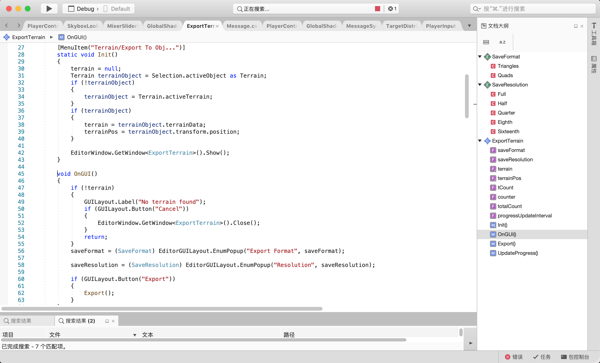

# 项目学习笔记

[如何通俗的理解c#中的命名空间、类、接口、结构、枚举、委托等概念？](https://www.zhihu.com/question/263468057/answer/269458014)
[【Playable API】不用Animator如何播放动画？](https://www.jianshu.com/p/efab9cb221db)

[脚本顺序AOS FUL OROO](https://www.jianshu.com/p/68ecef805135?utm_campaign)

U3D游戏源码学习指导--大鹏

# 如何弄清某个命名空间的功能

- 命名空间的using一般由C#定义的，Unity定义的，开发者自己定义的命名空间，前两者在unity中都可以直接使用，实际上在编写代码时如果你使用了某个命名空间中的类，VS会提示你补全命名空间的引用
- 面向百度搜索，哪里不会搜哪里，最快，但是很有可能搜出一些乱七八糟并不切题准确的东西，去官网搜还是更好一些
- 在MSDN【https://docs.microsoft.com/zh-cn/search/?search=&category=Al】可以找到微软设计时封装的含有C#核心功能的命名空间，如查找System.Collections ，可以知道该命名空间命名空间包含接口和类，这些接口和类定义各种对象（如列表、队列、位数组、哈希表和字典）的集合，那么我们在写代码的时候就可以直接使用该命名空间定义的接口和类了而不用自己去实现（所以如果你在读代码的过程中发现了某个不明觉厉无中生有不打自来犬牙呲互的类，小朋友你可以不要有那么多问号了，直接使用鹏哥告诉过你的办法，在VS中右键该类或方法或变量，点击找到定义，你就会知道他到底是来自C#或者unity，还是源码工程中自己实现的类，这样一来这个类立马裸体在你面前，有什么变量什么方法怎么使用还不是明明白白的，多说一句，一般这个办法比较适合本工程自己定义的类或者查看C#和unity内置变量或方法的具体实现细节，对于C#和unity内置的还是去查官方文档比较清楚）
- unity内置的怎么搜索呢？之前发给大家的Unity API手册就是说的这东西，如果有的手册中搜不到那就直接来官网搜吧[https://docs.unity3d.com/Manual/30_search.html?q=] 注意官网文档有Manual和Scripting API两个部分，前者搜不到换成后者再搜一下

# 如何弄清某个脚本功能

开发文档，文件夹名，脚本名，成员函数上面的注释，成员函数名，该脚本被引用的对象

1. 商业性代码或外包代码或内部开发可能会附带软件的开发文档或设计说明书，这是了解源码功能最快捷最深刻的方式，其中会对源码的架构和具体设计做出详细的说明。但一般供给内部人员开发以参考，开源项目中一般很少见到，尤其是咱们这种单纯的白嫖。。。所以一般需要使用其他方式进行推理
2. 在原工程中查找该脚本所处的位置，一般可以通过所在的文件夹名了解大概功能
3. 脚本名称
4. 稍微复杂一些的脚本中，开发者会在每个成员函数的上一行加上注释说明该成员函数的作用。
5. 成员函数名。另外，由于功能复杂的脚本中成员函数一般比较多，而且有的函数的功能会涉及该游戏开发中引入的一些复杂概念（如OnReceiveMessage用于触发某种条件时接受触发信息， void UpdateOrientation用于在判断玩家处于正确的动画状态机后更新自己的方向）无法直接理解其功能，可以先去理解其他函数和变量的功能然后将脚本中涉及的函数串起来理解，对于复杂的概念可以在搜索引擎或者《Unity 5.X 3D 游戏开发技术详解与典型案例》中查找学习
6. 鼠标右键代码文件,选择find references in secne，可以迅速找到引用了该脚本的物体，通过分析挂载该脚本的物体的样子、其他组件、该脚本的inspector栏中public变量引用的东西等等了解该脚本的功能

# 窥探具体功能的实现的具体步骤

1. 英语不好的话就先把整个代码复制粘贴到词典中翻译一遍，这样一来脚本中的注释就可以先痛快的了解一遍，真的大有益处
2. 简单的说我们的脚本都是什么套路呢，把我们要实现的东西数字化抽象出来，在类的开头定义我们需要的变量，接下来实现该类的成员函数，然后在unity的生命周期函数中，我们会先初始化一些类的对象，然后按照功能的实现逻辑用这个对象去调用一些方法。另一方面来说，挂载到某个物体上的脚本会按照生命周期函数的顺序开始执行，然后就是各种类的我调用你你调用他他又能调用我的操作。
3. 除却直接调用C#和unity的内置函数容易蒙圈，C#的各种咱们没具体见过的特性也容易蒙圈，如C#泛型、属性定义、各种修饰符等语法特性，可以先去《unity与C++网络开发》那本书中有讲C#的一章了解一下各种特性的语法结构，然后在源码再遇见你没见过的C#特性就不置于那么慌张了， 优雅地去百度查找学习掌握这行代码到底干了啥他不香吗？
4. 多关注各种对象的所属类和函数的返回值类型
5. 没见过的C#和unity的内置函数和变量的使用查找参见上文
   6.先翻译完各个变量，然后确定被调函数功能，最后确定生命周期函数

# 本次源码学习要做的工作

1. 在命名空间后面注释出该命名空间功能介绍
   【如何弄清某个命名空间的功能】
2. 在每个脚本的using下面写出本脚本具体实现的功能，以及为实现这个功能用到了设计的哪些成员函数【如何弄清某个脚本功能】
3. 在每个成员函数上方写出该函数的功能，如果你觉得这个函数实现的比较棒或者有知识含量，请给出提示方便其他人学习的时候重点掌握。对于unity生命周期的函数不能只介绍下运行顺序不是，大概说说这里面干了啥【窥探具体功能的实现的具体步骤】
4. using下方写完功能以后可以写出在学习这个脚本过程中找到的心得，毕竟自己写过注释学习过的的源码怎么也都不舍得删对不对，虽然写心得本质上是给梳理这个东西的脉络找个自嗨的借口，但是能帮到后继者也会感觉自己很强大有没有

# 我知道你一定会看的

1. 人人为我，我为人人。Unity 3D Game Kit是官方设计的3D游戏开发工具包，其代码质量和工程质量都非常高，并不局限于实现我们看到的那个小游戏示例，我在商店里原本只是想下一个评分较高的免费案例游戏，事后才发现这东西这么备受推崇。当然这个东西涉及到的类文件竟高达160个，代码结构并不比正常游戏代码简单，但好在涉及到的知识点全面，非常适合去编程初学者以学习的角度去掌握（感觉那些老鸟们知道这个插件包怎么用就行了，该掌握的东西都齐备了只要给钱自己也能写个这种插件包），这里水里火里各种花式操作学习一遍，再去看别的开源代码岂不是小意思。当然，这么多代码咱们一块学习是不现实的，每人分工一小块做出详细的注释，咱们再去学习别人做的这一块的时候能够得到清晰的指导岂不美哉，这才是团队学习正确的作战方式嘛！
2. 本指导有错的地方提醒我一下，你有别的想法也可以加进去给我看，多次版本更迭以后咱们到时候发到博客上去骗赞骗HR岂不美哉
3. 提醒：看代码时别拘泥于细节，先从大体上把握，有时候函数的具体实现看不明白可以先放一放
4. 每人负责哪一块大体不变，但工作量需要再调整得均衡一下，具体实现哪些代码见压缩包
5. 你一定知道VS有个文档大纲可以快速定位到各个变量和函数的实现位置
   

# 3D Game Kit 

Grenadier是Boss级敌人，有着特别的攻击模式，混合着远程伤害、近战伤害和盾形防御三种行动方式。
[中文教程](https://gamedevacademy.org/create-3d-games-without-coding/)
[Unity-3D游戏开发套件指南（入门篇）-免费资源](https://blog.csdn.net/qq_27489007/article/details/102457761)
[背头小哥讲U3D GameKit的使用](https://www.bilibili.com/video/BV1cE411c7h3?from=search&seid=548355606915945939)
[傅老师讲解](https://www.bilibili.com/video/BV1UW411f7v2?p=9)
[简单了解一下Unity 3D Game工具包，首先是工具包中的交互系统（interactive runtime）。Unity内本来有一个事件系统GameObject.SendMessage()。这个事件系统是用反射实现的，虽然使用非常简单方便，但效率很低。工具包使用XXX设计模式搭建的事件系统。](https://blog.csdn.net/charvl/article/details/90005309)
[3DGameKit的手上闪烁特效](https://www.bilibili.com/video/BV1AE411c71r?from=search&seid=548355606915945939)

[sourcetree上传项目](https://www.cnblogs.com/fisherbook/p/11397168.html)
基于Unity3D与Oculus_Quest的VR校园展示与社交系统的实现

# Component Guide中介绍的组件
prafab
- Ellen
- Player Controller

World Building
- Instance Painter
- PressurePad

Object 12
- Melee Weapon
- Range Weapon
- Spit
- Enemy Controller
- Damagebale
- Checkpoints
- Damage Zone
- Death Volume
- Contact Damage
- ScenelinkedSMB
- Target Scanner

GamePlay Components 12
- Command System
- Send Game Command
- Game Command Receiver
- Game Command Handler
- Send Game Command Sub-types
- Send On Became Invisible
- Send On Collision Enter
- Send On Collision Exit
- Send On Collision Stay
- Send On Trigger Enter
- Send On Trigger Exit
- Send On Trigger Stay

Game Command Handler Sub-types 16
- Moving Platform
- Interact On Trigger Health Crates
- Trigger Unity Event
- Toggle Game Object Active
- Switch Material
- Start Playable Director
- Simple Rotator
- Simple Translator
- Set GameObject Active
- Set Animator Trigger
- Respawn Player
- Play Sound
- Play Animation
- Particle System Emit
- Gameplay Counter
- Simple FX Synth

# 案例游戏需求清单
## 玩家
1. 四种点击不同打击
2. 站立不动会呼吸
3. 一段时间不动会自己放松
4. 血条为0时会死亡，重生点确定，屏幕会黑一下，重生动画播放，动画与人物的匹配
5. 走到资源点，资源球会变色并下降
6. 被怪物攻击血条会减一
7. 某些情况下箱子能被人物推动
8. 攻击箱子，箱子会被击碎并消失
9. 前后左右移动和奔跑动画
10. 穿模走上升降台的BUG
11. 跳出世界会死
## 怪物
1. 怪物都有警戒范围
2. 进入警戒范围会锁定主角并跟随，人物跑出警戒范围锁定会丢失
3. 怪物中击后会沿击中方向飞起一段距离并消失
4. 怪物平时会自己摇摆，翻身跳一下
5. 跟随目标死亡，怪物会自己回到出生点
6. 近战怪物锁定玩家后会先跟随跑动，跑到一定距离后会发动攻击跳跃并张嘴，跳完以后会转个身重新面向玩家
7. 远程怪物会自己控制与玩家之间的距离，蓄力后会发生毒液弹，人物受击后血条减一，毒液弹落在地上会生成落地效果，一段时间后毒液落地效果会小时
## 声音
1. 人物不同攻击不同声音
2. 人物跳起声音和落地声音
3. 人物听到的是立体声音，有两个话筒跟随
4. 怪物自己会有声音
5. 怪物攻击玩家时的声音
6. 怪物击中玩家时有声音
7. 人物掉血会有声音
8. 人物死亡音效
## 系统与杂
1. 第三人称视角跟随
2. 游戏控制UI框设计
2. 按ESC会出现游戏控制UI框，同时游戏暂停，脱离第三人称跟随
3. 所有事物都有影子
4. 上下浮动的木块
5. 人物有两个跟随相机？
6. 搜集所有的资源点会出现绿光台
7. 猜下绿光台会出现对话框
8. 踩框门会下降
9. 重新加载功能
10. 游戏控制框内可以调节游戏音效
11. 游戏控制框内再按一次ESC或者点X都可以回到游戏
12. 湖面上会出现太阳光的反射
13. 湖面上会有浮动的光点

