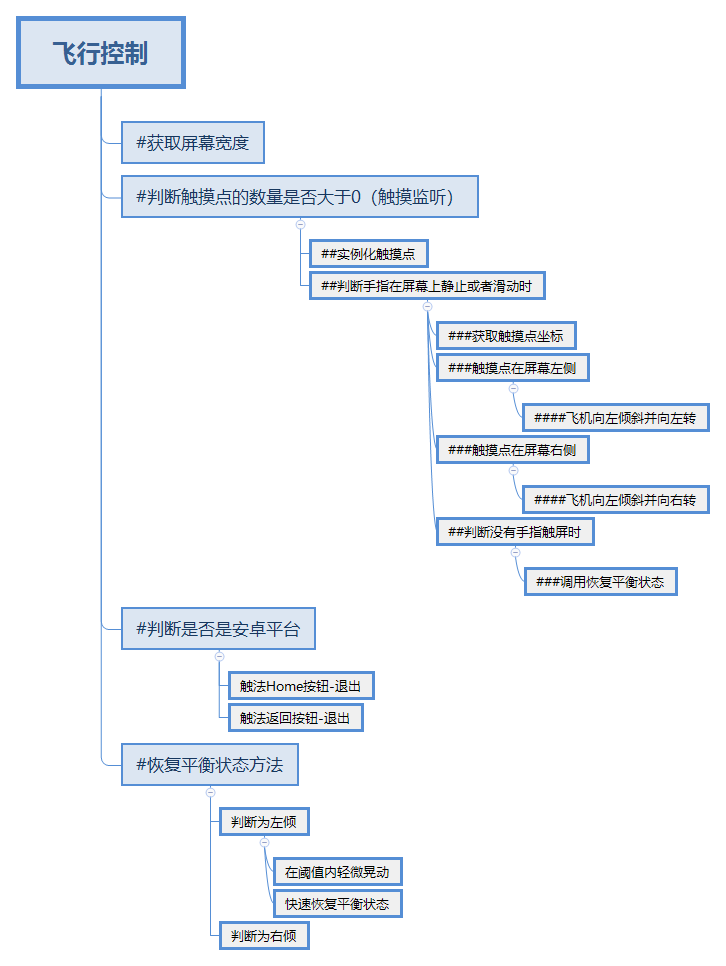

[toc]

# 1. 相机控制
## 1.1. 摄像机跟随
需要相对坐标（需要变化角度和高度和距离）始终一致（这个地方采用的是摄像机延迟变化而非随飞机一同变化），因为帧数比固定速率大，即Update中的变化要比FixedUpdate变化的快，所以每个Update中的变化采用以0.02s/0.02内帧数是理想中的最好（当然0.02s本身很小，故立即变化也可以，但效果最差，这个代码采用的是插值，角度和高度是插值计算，距离跟据角度和高度的插值结果进行立即变化，效果中等），当然最后还是落脚到LookAt函数
### 1.1.1. 总结
1.当前角度-旋转阻尼-得每帧旋转角度-期望角度，利用角度插值设置旋转阻尼，逐渐实现由当前角度到期望角度的变化。2.当前高度-高度阻尼-得每帧变化高度-期望高度，利用插值设置高度变化阻尼，逐渐实现由当前高度到期望高度的变化。3.（单独设置欧拉角的一个轴会导致不必要的偏移和旋转，但是为了实现这种慢慢的变化方向还是有必要设置单独的欧拉角的）4.摄像机距离目标背后的距离//这个地方第二个position虽然改变了，摄像机和目标物体的相对距离变化的原因是这个地方的摄像机是延迟变化，但是为什么非要去改变这个相对的x和z呢？如果不改变相对距离x和z而仅仅改变旋转角度和高度呢？不可以！因为旋转角度的变化就是要体现在x和z上。那么为什么非要是-呢？如果是+可不可以？不可以，因为这仍然是摄像机的延迟变化，物体在每个0.02s的点进行变化的时候物体和摄像机的位移就已经添加了一个矢量，现在就要把这两者的位移的矢量减去才是正确的，否则相对位移会越来越变形。LookAt的第二个参数默认时为y轴，旋转物体使z轴指向目标物体。
### 1.1.2. 脚本
```
using UnityEngine;
using System.Collections;

public class SmoothFollow : MonoBehaviour
{
    private GameObject target;          //所要跟随的目标对象
    public float distance = 10.0f;      //与目标对象的距离
    public float height = 5.0f;         //与目标对象的高度差
    public float heightDamping = 2.0f;  //高度变化中的阻尼参数
    public float rotationDamping = 3.0f;//绕y轴的旋转中的阻尼参数

    void Start()
    {
        // 寻找标签为“AirPlane”的游戏对象并设置为要跟随的目标对象
        target = GameObject.FindWithTag("AirPlane");
    }
    void LateUpdate()
    { 	// 如果目标对象不存在将跳出方法
        if (!target)
            return;

        // 摄像机期望的的旋转角度及高度
        float wantedRotationAngle = target.transform.eulerAngles.y;
        float wantedHeight = target.transform.position.y + height;

        // 摄像机当前的旋转角度及高度
        float currentRotationAngle = transform.eulerAngles.y;
        float currentHeight = transform.position.y;

        // 计算摄像机绕y轴的旋转中的阻尼
        currentRotationAngle = Mathf.LerpAngle(currentRotationAngle, wantedRotationAngle, rotationDamping * Time.deltaTime);

        // 计算摄像机高度变化中的阻尼
        currentHeight = Mathf.Lerp(currentHeight, wantedHeight, heightDamping * Time.deltaTime);

        // 转换成旋转角度,cuttenRotation就是绕y轴旋转旋转阻尼个单位
        var currentRotation =Quaternion.Euler(0, currentRotationAngle, 0) ;


        // 摄像机距离目标背后的距离//这个地方第二个position虽然改变了，摄像机和目标物体的相对距离变化的原因是这个地方的摄像机是延迟变化，但是为什么非要去改变这个相对的x和z呢？如果不改变相对距离x和z而仅仅改变旋转角度和高度呢？不可以！因为旋转角度的变化就是要体现在x和z上。那么为什么非要是-呢？如果是+可不可以？不可以，因为这仍然是摄像机的延迟变化，物体在每个0.02s的点进行变化的时候物体和摄像机的位移就已经添加了一个矢量，现在就要把这两者的位移的矢量减去才是正确的，否则相对位移会越来越变形。
        transform.position = target.transform.position;
        transform.position -= currentRotation * Vector3.forward * distance;

        // 设置摄像机的高度
        transform.position = new Vector3(transform.position.x, currentHeight, transform.position.z);

        // 摄像机一直注视目标
        transform.LookAt(target.transform);
    }
}
```
## 1.2. 转换成第一人称控制
### 1.2.1. 摄像机跟随1
```
using UnityEngine;
using System.Collections;

public class SmoothFollow : MonoBehaviour
{
    public GameObject target;          //所要跟随的目标对象
    public float distance = 10.0f;      //与目标对象的距离
    public float height = 5.0f;         //与目标对象的高度差
    public float heightDamping = 2.0f;  //高度变化中的阻尼参数
    public float rotationDamping = 3.0f;//绕y轴的旋转中的阻尼参数

    void Start()
    {
        // 寻找标签为“AirPlane”的游戏对象并设置为要跟随的目标对象
        //target = GameObject.FindWithTag("AirPlane");
    }
    void LateUpdate()
    { 	// 如果目标对象不存在将跳出方法
        if (!target)
            return;

        // 摄像机期望的的旋转角度及高度
        float wantedRotationAngle = target.transform.eulerAngles.y;
        float wantedHeight = target.transform.position.y + height;

        // 摄像机当前的旋转角度及高度
        float currentRotationAngle = transform.eulerAngles.y;
        float currentHeight = transform.position.y;

        // 计算摄像机绕y轴的旋转中的阻尼
        currentRotationAngle = Mathf.LerpAngle(currentRotationAngle, wantedRotationAngle, rotationDamping * Time.deltaTime);

        // 计算摄像机高度变化中的阻尼
        currentHeight = Mathf.Lerp(currentHeight, wantedHeight, heightDamping * Time.deltaTime);

        // 转换成旋转角度,cuttenRotation就是绕y轴旋转旋转阻尼个单位
        var currentRotation =Quaternion.Euler(0, currentRotationAngle, 0) ;


        // 摄像机距离目标背后的距离//这个地方第二个position虽然改变了，摄像机和目标物体的相对距离变化的原因是这个地方的摄像机是延迟变化，但是为什么非要去改变这个相对的x和z呢？如果不改变相对距离x和z而仅仅改变旋转角度和高度呢？不可以！因为旋转角度的变化就是要体现在x和z上。那么为什么非要是-呢？如果是+可不可以？不可以，因为这仍然是摄像机的延迟变化，物体在每个0.02s的点进行变化的时候物体和摄像机的位移就已经添加了一个矢量，现在就要把这两者的位移的矢量减去才是正确的，否则相对位移会越来越变形。
        transform.position = target.transform.position;
        transform.position -= currentRotation * Vector3.forward * distance;

        // 设置摄像机的高度
        transform.position = new Vector3(transform.position.x, currentHeight, transform.position.z);

        // 摄像机一直注视目标
        transform.LookAt(target.transform);
    }
}
```

### 1.2.2. 摄像机跟随2
```
using UnityEngine;
using System.Collections;

public class SmoothFollow : MonoBehaviour {

    public float distance = 10.0f;//跟随距离
    public float height = 5.0f;//跟随高度
    public float heightDamping = 2.0f;
    public float rotationDamping = 3.0f;//角度阻尼
    public float offsetHeight = 1.0f;//高度偏移量
    Transform selfTransform;

    public Transform Target;
    [AddComponentMenu("Camera-Control/Smooth Follow")]//添加功能组件选项
	void Start () {
        selfTransform = GetComponent<Transform>();
	}
	
	void LateUpdate () {
        if (!Target)
            return;

        float wantedRotationAngle = Target.eulerAngles.y;//预设角度
        float wantedHeight = Target.position.y + height;

        float currentRotationAngle = selfTransform.eulerAngles.y;//当前角度
        float currentHeight = selfTransform.position.y;

        currentRotationAngle = Mathf.LerpAngle(currentRotationAngle, wantedRotationAngle, rotationDamping * Time.deltaTime);//角度渐变至这个角度

        currentHeight = Mathf.Lerp(currentHeight, wantedHeight, heightDamping * Time.deltaTime);//高度渐变至这个高度

        Quaternion currentRotation = Quaternion.Euler(0, currentRotationAngle, 0);//当前要旋转的度数

        selfTransform.position = Target.position;//当前相机位置调整
        selfTransform.position -= currentRotation * Vector3.forward * distance;
//先复制过去，然后同时把距离和旋转度搞定，故弄玄虚，烂！（2/3）
        Vector3 currentPosition = this.transform.position;//设置代表新位置的变量
        currentPosition.y = currentHeight;//调整相机高度的变量，把高度搞定（1/3）
        selfTransform.position = currentPosition;//操控相机调整新的位置

        selfTransform.LookAt(Target.position + new Vector3(0, offsetHeight, 0));
        //摄像机的视野调整，把相机中心固定一下
	}
}
```
### 1.2.3. Transform.LookAt 看向
旋转此变换，让向前向量指向target的当前位置。简单说，旋转物体使z轴指向目标物体。 （单纯的旋转y轴）当该物体设置了LookAt并指定了目标物体时，该物体的z轴将始终指向目标物体，在设置了worldUp轴向时，该物体在更接近指定的轴向是旋转便的灵活，注意worldUp指的是世界空间，不论你物体在什么位置，只要接近指定的轴方向，旋转会变的更灵活。 

如果是两个点：按帧变化位置和距离，然后调整正对的中心即可
但是两个物体就得考虑旋转度了！！
不不不！准确的说相机是个有旋转度的点，是点看物，直接按帧设置变化的位置和距离以及旋转度即可
### 1.2.4. 移动
```
using UnityEngine;
using System.Collections;
using System.Collections.Generic;
public class control : MonoBehaviour
{
    public float speed;
    public float tilt;

    private Rigidbody rbd;

    void Update()
    {
    }
    // Use this for initialization
    void Start()
    {
        rbd = GetComponent<Rigidbody>();
    }

    // Update is called once per frame


    private void FixedUpdate()
    {
        float h = Input.GetAxis("Horizontal");
        float v = Input.GetAxis("Vertical");

        Vector3 vel = new Vector3(h, 0, v);
        rbd.velocity = vel * speed;

        rbd.rotation = Quaternion.Euler(0, 0, rbd.velocity.x * (-1) * tilt);

        rbd.position = new Vector3(rbd.position.x, 0, rbd.position.z);


    }
}

```
### 1.2.5. 摄像机方向跟随物体方向变化而变化

# 2. 太空射击
## 2.1. 子弹飞行
```
using UnityEngine;
using System.Collections;

public class Bolt_mover: MonoBehaviour {
	public float speed;
    void Start()
    {
		this.GetComponent<Rigidbody>().velocity = this.transform.forward * speed;
    }

}
```
## 2.2. 被空气墙销毁
```
using UnityEngine;
using System.Collections;

public class DestroyByBoundary : MonoBehaviour {

	void OnTriggerExit(Collider other){
		Destroy (other.gameObject);
	}
}

```
## 2.3. 陨石碰撞销毁
```
using UnityEngine;
using System.Collections;

public class DestroyByContact : MonoBehaviour 
{
	public GameObject explosion;
	public GameObject playerExplosion;
	public int scoreValue;
	private GameController gameController;

	void Start ()
	{
		GameObject gameContollerObject = GameObject.FindWithTag ("GameController");
		if (gameContollerObject != null) 
		{
			gameController = gameContollerObject.GetComponent<GameController>();
		}
		if (gameContollerObject == null) 
		{
			Debug.Log ("Cannot find 'GameController' script");
		}

	}
	void OnTriggerEnter(Collider other)
	{
		if(other.tag == "Boundary")
		{
			return;
		}
		Instantiate(explosion,transform.position,transform.rotation);
		if (other.tag == "Player") {
			Instantiate(playerExplosion,other.transform.position,other.transform.rotation);
			gameController.GameOver();
		}
		gameController.AddScore (scoreValue);
		Destroy (other.gameObject);
		Destroy (gameObject);
	}
}

```
## 2.4. 爆炸效果被时间销毁
```
using UnityEngine;
using System.Collections;

public class DestroyByTime : MonoBehaviour {
	public float lifetime;

	void Start()
	{
		Destroy (gameObject,lifetime);
	}
}

```
## 2.5. 陨石自旋
```
using UnityEngine;
using System.Collections;

public class RandonRotator : MonoBehaviour 
{	
	public float tumble;

	void Start ()
	{
		rigidbody.angularVelocity = Random.insideUnitSphere * tumble;
	}


}

```
## 2.6. 飞船控制
```
using UnityEngine;
using System.Collections;
using System.Collections.Generic;

[System.Serializable]
public class Boundary {
	public float xMin,xMax,zMin,zMax;
}

public class Player_mover: MonoBehaviour {
	public float speed;
	public float tilt;

	public Boundary bound;
	private Rigidbody rbd;

	public GameObject bullet;
	private float nextFire;
	public float fireRate;
	public GameObject shot;
	public Transform shotSpawn;

	void Update () {
		if (Input.GetButton ("Fire1") && Time.time > nextFire) {
			
			nextFire = Time.time + fireRate;
			Instantiate(shot,shotSpawn.position,shotSpawn.rotation) ;
			//audio.Play ();
		}
	}
	// Use this for initialization
	void Start () {
		rbd = GetComponent<Rigidbody>();
	}
	
	// Update is called once per frame


	private void FixedUpdate(){
		float h = Input.GetAxis ("Horizontal");
		float v = Input.GetAxis ("Vertical");
		
		Vector3 vel = new Vector3(h,0,v);
		rbd.velocity = vel * speed;
		
		rbd.rotation = Quaternion.Euler (0, 0, rbd.velocity.x * (-1)*tilt);

		float posX = Mathf.Clamp(rbd.position.x,bound.xMin,bound.xMax);
		float posZ = Mathf.Clamp (rbd.position.z, bound.zMin, bound.zMax);

		rbd.position = new Vector3 (posX, 0, posZ);


	}
}

```
## 2.7. 游戏控制
```
using UnityEngine;
using System.Collections;
using UnityEngine.UI;


public class GameController : MonoBehaviour {

	public GameObject hazard;
	public Vector3 spawnValues;
	public int hazardCount;
	public float spawnWait;
	public float startWait;
	public float waveWait;

	public Text scoreTest;
	private int score;

	public Text gameOverText;
	private bool gameOver;

	public Text restartText;
	private bool restart;

	public Texture2D newTexture;

	public void Awake()
	{
		Screen.SetResolution(1366, 768, false);
	}


	void Start()
	{
		Cursor.SetCursor(newTexture, Vector2.zero, CursorMode.Auto);
		gameOverText.text = "";
		gameOver = false;
		restartText.text = "";
		restart = false;
		score = 0;
		UpdateScore ();
		StartCoroutine (SpawnWaves ());
	}

	void Update() {
		if (restart) {
			if(Input.GetKeyDown(KeyCode.R)){
				Application.LoadLevel(Application.loadedLevel);
			}
		}
	}
	public void GameOver(){
		gameOver = true;
		gameOverText.text = "GameOver";
	}


	IEnumerator SpawnWaves()
	{

		while (true)
		{
			yield return new WaitForSeconds (startWait);
			for (int i = 0; i < hazardCount; i++) 
			{
				Vector3 spawnPosition = new Vector3 (Random.Range (-spawnValues.x, spawnValues.x), spawnValues.y, spawnValues.z);
				Quaternion spawnRotation = Quaternion.identity;
				Instantiate (hazard, spawnPosition, spawnRotation);
				yield return new WaitForSeconds(spawnWait);

				if(gameOver){
					restart = true;
					restartText.text = "Press 'R' to Restart";
				}
			}
			yield return new WaitForSeconds(waveWait);
		}
	} 

	public void AddScore(int newScoreValue)
	{
		score += newScoreValue;
		UpdateScore ();

	}

	void UpdateScore ()
	{
		scoreTest.text = "Score:" + score;
	}
}

```
# 3. 触屏控制飞机
#只有当飞机的倾斜程度在规定的范围内时倾斜程度的改变（绕z轴的欧拉角）和飞机方向的偏转（绕y轴的欧拉角）才能发生（和spaceshooter不同这个一开始没有改变摄像机的方向，难道是2D第三人称游戏需要改变，3D游戏不需要？），对于超过范围的情况，如果存在触摸，倾斜程度的改变会被抵消，方向的偏转不改变，不存在时则倾斜程度的改变会被恢复，方向的偏转不改变，因为方向的偏转是硬性硬性，倾斜程度的变化是弹性变化
#总结：1.触摸监听依靠触摸点的x值和屏幕宽度的一半的大小判断在屏幕左侧还是右侧 2.touch.phase表示触摸的状态3.触摸监听：用Input.touchCount获取触摸点并判断是否存在时-用Touch的模板和Input.touches[i]的内存来实例化触摸点并对每个触摸点进行循环-判断当前触摸点的触摸状态4.用Xmind画个图还是有点用的
#疑问：为什么飞机的倾斜和偏转不写在同一个Rotate中呢？

```
using UnityEngine;
using System.Collections;

public class AirControl : MonoBehaviour
{

    private Transform m_transform;          //保存Transform实例 
    public float speed = 50f;      //飞机的飞行速度
    private float rotationz = 0.0f;         //绕Z轴的旋转量
    public float rotateSpeed_AxisZ = 45f;   //绕Z轴的旋转速度
    public float rotateSpeed_AxisY = 20f;   //绕Y轴的旋转速度
    private float screenWeight;             //屏幕宽度
    private Vector2 touchPosition;          //触摸点坐标


    // Use this for initialization
    void Start()
    {
        m_transform = this.transform;       //赋值，减少外部代码的调用       
        this.gameObject.GetComponent<Rigidbody>().useGravity = false; //默认不受重力影响
        screenWeight = Screen.width;        //获取屏幕宽度
    }

    // Update is called once per frame
    void Update()
    {
        m_transform.Translate(new Vector3(0, 0, speed / 20 * Time.deltaTime));//向前移动
        GameObject.Find("propeller").transform.Rotate(new Vector3(0, 100f, 0));// 寻找到名称为“propeller”的对象并使其绕Y轴旋转
        rotationz = this.transform.eulerAngles.z;// 获取飞机对象绕z轴的旋转量

        //----------------触摸监听开始-----------------//
        if (Input.touchCount > 0) {         //当触摸的数量大于0
            for (int i = 0; i < Input.touchCount; i++) {
                Touch touch = Input.touches[i];        //实例化当前触摸点

                // 手指在屏幕上静止或发生滑动时触发的事件
                if (touch.phase == TouchPhase.Stationary || touch.phase == TouchPhase.Moved)
                {//stationary 不动的; 静止的 touch.phase
                    // 获取当前触摸点坐标
                    touchPosition = touch.position;
                    // 触摸点在屏幕左半侧
                    if (touchPosition.x < screenWeight / 2) {
                        if ((rotationz <= 45 || rotationz >= 315)) {
                            // 飞机向左倾斜
                            m_transform.Rotate(new Vector3(0, 0, (Time.deltaTime * rotateSpeed_AxisZ)), Space.Self);
                        }
                        // 飞机左转
                        m_transform.Rotate(new Vector3(0, -Time.deltaTime * 30, 0), Space.World);
                    }
                    // 触摸点在屏幕右半侧
                    else if (touchPosition.x >= screenWeight / 2) {
                        if ((rotationz <= 45 || rotationz >= 315)) {
                            // 飞机向右倾斜
                            m_transform.Rotate(new Vector3(0, 0, (Time.deltaTime * -rotateSpeed_AxisZ)), Space.Self);
                        }
                        // 飞机右转
                        m_transform.Rotate(new Vector3(0, Time.deltaTime * 30, 0), Space.World);
                    }
                }
                // 手指离开屏幕时触发的事件
                else if (touch.phase == TouchPhase.Ended) {

                    BackToBlance();     //调用恢复平衡状态方法
                }
            }
        }

        if (Input.touchCount == 0) {    //当没有手指触摸屏幕时

            BackToBlance();             //调用恢复平衡状态方法
        }
        //----------------触摸监听结束-----------------//

        //判断当前运行平台为Android平台
        if (Application.platform == RuntimePlatform.Android) {

            if (Input.GetKeyDown(KeyCode.Home)) {     //触发Hmoe按钮
                Application.Quit();                 //退出程序
            }
            if (Input.GetKeyDown(KeyCode.Escape)) {   //触发返回按钮
                Application.Quit();                 //退出程序
            }
        }
    }

    void BackToBlance()                 //恢复平衡方法
    {
        if ((rotationz <= 180)) {       //判断如果飞机为右倾状态
            if (rotationz - 0 <= 2) {   //在阈值内轻微晃动
                m_transform.Rotate(0, 0, Time.deltaTime * -1);
            }
            else {                      //快速恢复平衡状态
                m_transform.Rotate(0, 0, Time.deltaTime * -40);
            }
        }

        if ((rotationz > 180)) {        //判断如果飞机为左倾状态
            if (360 - rotationz <= 2) { //在阈值内轻微晃动
                m_transform.Rotate(0, 0, Time.deltaTime * 1);
            }
            else {                      //快速恢复平衡状态
                m_transform.Rotate(0, 0, Time.deltaTime * 40);
            }
        }
    }
}
```


# 4. 按钮监听
## 4.1. 点击打印
```
using UnityEngine;
using System.Collections;

public class UGUIOnClick : MonoBehaviour {
    public void Onbt1Click(int index)
    {
        Debug.Log("This is bt"+index);
    }
}

```
## 4.2. 更改text的内容和颜色
```
using UnityEngine;
using System.Collections;
using UnityEngine.UI;
public class UGUIText : MonoBehaviour {
    public Text tt;
	void Start () {
        tt.color = Color.red;
        tt.text = "this is text";
    }
}

```
## 4.3. 当滑杆的值发生改变时
```
using UnityEngine;
using System.Collections;
using UnityEngine.UI;
public class UGUISlider : MonoBehaviour {
	public Slider sd;
	public void OnsdValueChange()
	{
		Debug.Log (sd.value);
	}
}

```
## 4.4. UI的自动布局管理
在游戏运行时随时将新实例化的Ul控件或者游戏对象设置为挂载有Layout Group组件( 3种任意一个皆可）的游戏对象的子对象， Layout Group组件便会对其进行自动布局排列。在Start方法中新实例化出了一个items预制件，将其设置为挂载有布局管理器组件的UlMain的子对象，然后观察场景，就会发现新实例化的预制件巳经被自动排列好了。这在游戏开发中非常方便，可以随时实例化UI元素而不用再三考虑排布问题。
```
using UnityEngine;
using System.Collections;
using UnityEngine.UI;
public class UGUILayout : MonoBehaviour {
    public GameObject UIMain;
    public GameObject items;
	// Use this for initialization
	void Start () {
        for (int i = 0; i < 10; i++)
        { 
            GameObject item = (GameObject)Instantiate(items);
            item.transform.parent = UIMain.transform;
        }
	}
	
	// Update is called once per frame
	void Update () {
	
	}
}

```
## 4.5. 不规则物体的碰撞检测
```
using UnityEngine;
using System.Collections;
using UnityEngine.UI;
public class UGUIImagePlus : Image {
    PolygonCollider2D PGcollider;
    new  void  Awake()
    {
        PGcollider = this.GetComponent<PolygonCollider2D>();
    }
    public override bool IsRaycastLocationValid(Vector2 screenPoint, Camera eventCamera)
    {
        bool inside = PGcollider.OverlapPoint(screenPoint);
        Debug.Log(inside);
        return inside;
    }
}

```
## 4.6. 按钮长按
```
using UnityEngine;
using UnityEngine.Events;
using UnityEngine.EventSystems;
using System.Collections;
using UnityEngine.UI;

public class MyButton : Selectable, IPointerClickHandler, IPointerDownHandler, IPointerEnterHandler, IPointerExitHandler, IPointerUpHandler {
    //在属性面板中显示方法
    [SerializeField]
    UnityEvent m_OnClick = new UnityEvent();
    [SerializeField]
    UnityEvent m_OnDown = new UnityEvent();
    [SerializeField]
    UnityEvent m_OnEnter = new UnityEvent();
    [SerializeField]
    UnityEvent m_OnExit = new UnityEvent();
    [SerializeField]
    UnityEvent m_OnUp = new UnityEvent();
    [SerializeField]
    UnityEvent m_OnPress = new UnityEvent();
    //声明方法名
    public UnityEvent onClick {
        get {
            return m_OnClick;
        } set {
            m_OnClick = value;
        }
    }
    public UnityEvent onDown {
        get {
            return m_OnDown;
        } set {
            m_OnDown = value;
        }
    }
    public UnityEvent onEnter {
        get {
            return m_OnEnter;
        } set {
            m_OnEnter = value;
        }
    }
    public UnityEvent onExit {
        get {
            return m_OnExit;
        } set {
            m_OnExit = value;
        }
    }
    public UnityEvent onUp {
        get {
            return m_OnUp;
        } set {
            m_OnUp = value;
        }
    }
    public UnityEvent onPress {
        get {
            return m_OnPress;
        } set {
            m_OnPress = value;
        }
    }
    public virtual void OnPointerClick(PointerEventData eventData) {    //点击监听
        IgnoreError();
        m_OnClick.Invoke();
    }
    new public virtual void OnPointerDown(PointerEventData eventData) { //按下监听
        IgnoreError();
        //isPress = true;
        m_OnDown.Invoke();
    }
    new public virtual void OnPointerEnter(PointerEventData eventData) {    //鼠标进入监听
        IgnoreError();
        m_OnEnter.Invoke();
    }
    new public virtual void OnPointerExit(PointerEventData eventData) {     //鼠标离开监听
        IgnoreError();
        m_OnExit.Invoke();
    }
    new public virtual void OnPointerUp(PointerEventData eventData) {   //抬起监听
        IgnoreError();
        //isPress = false;
        m_OnUp.Invoke();
    }
    private void IgnoreError() {                    //判断按钮是否可用
        if (!IsActive() || !IsInteractable()) {
            return;
        }
    }
    /*  //按钮长按功能
    private bool isPress;
    private Selectable buttonSelectable;
    void Start() {
        buttonSelectable = GetComponent<Selectable>();
        if (!buttonSelectable) {
            buttonSelectable = gameObject.AddComponent<Selectable>();
        }
    }
    void Update() {
        if (isPress) {
            if (buttonSelectable.IsActive() && buttonSelectable.IsInteractable()) {
                m_OnPress.Invoke();
            }
        }
    }
     */ 
}
```
# 5. 音乐播放器
功能：播放，暂停，右切，左切，随机播放，重复播放，删除歌曲，导入歌曲，给待播放的歌曲排序，图标
步骤11：把.png文件的贴图类型设置为精灵模式，然后把它的format设置为Truecolor本色，然后添加到image控件中》搭建播放器UI界面》将Canvas组件的RenderMode设置为World Space，画布就能在3D场景中进行旋转等变换》将SoundBT的子对象BackGroundMask的位置和大小播放器界面重合，image组件的颜色设置为黑色，透明度设置为半透明（调节音量时UI界面变暗，突出Slider控件的效果）》将Slider控件（背景，填充区域，滑柄区域）的方向设置为从底向上，调整handle的贴图和颜色，暂时关闭Slider和黑幕》搭建单击ListBT就可以跳转到的MusicList界面》给List添加网格管理组件，给MusicList添加Scroll Rect组件和Mask组件，并将List挂载到Scroll Rect组件的Content上，暂时关闭MusicList》在List内创建Button控件ListButton，调整其长和宽，并将其Text命名为“Count”，在ListButton内再创建Text控件MusicInformation，和Button控件DeleteBT（其内设置为Image控件）并为其添加贴图然后关闭》Project中创建预制件，将ListButton挂载上去》编写监听所有按钮的触控事件的MusicBtnListener脚本和用于初始化音乐列表并监听音乐列表按钮触控事件的MusicListBtnListener，然后将其都挂载到Canvas上》添加粒子系统，编写能让界面根据鼠标位置进行动态变换的PanWithMouse脚本并将其同时挂载到Canvas和相机上（确保Canvas的Render Mode为世界空间时才有用）

功能：初始化音乐列表并监听音乐列表按钮触控事件
初始化音乐列表：根据音乐资源的数量实例化音乐按钮，并设置其父对象、调整大小、调整位置、设置编号以及规格化显示信息》利用委托给实例化的按钮添加监听事件（当bt被使用时调用onListElementBtnClick方法，注意：被委托的方法在委托内调用，委托作为添加监听AddListener的参数中的方法出现）》给删除按钮添加监听事件，根据内容设置列表大小（代码）？》给编辑按钮设置监听事件（是否出现删除按钮）》往动态数组alb中存放已经实例化好的列表中的各个按钮（动态数组中的元素类型不限制吗？）方便后面调用按钮》分别编写每个音乐按钮、编辑按钮、删除按钮（以及删除按钮后对列表的更新方法）的监听方法
## 5.1. 按钮监听
```
using UnityEngine;
using System.Collections;
using UnityEngine.UI;
public class MusicBtnListener : MonoBehaviour {
    public Button bplay;
    public Button bnext;
    public Button blist;
    public Button bsound;
    public Button bbackMenu;
    public GameObject MusicPlayer;
    public GameObject MusicList;
    private bool setSound = false;
    private bool showList = false;
         
	// Use this for initialization
	void Start () {
        blist.onClick.AddListener(OnListBtnClick);
        bplay.onClick.AddListener(OnPlayBtnClick);
        bsound.onClick.AddListener(OnSoundBtnClick);
        bbackMenu.onClick.AddListener(OnListBtnClick);
	}
	
	// Update is called once per frame
	void Update () {

	}
    void OnListBtnClick()
    {
        showList = !showList;
        MusicList.SetActive(showList);
    }
    void OnPlayBtnClick()
    {
        Debug.Log("play");
        
    }

    void OnSoundBtnClick()
    {
        setSound = !setSound;
        bsound.transform.GetChild(0).gameObject.SetActive(setSound);//开启/关闭 背景遮罩
        bsound.transform.GetChild(1).gameObject.SetActive(setSound);//开启/关闭 音量滑块
        //Debug.Log("Sound bt click");
    }

}

```
## 5.2. 初始化音乐列表
```
using UnityEngine;
using System.Collections;
using UnityEngine.UI;
public class MusicListBtnListener : MonoBehaviour {
    public AudioClip[] ac;
    public GameObject List;
    public GameObject musicBT;
    public Button bEdit;
    //public Button[] bMusic;
    private ArrayList alb=new ArrayList();

    private bool isEdit=false;
	void Start () {
        //bMusic=new Button[ac.Length];

        for (int i = 0; i < ac.Length; i++)//生成按钮
        {
            GameObject bt = Instantiate(musicBT);
            bt.GetComponent<RectTransform>().SetParent(List.GetComponent<RectTransform>());
            bt.GetComponent<RectTransform>().localScale = Vector3.one;  //调整大小
            bt.GetComponent<RectTransform>().localPosition = Vector3.zero;  //调整位置
            string[] musicInfomation = ac[i].name.Split('-');//按照＇－＇符号拆分歌手名和音乐名
            bt.transform.Find("Count").GetComponent<Text>().text = ""+(i+1);//编号
            bt.transform.Find("MusicInformation").GetComponent<Text>().text =  //歌手 名称
                string.Format("<size=12>{0}</size>" + "\n<size=15>{1}</size>", musicInfomation[0], musicInfomation[1]);
            bt.GetComponent<Button>().onClick.AddListener(          //
                delegate()
                {
                    this.onListElementBtnClick(bt);
                }
                );
            Button bdelete = bt.transform.Find("DeleteBT").GetComponent<Button>();
            bdelete.onClick.AddListener(
                    delegate()
                    {
                        this.OnDeleteBthClick(bt);                    
                    }
                );
            //bMusic[i] = bt.GetComponent<Button>();

            //alb.Add(bMusic[i]);
        }
        List.GetComponent<RectTransform>().sizeDelta = new Vector2(400, ac.Length * 50 + (ac.Length - 1) * 5);
        bEdit.onClick.AddListener(OnEditBtnListener);
        for (int i = 0; i < List.transform.childCount; i++)//添加到动态数组
        {
            alb.Add(List.transform.GetChild(i));
        }
        //EventTriggerListener.Get(bEdit.gameObject).onClick = (onEditBtnListener);
    }
    public void onListElementBtnClick(GameObject bt)
    {
        Debug.Log("this is bt"+bt.name);
    }
    void OnEditBtnListener()
    {
        isEdit = !isEdit;
        foreach (Transform go in alb)
        {
                
                go.transform.Find("DeleteBT").gameObject.SetActive(isEdit);
            //Debug.Log(bm.name);
        }
    }
    void OnDeleteBthClick( GameObject bt)
    {
        //Debug.Log(alb.IndexOf(bt.transform));
        alb.Remove(bt.transform);
        //该控件长度  该编号 
        Destroy(bt);
        UpdateMusicArrayListButtonText();
        //Debug.Log(alb.Count);
    }
    void UpdateMusicArrayListButtonText()
    { 
        foreach(Transform go in alb)//gengxin
        {
            go.transform.Find("Count").GetComponent<Text>().text = "" + (alb.IndexOf(go.transform) + 1);//编号
            Debug.Log((alb.IndexOf(go.transform) + 1));
        }
        List.GetComponent<RectTransform>().sizeDelta = new Vector2(400, (alb.Count+1) * 50);
    }
}

```
## 5.3. 动态界面效果
PanWithMouse.cs脚本为一个动态动画脚本，挂载到Canvas上后该对象会根据鼠标的位置进行动态的变换，可以让界面动态性更强。Pan WithMouse.cs脚本可以同时挂载在Canvas和摄像机上来组合使用，这样能够达到更佳的动态效果。当挂载在Canvas上时，需要确保Canvas组件中的RenderMode为" World Space", 这样脚本才会起作用。
```
using UnityEngine;
public class PanWithMouse : MonoBehaviour
{
	public Vector2 degrees = new Vector2(5f, 3f);
	public float range = 1f;

	Transform mTrans;
	Quaternion mStart;
	Vector2 mRot = Vector2.zero;

	void Start ()
	{
		mTrans = transform;
		mStart = mTrans.localRotation;
	}

	void Update ()
	{
		float delta = Time.deltaTime;
		Vector3 pos = Input.mousePosition;

		float halfWidth = Screen.width * 0.5f;
		float halfHeight = Screen.height * 0.5f;
		if (range < 0.1f) range = 0.1f;
		float x = Mathf.Clamp((pos.x - halfWidth) / halfWidth / range, -1f, 1f);
		float y = Mathf.Clamp((pos.y - halfHeight) / halfHeight / range, -1f, 1f);
		mRot = Vector2.Lerp(mRot, new Vector2(x, y), delta * 5f);

		mTrans.localRotation = mStart * Quaternion.Euler(-mRot.y * degrees.y, mRot.x * degrees.x, 0f);
	}
}

```
# 6. 赛车摇杆控制
## 6.1. 添加虚拟摇杆步骤
导入easytouch插件》Hedgehog Team--EasyTouch--Extensions-Adding joystick向游戏对象目录中添加虚拟摇杆按钮
## 6.2. 使用摇杆控制车轮碰撞器的移动和转动
```
using UnityEngine;
using System.Collections;

public class Car : MonoBehaviour {
    public WheelCollider FLCollider;
    public WheelCollider FRCollider;

    public EasyJoystick myJoystick;

    public float maxTorque = 500;
    public float maxAngle = 20;
	// Use this for initialization
	void Start () {
        GetComponent<Rigidbody>().centerOfMass = new Vector3(0, -0.8f, 0);
	}
	`void FixedUpdate () {
        FLCollider.motorTorque = maxTorque * myJoystick.JoystickTouch.y;
        FLCollider.steerAngle = maxAngle * myJoystick.JoystickTouch.x;
        FRCollider.motorTorque = maxTorque * myJoystick.JoystickTouch.y;
        FRCollider.steerAngle = maxAngle * myJoystick.JoystickTouch.x; 
	}
}
```
## 6.3. 控制车轮的移动和转动
```
using UnityEngine;
using System.Collections;

public class Wheel : MonoBehaviour {
    public WheelCollider CPCollider;
    public float CirValue=0;
	// Use this for initialization
	void Start () {
	
	}
	
	void Update () {
        transform.rotation = CPCollider.transform.rotation*Quaternion.Euler(CirValue,CPCollider.steerAngle,0);
        CirValue += CPCollider.rpm * 360 / 60 * Time.deltaTime;
	}
}

```
# 7. 赛艇摇杆控制
## 7.1. 使用EasyJoystick插件实现摇杆控制
```
using UnityEngine;
using System.Collections;

public class Move : MonoBehaviour
{
    public EasyJoystick MyJoystick;
    float MoveSpeed = 0.05f;
    float RotSpeed = 0.5f;
    public GameObject WaterB;
    // Use this for initialization
    void Start()
    {
        WaterB.SetActive(false);
    }

    // Update is called once per frame
    void Update()
    {
        if (MyJoystick.JoystickTouch.x > 0.5f) {
            transform.Rotate(0, RotSpeed, 0);
            Circle.addSpeed = true;
            
        }
        if (MyJoystick.JoystickTouch.x < -0.5f)
        {
            transform.Rotate(0, -RotSpeed, 0);
            Circle.addSpeed = true;
        }
        if (MyJoystick.JoystickTouch.y > 0.5f)
        {
            WaterB.SetActive(true);
            transform.Translate(0, 0, MoveSpeed);
            Circle.addSpeed = true;
        }
        if (MyJoystick.JoystickTouch.y < -0.5f)
        {
            transform.Translate(0, 0, -MoveSpeed); 
            Circle.addSpeed = true;
        }
        if (MyJoystick.JoystickTouch.x == 0 && MyJoystick.JoystickTouch.y==0)
        {
            WaterB.SetActive(false);
            Circle.minusSpeed = true;
        }
    }
}

```
## 7.2. 利用当超出范围时立马转成反方向的量实现随水流摆动的效果
```
using UnityEngine;
using System.Collections;

public class Shake : MonoBehaviour {
    float RotSpeedX=0.04f;
    float RotSpeedZ=0.06f;
    float ShakeFactor = 4;
	// Use this for initialization
	void Start () {

	}
	
	// Update is called once per frame
	void Update () {
        if (transform.eulerAngles.x >= ShakeFactor && transform.eulerAngles.x <= 180)
            {
                RotSpeedX = -0.04f;
            }
        if (transform.eulerAngles.x <= 360 - ShakeFactor && transform.eulerAngles.x > 180)
            {
                RotSpeedX = 0.04f;
            }
        if (transform.eulerAngles.z >= ShakeFactor && transform.eulerAngles.z <= 180)
            {
                RotSpeedZ = -0.06f;
            }
        if (transform.eulerAngles.z <= 360 - ShakeFactor && transform.eulerAngles.z > 180)
            {
                RotSpeedZ = 0.06f;
            }
            transform.Rotate(RotSpeedX, 0, RotSpeedZ);
	}
}

```
## 7.3. 利用Time.time-TimeA实现按帧插值模拟螺旋桨的加速和减速，模拟效果更好
```
using UnityEngine;
using System.Collections;

public class Circle : MonoBehaviour {
    float CirSpeed;
    float minSpeed = -1;
    float maxSpeed = -10;
    public static bool addSpeed;
    public static bool minusSpeed;
    bool Add = true;
    bool Minus = true;
    float TimeA;
    float TimeM;
	// Use this for initialization
	void Start () {
	
	}
	
	// Update is called once per frame
	void Update () {
        transform.Rotate(CirSpeed, 0, 0);
        if (addSpeed)
        {
            if (Add)
            {
                TimeA = Time.time;
                Add = false;
            }
            CirSpeed = Mathf.Lerp(minSpeed, maxSpeed, Time.time - TimeA);
            if (CirSpeed == maxSpeed)
            {
                addSpeed = false;
            }
        }
        else
        {
            Add = true;
        }
        if (minusSpeed)
        {
            if (Minus)
            {
                TimeM = Time.time;
                Minus = false;
            }
            CirSpeed = Mathf.Lerp(maxSpeed, minSpeed, Time.time - TimeM);
            if (CirSpeed == minSpeed)
            {
                minusSpeed = false;
            }
        }
        else
        {
            Minus = true;
        }
	}
}


```


# 8. 娃娃机
```
using UnityEngine;
using System.Collections;
using UnityEngine.UI;
using UnityEngine.EventSystems;

public class JointControl : MonoBehaviour {
    public Transform[] claws0;          //爪子一级支节
    public Transform[] claws1;          //爪子二级支节
    public Transform[] claws2;          //爪子三级支节
    private float angle;                //爪子打开或合拢的角度
    private float offset;               //角度步长
    public Transform Line;              //绳子对象
    private Vector3 offsetPosition;     //绳子移动步长
    private Vector3 rotateAxis;         //绳子旋转轴
    private bool isMove;                //绳子移动标志位
    private bool isRota;                //绳子旋转标志位
    void Start () {
        InitUI();           //初始化UI，进行屏幕自适应
        angle = 0;          //默认爪子为开启
    }
    void Update () {
        if (angle + offset >= 0 && angle + offset < 20) {                   //爪子可进行操作
            for (int i = 0; i < 4; i++) {                                   //进行开启或合拢
                claws0[i].Rotate(Vector3.left, offset * 2.5f, Space.Self);  //三级支节分别进行操作
                claws1[i].Rotate(Vector3.left, offset * 0.2f, Space.Self);
                claws2[i].Rotate(Vector3.left, offset * 1.8f, Space.Self);
            }
            angle += offset;
        }
        if (isMove) {                       //移动绳子
            Line.position = Vector3.Lerp(Line.position, Line.position + offsetPosition * 1.2f, Time.deltaTime * 1.2f);
        }
        if (isRota) {                       //旋转绳子
            Line.Rotate(rotateAxis, 5);
        }
    }
    public void ControlCatcher(int i) {     //开启或合拢爪子监听方法
        offset = i == 1 ? -0.2f : 0.2f;
    }
    public void MoveCatcher(int i) {        //移动绳子监听方法
        Vector3[] poses = new Vector3[6] {Vector3.forward, Vector3.back, Vector3.left, Vector3.right, Vector3.up, Vector3.down};
        offsetPosition = poses[i];
        isMove = true;
    }
    public void RotateCatcher(int i) {      //旋转绳子监听方法
        Vector3[] rotas = new Vector3[2] { Vector3.forward, Vector3.back };
        rotateAxis = rotas[i];
        isRota = true;
    }
    public void MoveButtonUp() {            //按钮抬起监听方法
        isMove = false;
        isRota = false;
    }
    private void InitUI() {                 //UI按钮屏幕自适应方法
        Vector2 editScreen = new Vector2(593, 327);
        Transform canvas = GameObject.Find("Canvas").transform;         //在Canvas下的对象将进行位置和大小的调整
        Vector2 scaleExchange = new Vector2(Screen.width / editScreen.x, Screen.height / editScreen.y);
        for (int i = 0; i < canvas.childCount; i++) {
            RectTransform canvasChildRT = canvas.GetChild(i).GetComponent<RectTransform>();
            canvasChildRT.position = new Vector3(scaleExchange.x * canvasChildRT.position.x,    //调整其位置
                                                 scaleExchange.y * canvasChildRT.position.y,
                                                 0);
            canvasChildRT.sizeDelta = new Vector3(scaleExchange.x * canvasChildRT.sizeDelta.x,    //调整其缩放比
                                                   scaleExchange.y * canvasChildRT.sizeDelta.y,
                                                   1);
        }
    }
}
```

# 9. 大炮轰击布料
## 9.1. 炮弹和按钮监听
```
using UnityEngine;
using System.Collections;
public class SampleListener : MonoBehaviour {
    public GameObject ballPre;
    public Transform targetPos;
    public Cloth cloth;
    private int icount;
    public GameObject FireFlare;
    void Start () {
        InitUI();               //屏幕自适应
    }
    public void Fire() {
        Rigidbody ballRi = ((GameObject)(Instantiate(ballPre, targetPos.position, targetPos.rotation))).GetComponent<Rigidbody>();  //实例化炮弹
        ballRi.AddForce((targetPos.position - transform.position) * 500);               //向炮弹施加一个力
        addCollider(ref cloth, ballRi.gameObject.GetComponent<SphereCollider>());       //将自身添加到布料碰撞列表
        BallListener.destoryGameobject.Add((GameObject)Instantiate(FireFlare, targetPos.position, targetPos.rotation));
    }
    public void Update() {
        if (BallListener.destoryGameobject.Count != 0) {                            //检测待销毁对象列表是否为空
            icount++;                                                               //计数器自加
            if (icount > 60) {
                GameObject.Destroy((GameObject)BallListener.destoryGameobject[0]);  //销毁列表头对象
                BallListener.destoryGameobject.RemoveAt(0);                         //移除列表中的对象
                icount = 0;                                                         //重置计数器
            }
        }
    }
    public void Rota(int i) {                           //炮管旋转回调方法
        transform.Rotate(Vector3.forward, i * 5);
    }
    private void addCollider(ref Cloth c, SphereCollider sc) {
        ClothSphereColliderPair[] cscp = new ClothSphereColliderPair[c.sphereColliders.Length + 1]; //重新声明碰撞器数组
        for (int i = 0; i < c.sphereColliders.Length; i++) {
            cscp[i] = c.sphereColliders[i];                             //初始化碰撞器数组
        }
        cscp[cscp.Length - 1] = new ClothSphereColliderPair(sc);        //添加碰撞器
        BallListener.clothColliders.Add(cscp[cscp.Length - 1]);         //储存碰撞器至列表
        c.sphereColliders = cscp;                                       //设置碰撞列表
    }
    private void InitUI() {                                             //UI按钮屏幕自适应方法
        Vector2 editScreen = new Vector2(866, 477);
        Transform canvas = GameObject.Find("Canvas").transform;         //在Canvas下的对象将进行位置和大小的调整
        Vector2 scaleExchange = new Vector2(Screen.width / editScreen.x, Screen.height / editScreen.y);
        for (int i = 0; i < canvas.childCount; i++) {
            RectTransform canvasChildRT = canvas.GetChild(i).GetComponent<RectTransform>();
            canvasChildRT.position = new Vector3(scaleExchange.x * canvasChildRT.position.x,    //调整其位置
                                                 scaleExchange.y * canvasChildRT.position.y, 0);
            canvasChildRT.sizeDelta = new Vector3(scaleExchange.x * canvasChildRT.sizeDelta.x,    //调整其大小
                                                   scaleExchange.y * canvasChildRT.sizeDelta.y, 1);
        }
    }
}

```
D 第1-11行的主要功能是进行相关参数和对象的声明，并调用UI初始化方法实现屏幕自适应。对于公共的对象，将在后面的开发过程中进行手动挂载。
D 第12-30行的主要进行了发射按钮回调方法、上下调整按钮回调方法以及Update方法的开发。程序通过给新生成的炮弹施加一个作用力使其被弹出。程序通过一个静态列表储存待销毁的对象，并在Update中每隔一段时间把列表头对象销毁。
D 第3 1-51行的主要功能是实现添加布料碰撞器和屏幕自适应方法的开发。将新生成的炮弹添加到布料碰撞器列表，使炮弹能与布料产生相互作用。程序通过将实际屏幕的尺寸与预定的屏幕尺寸做对比，重新设置UI控件的大小，使其能够在不同的屏幕上正常运行。
## 9.2. 显示每秒画面帧数
```
using UnityEngine;
using System.Collections;

public class ShowFPS : MonoBehaviour {

    public float f_UpdateInterval = 0.5F;

    private float f_LastInterval;

    private int i_Frames = 0;

    private float f_Fps;

    void Start() 
    {
		//Application.targetFrameRate=60;

        f_LastInterval = Time.realtimeSinceStartup;

        i_Frames = 0;
    }

    void OnGUI() 
    {
        GUI.Label(new Rect(0, 100, 200, 200), "FPS:" + f_Fps.ToString("f2"));
    }

    void Update() 
    {
        ++i_Frames;

        if (Time.realtimeSinceStartup > f_LastInterval + f_UpdateInterval) 
        {
            f_Fps = i_Frames / (Time.realtimeSinceStartup - f_LastInterval);

            i_Frames = 0;

            f_LastInterval = Time.realtimeSinceStartup;
        }
    }
}

```
## 9.3. 炮弹的监听，并在适当的时间点销毁炮弹对象，并产生对应的粒子系统
```
using UnityEngine;
using System.Collections;
public class BallListener : MonoBehaviour {
    public static ArrayList clothColliders = new ArrayList();   //列表中储存了能与布料发生碰撞的对象
    public static ArrayList destoryGameobject = new ArrayList();
    public GameObject Emi;
    Cloth cloth;                                                //指定的布料对象
    void Start () {
        cloth = GameObject.Find("Cloth").GetComponent<Cloth>(); //初始化布料对象
    }
    void OnTriggerEnter(Collider target) {                  //碰撞检测
        removeCollider();                               //移除碰撞列表中的对象
        Quaternion q = new Quaternion();
        q.eulerAngles = new Vector3(270, 0, 0);
        GameObject fire = (GameObject)Instantiate(Emi, transform.position, q);
        if (!target.gameObject.name.Equals("Cloth")) {   //与布料对象发生碰撞
            destoryGameobject.Add(fire);
        }
        Destroy(gameObject);                            //进行自我销毁
    }
    void removeCollider() {
        clothColliders.Remove(new ClothSphereColliderPair(GetComponent<SphereCollider>())); //在碰撞列表中移除自身
        ClothSphereColliderPair[] cscp = new ClothSphereColliderPair[clothColliders.Count]; //重新声明碰撞列表
        for (int i = 0; i < cscp.Length; i++) {
            cscp[i] = (ClothSphereColliderPair)clothColliders[i];               //初始化碰撞列表
        }
        cloth.sphereColliders = cscp;                                           //设置碰撞列表
    }
}

```
D 第1 -10行的主要功能是进行相关参数和对象的声明，并进行Start方法的开发。该方法在脚本运行时运行一次，用于布料对象的初始化。
D 第11-20行的主要功能是进行炮弹的碰撞检测。当炮弹与其他物体产生碰撞时，则产生一个火焰粒子系统对象，同时销毁该炮弹对象。若不是与布料对象碰撞，则将其加入待销毁列表，并在一定的时间之后将其销毁。
D 第2 1-30行的主要功能是实现移除碰撞体的函数的开发。该函数与"Sampl eLi stener. cs"脚本中的addCollider方法相对应。在炮弹要进行销毁之前，将其在布料碰撞器列表中的项删除，使其不再占用布料碰撞器列表中的位置。
# 10. 小杂项
## 10.1. 查找场景中的脚本
我怎么既没有EditorWindow这个类，也没有windows-editor
https://blog.csdn.net/yisuolite/article/details/84995938
https://blog.csdn.net/alayeshi/article/details/52039314?utm_source=distribute.pc_relevant.none-task

## 10.2. 生成台球阵列预制件
```
using UnityEngine;
using System.Collections;

public class BallPrefabScript : MonoBehaviour {
    public int i = 5;                                       //声明整型变量i
    public int j = 0;                                       //声明整型变量j
    public Rigidbody BallPrefab;                            //声明刚体BallPrefab
    public float x = 0.0f;                                  //初始化x，y，z的坐标
    public float y = 4.0f;
    public float z = 0.0f;                                  
    public float k = 2.0f;                                  //声明实例化球的行数
    public int n = 4;
    int count = 0;                                          //声明一个计数器
    public Rigidbody[] BP;                                  //声明刚体数组
    void Start(){                                           //声明Start方法
        BP = new Rigidbody[10];                             //初始化刚体组数
        count = 0;                                          //计数器置0
        for (i = 0; i <= n; i++)                            //对变量i进行循环
            for (j = 0; j < i; j++)                         //对变量j进行循环
                //在自定义坐标位置实例化10球
                BP[count++] =(Rigidbody )Instantiate(BallPrefab,
                    new Vector3(x-2.0f*k*i+4.0f*j*k,2.0f,z-2.0f*1.75f*k*i),BallPrefab.rotation);
    }
}

```
## 10.3. 用GUI实现手机相册
用Texture来创建.png.jpg
ScaleMode.ScaleToFit 屏幕自适应（按屏幕比例，迎合设定的屏幕大小） 把原图按照指定的大小在View中显示，拉伸显示图片，不保持原比例，填满ImageView.
ScaleMode.ScaleAndCrop 缩放裁剪（按原图比例，等比例放大超出则裁剪）将原图的中心对准ImageView的中心，等比例放大原图，直到填满ImageView为止（指的是ImageView的宽和高都要填满），原图超过ImageView的部分作裁剪处理。
ScaleMode.StretchToFill 拉伸填充（按屏幕最大边比例，以最大边进行正四边形放大，超出的裁剪）控件的高度和宽度会对称的设置直到填充整个容器.例如设置一个Rectangle在一个100*200的容器中,那么则会得到一个200×200的控件大小,其他的部分则会被截取掉.如果设置了明确的高度和宽度,例如设置Rectangle的width为10,高度为100,则会得到一个100*100这样对称的控件.
```
using UnityEngine;
using System.Collections;

public class AlbumScript : MonoBehaviour {
    public Texture BackgroundTex;                                       //声明背景纹理图片
    public Texture AlbumTex;                                            //声明相册标题纹理图片
    public Texture Texture1;                                            //声明示例图片1
    public Texture Texture2;                                            //声明示例图片2                                           
    public Texture Texture3;                                            //声明示例图片3
    public Texture Texture4;                                            //声明示例图片4
    public Texture Texture5;                                            //声明示例图片5
    public Texture[] Scene;                                             //声明示例图片数组
    public Texture LeftTexture;                                         //声明左箭头按钮纹理图片
    public Texture RightTexture;                                        //声明右箭头按钮纹理图片
    public Texture okTexture;                                           //声明确定按钮纹理图片
    public Texture returnTexture;                                       //声明返回按钮纹理图片
    int i = 0;                                                          //声明示例图片数组索引
    public GUIStyle MyStyle;                                            //声明GUIStyle
    void Update() {                                                     //声明Update方法
        if (Application.platform == RuntimePlatform.Android) {          //判断运行平台是否为Android平台
            if (Input.GetKeyUp(KeyCode.Home)) {                         //判断按键是否为Android设备的Home键
                Application.Quit();                                     //若是Home键，项目退出
            }
            if (Input.GetKeyUp(KeyCode.Escape)) {                       //判断按键是否为Android设备的返回键
                Application.Quit();                                     //若是返回键，项目退出
            }
        }
    }
    void OnGUI(){                                                       //声明OnGUI 方法
        float ratioScaleTempH = Screen.height / 960.0f;                 //声明屏幕自适应的纵向缩放比变量
        float ratioScaleTempW = Screen.width / 540.0f;                  //声明屏幕自适应的横向缩放比变量
        Rect windowRect =                                               //声明自定义矩形窗口，实现屏幕自适应
            new Rect(20*ratioScaleTempW,250*ratioScaleTempH,500*ratioScaleTempW,550*ratioScaleTempH);
        GUI.DrawTexture(                                                //绘制背景纹理图片，并实现屏幕自适应
            new Rect(0,0,540*ratioScaleTempW,960*ratioScaleTempW),
            BackgroundTex,ScaleMode.ScaleToFit,true,540.0f/960.0f);
        GUI.DrawTexture(                                                //绘制相册标题纹理图片，并实现屏幕自适应
            new Rect(170*ratioScaleTempW,20*ratioScaleTempH,200*ratioScaleTempW,100*ratioScaleTempH),
            AlbumTex,ScaleMode.ScaleToFit,true,200.0f/100.0f);
        //绘制左箭头按钮纹理图片，并实现屏幕自适应，以及对按钮是否被按下进行判定
        if (GUI.Button(new Rect(20 * ratioScaleTempW, 145 * ratioScaleTempH, 50 * ratioScaleTempW, 50 * ratioScaleTempH),
            LeftTexture,MyStyle)){
                i--;                                                    //示例图片数组索引自减
                if (i < 0) {                                            //若示例图片数组索引小于0
                    i = 4;                                              //将索引值设为4
                }
        }
        //绘制示例图片1按钮纹理图片，并实现屏幕自适应，以及对按钮是否被按下进行判定
        if (GUI.Button(new Rect(70 * ratioScaleTempW, 130 * ratioScaleTempH, 80 * ratioScaleTempW, 80 * ratioScaleTempH),
            Texture1, MyStyle)) {
                i = 0;                                                  //设置示例图片数组的索引值为0
        }
        //绘制示例图片2按钮纹理图片，并实现屏幕自适应，以及对按钮是否被按下进行判定
        if (GUI.Button(new Rect(150 * ratioScaleTempW, 130 * ratioScaleTempH, 80 * ratioScaleTempW, 80 * ratioScaleTempH),
            Texture2, MyStyle)) {
                i = 1;                                                  //设置示例图片数组的索引值为1
        }
        //绘制示例图片3按钮纹理图片，并实现屏幕自适应，以及对按钮是否被按下进行判定
        if (GUI.Button(new Rect(230 * ratioScaleTempW, 130 * ratioScaleTempH, 80 * ratioScaleTempW, 80 * ratioScaleTempH),
            Texture3, MyStyle)){
                i = 2;                                                  //设置示例图片数组的索引值为2
        }
        //绘制示例图片4按钮纹理图片，并实现屏幕自适应，以及对按钮是否被按下进行判定
        if (GUI.Button(new Rect(310 * ratioScaleTempW, 130 * ratioScaleTempH, 80 * ratioScaleTempW, 80 * ratioScaleTempH),
            Texture4, MyStyle)){
                i = 3;                                                  //设置示例图片数组的索引值为3
        }
        //绘制示例图片5按钮纹理图片，并实现屏幕自适应，以及对按钮是否被按下进行判定
        if (GUI.Button(new Rect(390 * ratioScaleTempW, 130 * ratioScaleTempH, 80 * ratioScaleTempW, 80 * ratioScaleTempH),
            Texture5, MyStyle)){
                i = 4;                                                  //设置示例图片数组的索引值为4
        }
        //绘制示右箭头按钮纹理图片，并实现屏幕自适应，以及对按钮是否被按下进行判定
        if(GUI.Button(new Rect(470 * ratioScaleTempW, 145 * ratioScaleTempH, 50 * ratioScaleTempW, 50 * ratioScaleTempH),
            RightTexture, MyStyle)){
                i++;                                                    //示例图片数组索引自加
                if (i > 4) {                                            //若示例图片数组索引大于4
                    i = 0;                                              //将索引值设为0
                }
        }
        windowRect = GUI.Window(0,windowRect,DoMyWindow,"");        //绘制一个窗口
        //绘制示确定按钮纹理图片，并实现屏幕自适应，以及对按钮是否被按下进行判定
        if (GUI.Button(new Rect(70 * ratioScaleTempW, 830 * ratioScaleTempH, 100 * ratioScaleTempW, 50 * ratioScaleTempH),
            okTexture, MyStyle)) {
                Debug.Log("显示的风景图片");                            //若被按下则打印提示信息
        }
        //绘制示返回按钮纹理图片，并实现屏幕自适应，以及对按钮是否被按下进行判定
        if(GUI.Button(new Rect(370 * ratioScaleTempW, 830 * ratioScaleTempH, 100 * ratioScaleTempW, 50 * ratioScaleTempH),
            returnTexture,MyStyle)){
                Application.Quit();                                     //若被按下则退出程序
        }
    }
    void DoMyWindow(int windowID){                                      //声明DoMyWindow函数
        float ratioScaleTempH = Screen.height / 960.0f;                 //声明屏幕自适应的纵向缩放比变量
        float ratioScaleTempW = Screen.width / 540.0f;                  //声明屏幕自适应的横向缩放比变量
        //在刚绘制的窗口内，自定义一个区域并绘制一个与示例图片数组索引项对应的示例图片
        GUI.DrawTexture(new Rect(10 * ratioScaleTempW, 30 * ratioScaleTempH, 480 * ratioScaleTempW, 480 * ratioScaleTempH),
            Scene[i], ScaleMode.ScaleToFit, true, 500.0f / 500.0f);
    }
}

```
# 11. 几个3D技术
## 11.1. 射线拾取
```
using UnityEngine;
using System.Collections;

public class Shiqu : MonoBehaviour {
    public  string touchname=null;//声明射线碰触到的物体名字变量
    private  GameObject gb;//声明游戏组成对象变量
    private  GameObject gbe;
    private GameObject obj;
    public  GameObject objj;
    private bool cubeflag=false;//声明一个标志位用来判断事件的发生
    private bool sphereflag=false;
    private bool Cylinderflag=false;
    public Texture2D texture;//声明一个Texture2D变量
	void Update () {
        foreach (Touch touch in Input.touches)//对当前触控进行循环
      {
             if(touch.phase==TouchPhase.Began)//判断事件是否有触摸触发
              {
                  Ray ray = Camera.main.ScreenPointToRay(touch.position);//声明有一条由触控点和摄像机组成的射线
                  RaycastHit hit;//声明一个RayCastHit型变量hit
                  if (Physics.Raycast(ray, out hit))//判断此物理事件
                  {
                      touchname = hit.transform.name;//获得射线碰触到物体的名称
                      SetText(touchname);//处理碰触触发事件
                  }
              }
      }           
        
      
        if(sphereflag)//如果sphereflag为真
        {
            gb.transform.Rotate(Time.deltaTime *100,0,0);//开始旋转物体
            gb.transform.position = new Vector3(-2.82f, -1.45f, 3.48f);//使物体位置发生移动
        }
        if(cubeflag)//如果cubeflag为真
        {
            gbe.GetComponent<Renderer>().material.mainTexture = texture;//改变物体的纹理图
        }
        if(Cylinderflag)//如果Cylinderflag为真
        {
            GameObject.Destroy(obj );//销毁该游戏对象
            objj.SetActive(true);//显示另外一个游戏对象
        }
	}
    void SetText(string  cubename)//处理碰触触发事件
    {
        switch (cubename )
        {
            case "Cube"://如果碰触到的是Cube
                gbe  = GameObject.Find("Cube");//找到Scene中的Cube物体
                cubeflag = true;//切换标志位
                break;
            case "Sphere"://如果碰触到的是Sphere
                gb = GameObject.Find("Sphere");//找到Scene中的Sphere物体
                sphereflag = true;
                break;
            case "Cylinder"://如果碰触到的是Cylinder
                 obj   = GameObject.Find("Cylinder");//找到Scene中的Cylinder物体
                 Cylinderflag = true;
                 break;
        }
           
    }
}

```

