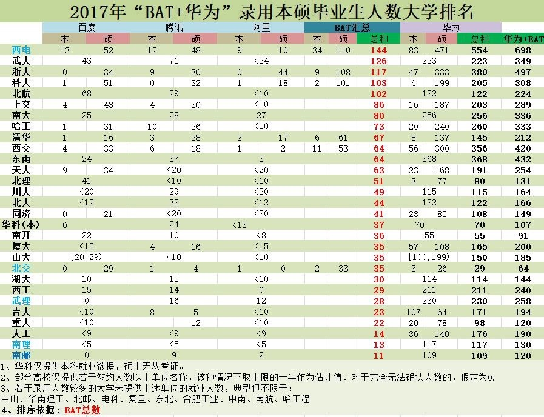

# 考研
严格按照：三轮复习进行：一轮，看书预习+听课+做题总结+单元统练
二轮专题：做题看书预习+听课+做题总结+专题统练
三轮冲刺：套卷练习+总结
大一大二=高一高二，大三=高三
[软微869](https://zhuanlan.zhihu.com/p/108429435)
[985计算机/软件如何400+](https://zhuanlan.zhihu.com/p/112507699)
[如何看待2020计算机考研诸神之战？](https://www.zhihu.com/question/373680232)
[二本一战跨考中科大软件工程经验贴](https://zhuanlan.zhihu.com/p/108213915)

* 每年都招调剂的研究所不错
* [一周一本经济学人学英语](https://www.zhihu.com/question/294241400/answer/552579562)
作者：风雨与晴
链接：https://www.zhihu.com/question/312939070/answer/612404233
来源：知乎
著作权归作者所有。商业转载请联系作者获得授权，非商业转载请注明出处。

5.12更新在文末。%%%%%%%%%%%%%%%%%%%%%%%%%%看我斜杠，已经二战了，本科985总分344还在找调剂什么叫单科没过的痛？这就是了瞄准哈工大深圳的，专业课就考两门，谁知各路神仙也是这么想的，400+十几个，结果复试线360单科80。今年计算机全国开花是有一定的历史因素的。除了众所周知计算机薪酬高、是没钱没背景的孩子突破阶级固化的唯一出路，无知媒体把人工智能的概念炒得火热之外，也因为18下半年到现在以至于整个19上半年的资本寒冬和裁员潮让考研充电成了行业人的不二之选。所以在此也奉劝各位科班想上更好学校的、跨考想换命运的、辞职想提学历的各位：千万不要好高骛远，自想当然。要明白计算机考研态势已经到了大叔大妈都要入场的阶段。为调剂攒点好运气，说几点希望对各位有志青年们有用：想考研千万不要眼里只有高校。除了中科院的各种所、各地特别是北京的无数科研院所都招研究生的。科研院所大部分都竞争很小、公费培养、待遇较高、毕业要留所三五年。留所这件事不要想着多不好，如果有个所第一年委托清华计算机系培养，毕业要求留所5年，事业编制还可以协助解决北京上海户口，你告诉我何乐而不去呢？特别是还有不用留所的......我都哭了，找调剂才知道有这块大宝藏。我想如果当初知道有这些个地方可以去我也不会这么莽......想考研千万不要眼里只有92共识。你要知道有些双非学校简直特么性价比不要太高...比如上科大，唯一让它不是92的原因就是因为只建校5年而已，上科大的师资力量丝毫不逊于大部分985，可以说是超一流了，又是新学校，硬件条件好的飞起。对于英语好的考过雅思托福的大佬，求求你们看看港科大深圳和和港中文深圳，将来凭借一流师资、国际化教学和大湾区发展规划，就算你定居深圳对你未来的小孩来说也绝对是极佳的选择啊。而且君不见深圳大学旁边就是腾讯总部，其他大公司进不去马化腾还能不照顾照顾母校？想考研千万不要只仗着英语政治好。来你过来看看：我两年都是英语82+，政治72+，我现在好过了吗？没有。老弟老妹，听我一句，得数学者得天下。不要老看视频，练习题，赶紧早早把真题刷两遍，再做其他题不迟。可能是我自己数学天赋为负数，这两年我都用的张宇，大家自行琢磨。初试完你就开始放松=放弃考研。你就想想那几十个380+、400+老师怎么选？上机、英语、专业面试，每一层都可以筛掉一群人。你没有ACM金牌没有CCF证书没有一作论文，机试不考个满分就想招老师的眼了？听我一句，初试完再继续刚三个月，发篇论文、写个项目、刷刷乐扣、考个证证甚至雅思托福，对你真是一点害处都没有。最后一句，上边这些你都不看这句话你一定要听：考得好不如选的好，再不要说努力比选择更重要了。各位加油。%%%%%%%%%%%手动%%%%%%%%%%%明天要入职了。北京，图像，6k/月。靠调剂简历找到的工作。调剂两个月，人生大起大落。套用群里一句印象深刻的话：“复试时遇见一老哥，一战200，二战300，三战400分，人超级nice，一看就是经历了调剂的暴锤。” Can't agree more.在此只简单概括给出我整个调剂经历，然后还是跟各位讲几句实在的话，最后补充几条细节上的建议。找调剂具体经历可能日后有时间了另开一贴吧。调剂复试全过程：1、上科大老师打来的电话面试，正午睡中惊坐起，由于是找调剂第一个面试，紧张得气都不连贯了，结果回答得一塌糊涂，gg。2、郑大老师发邮件让我过去面谈，到了办公室拿着我的简历问问题，说还挺不错如果有名额优先考虑你，结果当然是没有名额啦。3、广大方班线上预复试，这是我今年最玄乎的体验。我今年把方班做调剂的第一选择，却被无情抛弃（窟了）。看了复试名单和拟录取名单以后我至今没想明白为什么我没有进复试，结果呢，正式复试按1:1喊的人，去的都录了，传说中二批调剂的一个名额也被今年某折纸大佬直接截胡。也有收获吧，认识了方班调剂几位很nice的哥(姐)们(姐)。4、合工大老师电话复试，聊了半个小时，说对我印象很好，非常欢迎到他们实验室来，但是还是得等招办发通知，最后呢？自然是没有复试通知。5、首师大复试通过，拿到拟录取！但是受合工大一位boss主动发来的“你好好准备复试，希望很大！”邮件的蛊惑，拒绝了首师大的拟录取，于是我就错失了我唯一的上学机会，我的人生也就由此有了剧变。（我tm#%1！#@&*￥#…）6、哈工程二批。机试通过，笔试（网安）没过，没有面试机会。人生第一次体验了坐飞机travel 而已。7、中科院重庆绿色智能研究所，其实也没有什么复试，发了邮件就加了老师微信，说没名额了，但是我可以先去所里实习，按研究生同等待遇，等明年再考所里研究生。感谢老师认可，没去。8、江南大学二批。老师直接打电话过来让我填系统，好好准备复试，我照做了，结果呢？并没有通知。（丢！）9、自然还有无数其他老师回邮件说你很优秀，建议填报，好好准备然而再没下文，就按下不表了。两个月间发的邮件没有一百也得八十了，这意味着几乎所有收计算机相关调剂的院校所我都做了功课，填系统、发邮件、加群、打电话。调剂白热化阶段我的QQ列表全是调剂群的消息，个个99+，手里不停地刷；调剂文件夹里最多几十项，随着时间的推移一个一个被我挪进了“凉凉”文件夹。心态也从刚出分的“我这个分无论如何也能走个北京的211了”，到后来“我靠这些学校调剂生源那么好吗？不太稳啊”，再到“哪里都行，随便哪个211给个复试机会吧”，一直到“北京机会多，一本也能上”，最后“日，我失学了”。我曾经与老师邮件聊的火热，也接到过老师主动打来的电话，我曾经参加过电话或线上复试，也坐过大半天高铁被老师喊到办公室面试了15分钟，甚至为了找调剂坐了人生第一次和第二次飞机，到最后都消散如烟。我的本科四年过得不可谓不努力且收获颇丰，但是从决定跨考的那一刻起，我就相当于抛弃了一切原有的硬件优势，空杯撞南墙。考研两年，调剂两个月，我的三观产发生了重大的影响，这一点是我始料未及的。一切尘埃落定回首来路，痴人说梦bb几句，不讲操作细节，只说观念方向，有不好听的您过耳忘就成，我也懒得反驳。大佬及早退散，下面这些血泪教训只针对像我这样985+年年奖学金+创新创业负责人+一作EI录用+毕业综测10%+六级530+文体两开花-跨考=-∞的菜鸡：首先要说的一点，各位考研er也都听说了：不知道是不是受翟天临事件的影响，19出分以后教育部出了个文件，禁止各高校进行优秀生源调剂、按照分数从高到低复试等等。我在此就不恶意揣测教育部的意图了（可能人家想让92的赶紧就业得了），但是确实造成了今年调剂与往年很大的不同，不知道明年各位的境况会不会依然那么紧张。然后事实又一次验证了那句老话，饿死胆小的，撑死胆大的。南航南理两所著名的“只收985调剂”计算机照常将优秀生源调剂复试放在一志愿复试之前，而往年的真实备胎科软今年愣是没收校外调剂，大家苦苦等待的西交校外调剂最终还是没有放出。反正一句话，咱也不知道，咱也不敢问。选择远大于努力。事实是：华侨大学今年收调剂的标准是985+国家级奖项/项目；南开计算机专硕都是370水平，但是学硕300+的才两个还是三个。信息不对称这辈子是不可能消除的，只有拿今后至少五年的生活做做赌博这个样子。各位查信息的时候一定要暗中观察这个院校是否保护一志愿，像南航南理那样的就差没凑在你耳边轻轻说：“我们只要985！”，非92还是别报了吧。大湾区的一本和航天、电子系统底下的院所我认为非常具有选择的价值。努力了成功只是恰巧成功，努力了失败却被认为是不够努力。这是我现在最大的感受。所有人走到今天的地步，只有不到三成能归因于自己的所作所为，自己身上其他部分全都是家庭和环境的馈赠或遗毒。（防杠精：当然我意思不是好家庭就出成功人士）所以各位，不要看知乎上那些十几k赞的手把手教你考研，什么二本上清华，三个月上北大的live，他们昧着良心割韭菜，你就不要伸脖子。自己好好思考自己所处的世界，拥有的条件和资源，锤炼自己的上限和耐心。收藏文章爽，一直收藏一直爽，但是爽又不能让你有学上。一个非常重要的血淋淋的事实！不说报考，调剂这一块：能在系统上给你发复试通知的是学院招办老师，而招办老师与你千方百计联系上的导师互不干涉工作。懂我意思了吧。不论导师说的天好，他也只是从以往经验猜想招办老师会不会给你发通知——而招办老师呢，人家只看章办事，院领导说怎么招就怎么发。意味着什么呢，招办老师的手先天决定了找调剂的你的命运。甚至首师大的复试机会，还是我打了无数次电话，接通以后说明情况那边来一句：“嗯？没给你发通知吗？”我：？？？ 。各位，一切以到手的复试通知为准。任何不愿意为了你去跟招办打招呼的老师，说觉得你不错好好准备你就当放了个...阿姆斯特朗回旋加速炮。双一流学科名单不是个绕吗？学科评估比那个价值大的多。可能还有人不知道：大部分学校确实属于教育部，但是也有很多强校属于工信部，而双一流是教育部整的——西工大：“没错，航空航天强校就是...”复旦：“没错，就是我！”千万不要抱有侥幸心理。无论在哪个阶段，你一定要相信，只要你冒出了类似“诶，这个还可以这么干...”“卧槽我捞了个大便宜？”这样的念头，我敢肯定这件事在最后关头一定会出问题，所以千万不要在这个念头上孤注一掷。据我的经验，所有自认为是故事主角的人物后来都以出其不意的方式领了盒饭（说的就是你，夜王！）关于跨考。是这样的，参考我的水平，我之上的您随意，和我差不多的和暂时屈居之下的你可以思考一下在这整个调剂过程中你在哪个环节可以做的比我好，否则的话：不建议跨考211以上院校。这就是结论了。说实话，考研之前，我对我的学习能力信心满满（要不然也不会一战就刚408），而结果也确实是专业课学会了，但是都栽在了数学上。我毫不羞涩的可以说，我曾经幻想着考研进入计算机行业以后打拼五到十年能够有一席之地，在保证了家庭和孩子的生活以后，愿意做出牺牲，能好好为社会的公平和世界的和平做出一点微小的贡献——我真的这么想的，即使是今年出分之前我仍然是这么想的。但是调剂两个月到现在，在无数次任人挑选和欺骗后的我的心思只剩下一条：赚钱，赚很多钱，仅仅是为了让自己和家人的生活过得好，过得更好。让我的孩子不用为了生存而限制自己人格的发展，让ta可以做出是否要去改变这个世界的选择，让ta可以真正的仰望星空，思考星辰与大海。而不用在这个被资本裹挟的时代，听那些风口上的猪鼓吹福报，教导669，年薪几十万挤破头进入生活完全依附于大公司的所谓中产阶级。...溜了溜了，搬砖走起。一起加油诸位。